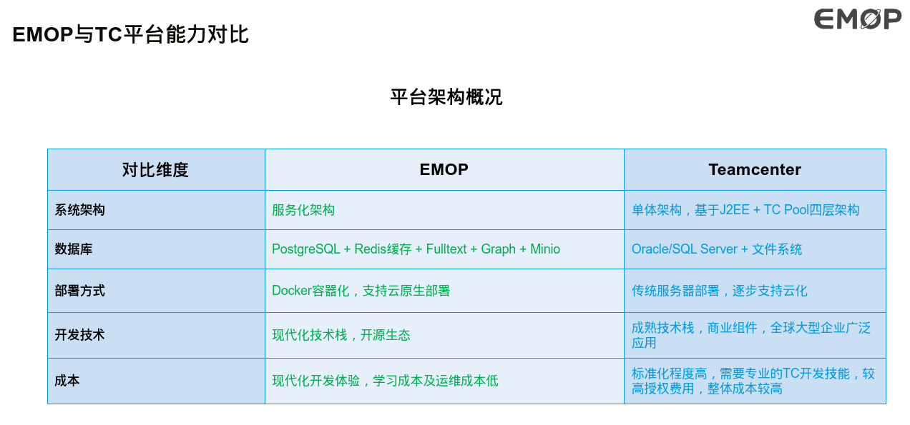
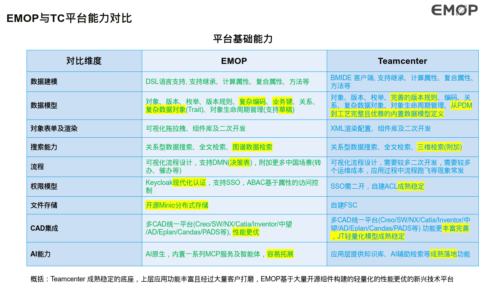

# EMOP 开发者门户 (Developer Portal)

欢迎来到EMOP开发者门户！这里包含了完整的文档、示例代码和集成测试，帮助你快速上手EMOP平台开发。

## 📺 课程视频

完整的EMOP开发课程视频讲解：[点击观看](http://www.eingsoft.com:81/emop-traing-course.mp4)

## 📚 学习路径

建议按照以下顺序学习，从基础到进阶，循序渐进：

| 序号 | 项目 | 说明 | 学习重点 | 难度 |
|------|------|------|----------|------|
| 1 | [docs](./docs/) | **平台文档** - 架构、规范、最佳实践 | 理解EMOP架构、元数据机制、开发规范 | ⭐ |
| 2 | [hello-emop-server](./hello-emop-server/) | **入门示例** - 创建自定义模型和服务 | 学习ModelObject定义、Service开发、RPC/REST调用 | ⭐⭐ |
| 3 | [relation-sample](./relation-sample/) | **关系操作** - 结构关系、关联关系、XPath、DSL | 掌握对象关系设计、XPath查询、DSL数据操作 | ⭐⭐⭐ |
| 4 | [file-storage-sample](./file-storage-sample/) | **文件存储** - 上传下载、批量操作、附件管理 | 理解票据机制、批量操作、多站点架构 | ⭐⭐ |
| 5 | [cad-integration-sample](./cad-integration-sample/) | **CAD集成** - 客户端调用、服务端扩展 | 学习CAD集成流程、扩展点机制 | ⭐⭐⭐⭐ |
| 6 | [integration-test](./integration-test/) | **集成测试** - 各种API使用样例和性能测试 | 参考实际API调用方式、性能优化技巧 | ⭐⭐⭐ |
| 7 | [rest-sample](./rest-sample/) | **REST样例测试** - 各种REST API使用样例,VSCode中使用httpYac插件以支持返回体的断言| 参考实际REST API调用方式 | ⭐⭐ |

## 📖 项目详解

### 1. docs - 平台文档

**位置**: `./docs/`

**内容概览**:
- **平台架构** (`platform/`): 元数据、缓存、分布式文件服务、全文检索、监控等
- **业务开发** (`business/`): 后端开发、前端开发、DSL语法、建模规范
- **PLM功能** (`plm/`): BOM管理、CAD转换、分类、权限、工作流
- **AI能力** (`ai/`): MCP协议、AI Agent、CAD设计助手
- **部署运维** (`deployment/`): Docker部署、运维指南、系统要求

**学习目标**:
- 理解EMOP的整体架构和设计理念
- 掌握元数据驱动的开发模式
- 了解平台提供的核心能力和服务

---

### 2. hello-emop-server - 入门示例

**位置**: `./hello-emop-server/`

**功能特性**:
- ✅ 创建自定义领域模型 (HelloTask)
- ✅ 实现业务服务 (HelloTaskService)
- ✅ 支持RPC和REST两种调用方式
- ✅ 自动生成REST API (基于元数据)
- ✅ 内嵌EMOP Server启动，可在IDE中直接调试

**学习目标**:
- 学会定义 `@PersistentEntity` 持久化实体
- 掌握 `@Remote` RPC服务开发
- 理解元数据如何自动生成REST API
- 熟悉EMOP项目的标准结构 (api/plugin/server/client)

---

### 3. relation-sample - 关系操作示例

**位置**: `./relation-sample/`

**功能特性**:
- ✅ **结构关系**: 通过外键实现的固定层次关系 (项目-任务、任务树)
- ✅ **关联关系**: 通过关系表实现的动态多对多关系 (任务-文件)
- ✅ **XPath操作**: 路径表达式查询和更新 (`project.get("tasks[*]/name")`)
- ✅ **DSL操作**: 声明式数据操作 (`create object`, `relation`, `query`)
- ✅ **数据导入导出**: 表格导入、树形导入、关系导入

**学习目标**:
- 理解结构关系 vs 关联关系的区别和适用场景
- 掌握XPath路径语法和高级查询技巧
- 学会使用DSL进行数据操作
- 了解批量数据导入的最佳实践

---

### 4. file-storage-sample - 文件存储示例

**位置**: `./file-storage-sample/`

**功能特性**:
- ✅ **基础操作**: 上传票据、直接上传、访问票据、文件下载
- ✅ **批量操作**: ZIP批量上传解压、批量下载、目录下载
- ✅ **附件管理**: 附加文件上传 (缩略图.jpg、校验文件.md5等)
- ✅ **多站点支持**: 基于用户属性的站点选择、异地卷架构

**学习目标**:
- 理解票据机制和预签名URL的安全性
- 掌握批量操作的性能优化技巧
- 了解附加文件的使用场景
- 学会在多站点环境下进行文件操作

**核心概念**:
- **票据机制**: 通过预签名URL进行文件操作，避免直接暴露存储凭证
- **逻辑bucket**: 使用逻辑名称 (如"cad")，minio-proxy自动映射到实际bucket (如"cad-zjk1")
- **附加文件**: 与主文件关联的衍生文件，通过扩展名区分

---

### 5. cad-integration-sample - CAD集成示例

**位置**: `./cad-integration-sample/`

**项目结构**:
- **cad-integration-client**: 模拟CAD客户端，演示如何调用EMOP API
- **cad-integration-server**: 服务端扩展，演示如何定制CAD集成功能

**功能特性**:

#### 客户端 (cad-integration-client)
- ✅ **保存到EMOP**: BOM比对 → 提交结构 → ZIP重组 → 批量上传
- ✅ **从EMOP打开**: 获取BOM → 收集文件ID → 批量下载 → 本地解压
- ✅ **动态ID适配**: 自动处理服务器端动态生成的ID
- ✅ **ZIP重组**: 根据最终fileId重组文件结构
- ✅ **多站点支持**: 自动选择最优站点

#### 服务端 (cad-integration-server)
- ✅ **ItemEntity处理扩展**: 对比前后、保存前后、加载后处理
- ✅ **属性处理扩展**: 单位转换、计算派生属性、属性验证
- ✅ **BOM结构处理扩展**: 过滤虚拟件、自定义ItemCode生成
- ✅ **文件处理扩展**: 文件过滤、类型判断、文件转换
- ✅ **验证扩展**: 业务规则验证、数据完整性检查

**学习目标**:
- 理解CAD集成的完整数据流程
- 掌握扩展点机制的使用方法
- 学会处理动态ID映射和文件重组
- 了解如何定制化CAD集成功能

**核心流程**:
```
保存到EMOP:
CAD客户端 → Compare BOM → Post BOM结构 → 重组ZIP → 批量上传

从EMOP打开:
CAD客户端 → 获取BOM结构 → 批量下载文件 → 解压到本地
```

---

### 6. integration-test - 集成测试

**位置**: `./integration-test/`

**内容概览**:
- **usecase/**: 各种业务场景的集成测试
  - `common/`: 通用功能测试 (CRUD、查询、事务等)
  - `modeling/`: 建模相关测试 (元数据、类型系统等)
  - `datasync/`: 数据同步测试
  - `permission/`: 权限测试
  - `pipeline/`: 流水线测试
  - `other/`: 其他功能测试
- **performance/**: 性能测试
  - 基础对象服务性能测试
  - 大数据查询性能测试
  - 建模性能测试
  - 编码生成器性能测试

**学习目标**:
- 参考实际的API调用方式和最佳实践
- 了解各种功能的测试用例
- 学习性能优化技巧
- 作为开发时的API使用参考

---

## 🚀 环境准备

所有示例项目都需要以下环境：

### 基础环境
- **JDK**: 17+
- **Maven**: 3.6+
- **IDE**: VS Code及衍生IDE(包含Cursor, TRAE, KIRO等AI编辑器) 或 IntelliJ IDEA

### 服务依赖

在本地 `/etc/hosts` (Linux/Mac) 或 `C:\Windows\System32\drivers\etc\hosts` (Windows) 中添加：

```bash
# 注册中心 (建议使用本地consul，避免污染公共环境)
127.0.0.1 registry-dev.emop.emopdata.com

# 缓存服务
192.168.10.103 cache-dev.emop.emopdata.com

# 数据库
192.168.10.103 emop-db-master-dev.emop.emopdata.com

# 文件存储 (file-storage-sample 和 cad-integration-sample 需要)
192.168.10.103 storage-dev.emop.emopdata.com
192.168.10.103 minioproxy-dev.emop.emopdata.com

# EMOP网关 (file-storage-sample 和 cad-integration-sample 需要)
192.168.10.103 dev.emop.emopdata.com
```

### Maven配置

确保已配置阿里云私仓，在 `~/.m2/settings.xml` 中添加。


### EMOP平台对比
技术栈对比
[](./docs/images/emopVStc1.png)

基础能力对比
[](./docs/images/emopVStc2.png)