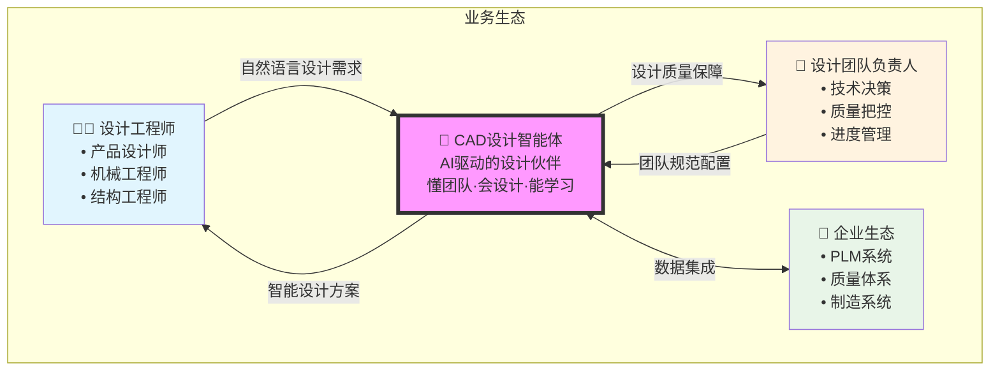
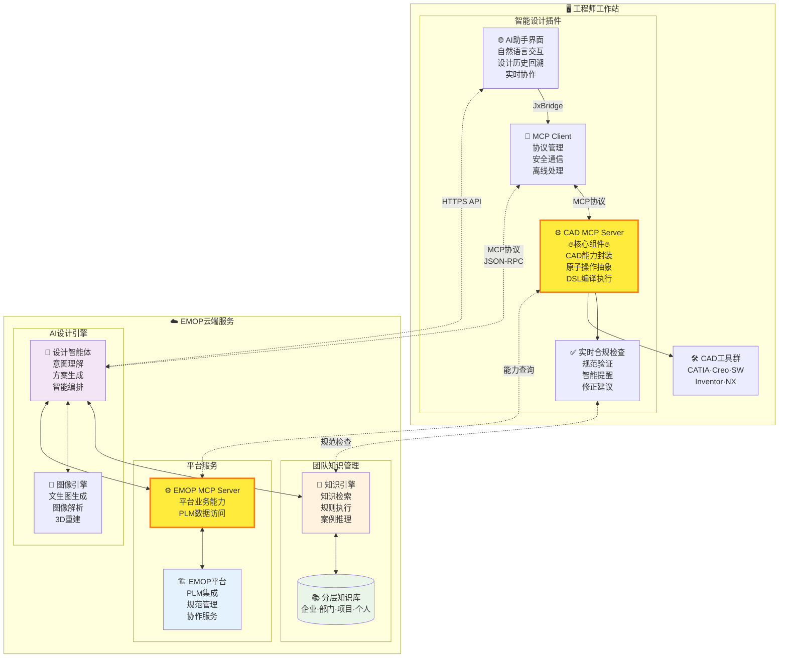
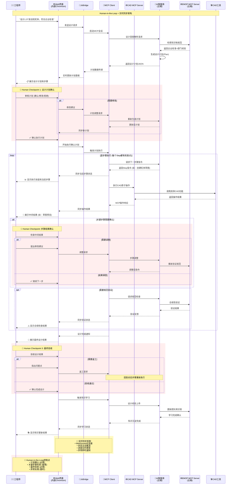

# CAD设计智能体架构设计(待实现)

## 概述

CAD设计智能体是EMOP 3.0平台`AI粘合原子对象`思想的重要体现，采用"CAD本地插件 + 云端AI服务 + 团队知识驱动"的混合架构，实现自然语言驱动的从业务到设计的工作流程。通过Model Context Protocol (MCP) 协议和分层知识管理体系，将传统CAD工具转化为AI驱动的智能设计平台，真正做到"懂团队、会设计、能学习"。

## 设计哲学

### 从工具到智能伙伴
- **传统CAD**：工程师操作工具完成设计
- **智能CAD**：AI理解意图，规划设计，并执行动作从而辅助完成设计，工程师专注创新

### 原子化能力组合
- **设计原子**：参数化建模、约束求解、特征操作
- **智能编排**：AI根据设计意图，智能组合原子能力
- **自适应学习**：从设计数据(特征)及plm数据(物料等)中学习，优化画图步骤，

### 知识驱动设计
- **团队规范融入**：如同代码规范，设计过程自动遵循团队标准
- **经验复用**：如同组件库，历史设计模式智能推荐复用
- **持续优化**：如同代码重构，设计知识持续沉淀和改进

## 整体架构

### 架构设计原则

采用分层视图设计，遵循 C4模型的层次化抽象思想，将复杂的CAD设计智能体系统分解为清晰的层次结构，便于理解、开发和维护。

### 业务上下文视图

展示CAD设计智能体在整个业务生态中的位置和价值。



**价值定位**：将传统"工程师操作工具"的模式升级为"AI理解意图，协助完成设计"的智能协作模式。

### 系统容器视图

展示CAD设计智能体的主要系统组件及其关系，重点标记MCP Server的位置。



### 核心交互流程

展示通过MCP Server实现的知识驱动设计流程。



## 核心组件设计

### 1. 智能设计插件 (CAD Plugin)

**AI助手Web界面**：
- 自然语言交互面板，支持团队术语和习惯表达
- 设计历史展示和回溯，关联团队知识库
- 智能建议和推荐，基于团队经验和规范
- 设计进度可视化，符合团队项目管理流程
- 实时协作状态，显示团队成员设计活动

**实时合规检查器**：
- 团队设计规范实时验证
- 企业标准件库自动匹配
- 制图标准智能提醒
- 工艺约束检查
- 成本控制提醒

**MCP Client (Java/C# SDK)**：
- 协议管理和会话状态维护
- 与云端AI服务的安全通信
- 本地缓存和离线处理能力
- 错误处理和重试机制
- 知识同步和更新机制

**MCP Server (设计能力封装)**：
- 几何建模原子能力
- 参数约束原子能力
- 特征操作原子能力
- 文件管理原子能力
- 设计验证原子能力

**DSL设计语言编译器**：
- 自然语言到设计指令的转换
- 参数化设计模板库
- 设计规范自动检查
- 跨CAD平台的统一抽象

### 2. 团队知识管理层

**分层知识库架构**：

**企业级知识**：
- **设计标准**：制图规范、材料标准、工艺规范
- **标准件库**：螺栓紧固件、密封件、标准零件
- **质量体系**：设计评审流程、质量控制标准

**部门级知识**：
- **专业规范**：发动机设计规范、传动系统规范、底盘设计准则
- **设计案例**：成功项目案例、失败教训总结、优化案例分析
- **经验库**：专家经验、设计技巧、常见问题解决方案

**项目级知识**：
- **项目要求**：客户特定规范、法规要求、成本约束
- **设计约束**：技术边界条件、接口要求、性能指标
- **项目经验**：设计决策记录、问题解决历程、优化过程

**个人级知识**：
- **设计偏好**：建模习惯、参数设置偏好、工具使用习惯
- **个人经验**：个人设计技巧、常见错误记录、解决方案库

### 4. CAD设计智能体 (AI Agent Core)

**知识驱动的设计意图理解**：
- 团队术语和表达习惯的微调
- 基于团队历史的设计模式识别
- 企业规范和约束的自动融入
- 多轮对话中的上下文理解

**知识增强的设计编排引擎**：
- 基于团队经验的原子能力智能组合
- 符合团队流程的执行计划生成
- 团队质量标准的自动验证
- 异常处理和团队规范的自动修正

## 典型应用场景：知识驱动的装配体协同设计

### 场景描述：发动机装配体设计（团队知识融入版）

某汽车公司发动机团队需要设计新一代发动机，团队有以下特色：
- **企业标准**：20年沉淀的设计规范和质量体系
- **部门经验**：发动机专业团队的丰富设计案例库
- **项目约束**：客户特定要求和成本控制目标
- **个人习惯**：每个工程师的建模偏好和工作流程

### 知识驱动的Human-in-the-Loop工作流程

#### 第一阶段：智能BOM规划（融入团队知识）

**1. 系统工程师发起（王总工）**
```
工程师输入："设计一台1.5T涡轮增压发动机，功率150kW，符合国六排放标准"

AI知识增强理解：
基础理解：排量1.5L，增压方式，功率目标，排放标准
+ 企业知识融入：
  - 按企业标准ES-ENG-001，1.5T发动机采用直列4缸布局
  - 材料选择遵循企业合格供应商清单
  - 零部件编码按企业标准ERP-CODE-V3
+ 部门经验融入：
  - 参考类似的1.4T和1.6T发动机成功经验
  - 避免之前1.2T发动机的散热问题
  - 采用部门成熟的涡轮增压技术方案
+ 王总工偏好融入：
  - 王总工偏好模块化设计，便于后续改型
  - 习惯预留10%的性能裕量
  - 注重制造工艺性和维修便利性
```

**2. 知识驱动的BOM生成**
```
AI生成符合团队规范的BOM：
发动机总成 (编码:ENG-15T-001，按企业编码规范)
├── 缸体分总成 (材料:灰铸铁HT250，符合ES-MAT-005)
│   ├── 缸体本体 (按部门设计规范ED-BLOCK-002)
│   ├── 缸套(4个) (供应商:合格清单A级供应商)
│   └── 水套密封件 (标准件:企业标准库)
├── 缸盖分总成 (铝合金A356，轻量化设计)
│   ├── 缸盖本体 (集成排气歧管，参考1.4T成功案例)
│   ├── 进排气门(16个) (钢材:38CrSi，按ES-VAL-001)
│   └── 可变气门正时机构 (模块化设计，王总工偏好)
├── 曲轴连杆分总成
└── 增压系统分总成 (预留升级接口，王总工建议)

团队知识应用标识：
✓ 遵循企业编码标准
✓ 材料选择符合企业规范  
✓ 参考部门成功案例
✓ 融入王总工设计偏好
✓ 避免历史问题点
```

**3. Human Review 环节（团队协作）**
```
系统展示：
- BOM结构对比：当前方案 vs 企业标准模板 vs 竞品分析
- 知识应用说明：具体应用了哪些团队知识
- 风险提示：基于历史经验的潜在风险点
- 成本预估：基于企业成本数据库的初步估算

王总工确认：
✓ 整体架构合理，符合企业技术路线
✗ 修改建议：增加EGR系统模块，满足排放法规
✓ 模块化设计思路正确
✗ 调整：缸盖集成度可以更高，减少接口数量

团队知识更新：
- 记录王总工的设计决策和理由
- 更新"1.5T发动机设计"知识条目
- 标记新的设计偏好：高度集成化设计
```

#### 第二阶段：知识驱动的并行设计

**1. 缸体设计（张工程师，10年发动机设计经验）**
```
工程师："基于BOM要求，设计缸体本体，材料用灰铸铁HT250"

AI知识增强执行：
基础设计流程：
1. 加载设计约束 → 从BOM获取接口要求
2. 材料属性设置 → HT250性能参数

+ 企业知识应用：
3. 应用企业制图标准ES-DRAW-001 → 图框、线型、标注规范
4. 调用企业标准件库 → 螺栓、销子、密封件规格
5. 执行企业工艺约束 → 铸造工艺规范ES-CAST-003

+ 部门经验应用：
6. 参考部门缸体设计模板 → 水套布局、油道设计
7. 应用部门设计规则 → 壁厚梯度、圆角半径
8. 执行部门质量标准 → 强度校核、疲劳分析

+ 张工个人经验应用：
9. 采用张工偏好的建模序列 → 先主体后特征
10. 应用张工命名规范 → BLOCK_MAIN_001
11. 使用张工常用的检查清单 → 工艺性检查

实时知识提示：
💡 企业经验：类似1.4T项目，此处壁厚建议≥8mm
💡 部门规范：水套与缸孔间距按ED-COOL-001执行
💡 历史教训：避免XX项目的砂芯悬臂过长问题
💡 张工经验：习惯在此处添加工艺定位孔
```

**2. 团队协作中的知识共享**
```
实时协作场景：
李工程师（缸盖设计）："缸盖螺栓孔深度多少合适？"

AI知识检索和推荐：
- 企业标准查询：螺栓啮合长度按ES-BOLT-002，≥1.5倍螺栓直径
- 部门案例检索：类似项目采用M12螺栓，孔深18mm
- 张工经验参考：缸体侧螺栓孔深度通常比理论值深2mm
- 工艺约束提醒：注意底部倒角，避免应力集中

自动协调建议：
基于团队知识的接口协调：
- 螺栓规格：M12×1.25（企业标准规格）
- 螺栓强度：8.8级（部门常用规格）
- 孔径公差：+0.3mm（张工经验值）
- 孔深：18mm（李工缸盖设计要求）

知识沉淀：
- 记录此次协作决策过程
- 更新"缸体缸盖接口设计"知识条目
- 标记为团队协作最佳实践
```

#### 第三阶段：知识验证和优化

**1. 设计合规性智能检查**
```
AI执行团队规范检查：

企业标准合规性：
✓ 制图标准：符合ES-DRAW-001，图框、标题栏、技术要求格式正确
✓ 材料规范：HT250符合ES-MAT-005，供应商为A级合格供应商
✗ 编码规范：零件编码格式不符合ERP-CODE-V3，需要调整
✓ 质量标准：设计评审节点设置符合QS-REVIEW-001

部门规范合规性：
✓ 设计规则：壁厚梯度符合ED-THICK-001
✓ 工艺约束：铸造工艺参数符合ED-CAST-002
✗ 接口标准：螺栓孔位置与标准模板偏差3mm，需确认
✓ 强度校核：安全系数2.8，满足部门要求≥2.5

项目约束检查：
✓ 重量目标：缸体重量45kg，符合轻量化要求≤50kg
✗ 成本控制：材料成本超预算5%，需要优化
✓ 供应商：所有材料供应商均在合格清单内

个人习惯验证：
✓ 张工建模规范：特征命名、建模顺序符合个人习惯
✓ 检查清单：按张工常用检查项逐一验证
✗ 工艺孔缺失：张工习惯添加的定位孔未包含

修正建议：
1. 零件编码修正为：ENG-15T-BLOCK-001
2. 螺栓孔位置微调，与标准模板对齐
3. 材料优化：局部减薄2mm，重量减轻2kg，成本降低3%
4. 添加Φ8定位孔2个，符合张工工艺习惯
```

**2. 团队知识学习和更新**
```
设计完成后的知识沉淀：

新增团队知识：
- 设计案例：1.5T发动机缸体设计成功案例
- 设计决策：轻量化与成本平衡的决策过程
- 问题解决：编码规范冲突的处理方法
- 协作模式：张工李工接口协调的有效做法

知识有效性验证：
- 追踪设计后续验证结果
- 收集制造、测试、使用反馈
- 更新知识置信度和适用范围
- 标记需要改进的知识条目

团队能力提升：
- 分析张工在此项目中的新技能点
- 更新张工个人能力标签
- 推荐相关培训和学习资源
- 为类似项目推荐合适人员

企业知识资产增长：
- 累计设计案例数量 +1
- 验证设计规范有效性 +5项
- 新增协作模式模板 +1个
- 更新成本控制经验 +3条
```

### 知识驱动的文生图优化实例

```
原始需求："设计一个发动机缸体"

团队知识增强后的文生图提示词：
"发动机缸体设计，直列4缸布局，灰铸铁HT250材质，
按XX汽车企业设计标准ES-DRAW-001制图规范，
集成水套冷却系统符合ED-COOL-001部门规范，
壁厚梯度设计遵循ED-THICK-001，
圆角过渡R3-R5符合铸造工艺ED-CAST-002，
螺栓连接界面按企业标准ES-BOLT-002，
张工偏好的简洁造型风格，
技术制图标准，等轴测投影，专业工程图"

生成的图片特点：
- 符合企业制图标准的图框和标注
- 体现部门水套设计特色
- 包含张工偏好的设计细节
- 遵循铸造工艺约束
- 标注企业标准件规格
```
通过知识驱动的CAD设计智能体，EMOP 3.0真正实现了"AI + 团队智慧"的深度融合，让每一次设计都站在团队经验的肩膀上，将传统的CAD工具升级为具有团队记忆和学习能力的智能设计伙伴。