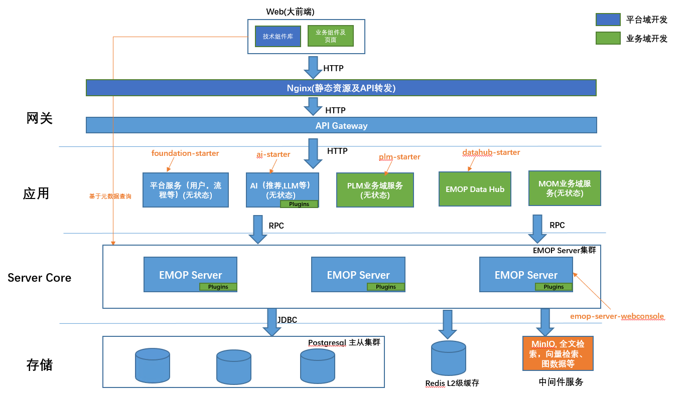

# EMOP业务开发指南

## 架构概述

[](../images/architecture/overview.png)

EMOP采用以下架构模式：

1. **EMOP平台服务（EMOP Server）**
   - 基于插件机制扩展核心功能
   - 提供分布式数据存储能力

2. **业务域服务（PLM）**
   - 通过 RPC 调用服务器端功能


项目打包及启动结构，EMOP Server及PLM服务:
```
emop-business/                          # EMOP业务系统根目录
├── emop-server-plugins/                
│   ├── emop-server-plugin-api.jar      # 服务器插件API接口定义jar包
│   ├── emop-server-plugin.jar          # 插件核心实现jar包
│   └── startEMOPServer.bat             # EMOP服务器启动脚本
│   │       └── emop-server-webconsole.jar     # EMOP Server Fat Jar(不包含插件) 
├── emop-plm/                          # PLM产品生命周期管理模块 
│   ├── emop-plm-starter.jar           # PLM服务启动Fat Jar包(包含PLM主程序)
│   ├── project-manager.jar            # 项目管理领域实现jar包 
│   ├── project-manager-api.jar        # 项目管理领域模型及API定义jar包
│   ├── ......                         # 更多领域模型、API定义及实现
│   └── startPLMServer.bat             # PLM服务启动脚本
├── emop-foundation/            # 基础服务 
│   ├── auth/                   # 认证服务实现
│   ├── auth-api/               # 认证服务API定义
│   ├── foundation-starter/     # Foundation服务启动模块
│   ├── usercenter/             # 用户中心服务实现
│   ├── usercenter-api/         # 用户中心API定义
│   ├── workflow/               # 工作流实现
│   ├── workflow-api/           # 工作流API定义
├── web/
│   ├── packages/platform              # 平台UI组件库
│   ├── packages/ai                    # 平台AI组件
│   └── packages/plm                   # PLM业务组件及页面
├── docker/                            # 镜像构建,生产环境配置等
```

## 重要说明

1. PLM与EMOP Server之间的调用基于 RPC 调用机制
2. 目前不支持分布式事务，客户端事务需要手动控制（后续会支持注解方式），服务器端采用`@Transactional`注解
3. 平台提供基于元数据`Metadata`的统一查询更新服务，并通过`gateway`实现智能路由(架构图橙色线)。业务开发应优先使用平台提供的基于元数据的数据查询及更新能力，而不是在业务域中重复开发类似功能。主要优势包括：
   - 无需中间的RPC直接路由到数据存储节点进行查询
   - 支持分布式并行查询
   - 服务端及前端统一的查询和更新API，降低开发复杂度
   - 自动的索引管理和性能优化

## 插件开发指南

插件在EMOP Server中运行，负责核心领域模型和基础操作。

### 1. 插件项目结构

```
emop-server-plugins/
├── emop-server-plugin-api/           # 插件API定义
│   └── src/main/java/io/emop/
│       └── model/                    # 核心领域模型
│           ├── bom/                  # BOM相关模型
│           ├── cad/                  # CAD相关模型
│           ├── document/             # 文档相关模型
│           ├── material/             # 物料相关模型
│           └── ....../               # 更多相关领域模型
│       └── service.api.domain/       # 领域服务接口
│           ├── bom/                  # BOM服务接口
│           ├── cad/                  # CAD服务接口
│           ├── doc/                  # 文档服务接口
│           └── ....../               # 更多相关服务接口
├── emop-server-plugin/              # 插件实现
    └── src/main/java/
        └── impl/                    # 服务实现
```

### 2. 领域模型示例

在 EMOP 中，领域模型通过特定注解来标记持久化和关系属性。以下是一个 BOM 模型的示例：

```java
@Getter @Setter
@PersistentEntity(schema = Schema.BOM, name = "BomView")
public class BomView extends AbstractModelObject {
    @QuerySqlField(index = true, notNull = true)
    private String code;
    
    @QuerySqlField
    private BomType type;
    
    @QuerySqlField
    private String tag;
    
    @StructuralRelation(notNull = true)
    @LocalizedNameDesc(name = "顶层节点", description = "该BOM的顶层节点")
    private BomLine topline;
    
    public enum BomType {
        EBOM,
        MBOM,
        PBOM,
        SBOM
    }
}

@PersistentEntity(schema = Schema.BOM, name = "BomLine")
@Getter @Setter
public class BomLine extends AbstractModelObject {
    @QuerySqlField(index = true, notNull = true)
    private Long bomViewId;
    
    @QuerySqlField(index = true, notNull = true)
    private String code;
    
    @QuerySqlField(notNull = true)
    private String revId;
    
    @StructuralRelation
    @LocalizedNameDesc(name = "子项", description = "子BOM行")
    private List<BomLine> children;
    
    @AssociateRelation(notNull = true)
    @LocalizedNameDesc(name = "目标对象", description = "BOM行对应的目标对象")
    private ModelObject target;
}
```

关键注解说明：
- `@PersistentEntity`: 标记持久化实体，指定 schema 和名称
- `@QuerySqlField`: 定义查询字段，支持索引和非空约束
- `@StructuralRelation`: 标记结构性关系
- `@AssociateRelation`: 标记关联关系
- `@LocalizedNameDesc`: 提供本地化的名称和描述

详细的建模规范请参考[领域建模指南](../platform/domain-modeling.md)。

```java
// 在 emop-server-plugin-api 中定义服务接口
@Remote
public interface BOMService {
    List<BOMItem> batchCreate(List<BOMItem> items);
}

// 在 emop-server-plugin 中实现服务
@Service
public class BOMServiceImpl implements BOMService {
    @Transactional
    public List<BomLine> batchCreate(List<BomLine> toplines) {
        // 修整对应的树形数据
        S.service(QueyService.class).saveAll(lines);
    }
}
```
### 3. Service体系
EMOP平台单独提供了一套service，核心与Spring框架解耦，仅在应用层进行融合。平台使用`sofa-rpc`实现分布式服务调用，`consul`进行服务注册与发现。

**Service特点**：
- EMOP核心框架与Spring解耦，保持独立性, 应用层通过适配器模式与Spring融合
- 本地服务与远程服务调用API保持一致, 调用时优先使用本地服务, 只有当服务标记为远程服务且本地不存在实现时, 才会进行远程RPC调用, 通过统一的API同时可以获得Spring注册的service
- 一个注解将本地服务发布为远程服务
- 登录用户信息会在远程调用时自动传递
- 二进制高性能通信

#### 1. 创建服务接口

```java
public interface ProjectService {
    Project createProject(Project project);
}
```

#### 2. 实现服务

```java
import io.emop.model.annotation.Service;

@Service
public class ProjectServiceImpl implements ProjectService {
    
    @Override
    public Project createProject(Project project) {
        return project;
    }
}
```
**`@Service` 注解参数说明：**
- `value`: 指定要注册的服务接口，如果不指定则自动推断
- `initMethod`: 服务实例构建后初始化方法，默认为"init"
- `destroyMethod`: 服务实例销毁前方法，默认为"destroy"
- `singleton`: 是否为单例模式，默认为true
  - `true`: 单例模式，同一个服务接口只创建一个实例
  - `false`: 多例模式，每次获取都创建新实例


#### 3. 标记远程服务接口

如果需要将服务发布为RPC供其他服务调用，在服务接口上添加 `@Remote` 注解：

```java
import io.emop.model.annotation.Remote;

@Remote
public interface ProjectService {
    Project createProject(Project project);
}
```

`@Remote` 注解参数说明：
- `timeout`: 超时时间(毫秒)，默认30000
- `retries`: 重试次数，默认3
- `loadBalancer`: 负载均衡策略，默认roundRobin
- `group`: 服务分组，默认default
- `version`: 服务版本，默认0.0.1


获取Service实例统一使用：
```java
// 获取本地服务
MetadataService metadataService = S.service(MetadataService.class);

// 获取远程服务
ProjectService projectService = S.service(ProjectService.class); 
```

::: warning ⚠️远程服务接口设计约束

**1. 不支持可变参数**，需要使用List替代：

```java
@Remote
public interface DocumentService {
    
    // ❌ 不支持可变参数
    // void deleteDocuments(Long... docIds);
    
    // ✅ 使用List
    void deleteDocuments(List<Long> docIds);
    
    // ✅ 如果一定需要可变参数，可以重载提供default实现
    default void forceDelete(@NonNull Long... ids) {
        forceDelete(Arrays.stream(ids).toList());
    }
    
    void forceDelete(@NonNull List<Long> ids);
}
```

**2. 性能损耗**，针对RPC调用需要避免大量的循环调用，每次调用消耗网络延时约0.5~2毫秒

**3. 输入输出可序列化**，参数和返回值建议是干净的DTO对象：

**序列化最佳实践：**
- 使用基本数据类型（String, Long, Integer, Boolean等）
- 使用标准Java集合（List, Set, Map）
- 避免传输包含文件流、数据库连接等不可序列化的资源
- 使用扁平化的DTO结构，避免过深的对象图

**常见序列化问题：**
- 传输大对象导致网络超时
- 包含Spring框架对象（如ApplicationContext）导致序列化异常
- 包含Logging框架对象（如log4j对象）导致序列化异常
:::

#### 4. 外部依赖管理（Spring集成）

为了减少对Spring的直接依赖，同时又能使用Spring管理的资源（如Redis等），EMOP实现了适配器模式`S.ExternalResourceProvider`来桥接这两个体系.

在服务中使用外部依赖：

```java
import io.emop.model.annotation.Service;

@Service
public class CacheServiceImpl implements CacheService {
    @Override
    public void put(String key, Object value) {
		//RedisTemplate由Spring初始化, 通过 S.service() 统一的 API 获得
        S.service(RedisTemplate.class).opsForValue().set(key, value);
    }
}
```

## PLM业务开发指南

PLM作为客户端，通过 RPC 调用EMOP Server的服务。

### 1. 项目结构

```
emop-plm/
├── emop-plm-starter/           # PLM启动模块
├── project-manager/            # 项目管理模块
├── project-manager-api/        # 项目管理API
├── ....../                     # 更多领域模型
```

### 2. 客户端事务处理
客户端借助[pipeline](./specification/pipeline#_3-2-事务边界详解)实现对应的事务

### 3. RPC调用示例

```java
@Service
public class PLMBOMService {
    // 批量操作
    public List<BOMLine> batchCreate(List<BOMLine> toplines) {
		// 通过RPC调用服务器端方法
        return S.service(BOMService.class).batchCreate(toplines);
    }
}
```

## 开发规范

**[AI辅助开发规范](specification/ai-coding)**

**[EMOP平台特定开发规范](specification/coding)**


## 最佳实践

### 1. 事务处理
- 服务器端使用 @Transactional 注解
- 客户端借助[pipeline](./specification/pipeline#_3-2-事务边界详解)实现对应的事务
- 避免跨越RPC的分布式事务
- 使用批量操作减少事务数量

### 2. 性能优化
- 合并多个操作到一次RPC调用
- 使用批量接口而不是循环调用
- 使用[pipeline](./specification/pipeline)批量API

```java
// 好的实践，同步的一次性处理的API
public void goodPractice() {
    // 一次RPC调用，批量处理
    List<BOMItem> items = prepareBOMItems();
    bomService.batchCreate(items);
}

// 好的实践，pipeline的批量API
public void goodPractice2() {
   ObjectServicePipeline objPipeline = ObjectService.pipeline();
   List<ResultFuture<BOMItem>> saveFutures = new ArrayList<>();
   for (BOMItem item : items) {
        ResultFuture<BOMItem> createdItemFuture = objPipeline.create(item);  // 延迟保存
        saveFutures.add(createdItemFuture);
   }
   objPipeline.execute(); //执行pipeline
   BOMItem firstCreatedBOMItem = saveFutures.get(0).get();
}
        
// 避免这样做
public void badPractice() {
    // 多次RPC调用
    for (BOMItem item : items) {
        bomService.create(item);  // 每次都是一个RPC调用
    }
}
```

## 开发建议

1. **领域模型设计**
   - 在插件API中定义核心模型
   - 确保模型的可序列化性
   - 考虑RPC调用的性能影响

2. **接口设计**
   - 提供粗粒度的批量操作接口
   - 减少跨服务调用
   - 明确接口的事务边界

3. **事务处理**
   - 保持事务粒度尽可能小
   - 实现必要的补偿机制
   - 考虑使用最终一致性

## 常见问题

1. **RPC调用失败**
   - 检查网络连接
   - 验证服务注册状态
   - 检查序列化配置

2. **性能优化**
   - 使用批量接口
   - 优化数据模型
   - 合理使用缓存