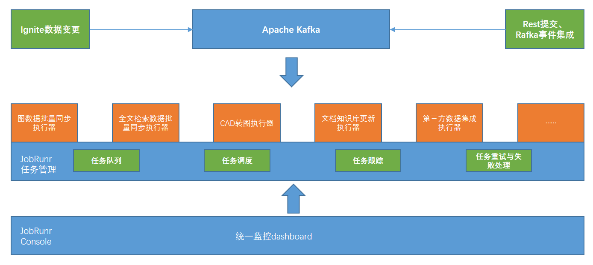

# EMOP Datahub 数据集成服务

## 1. 概述

EMOP Datahub 是 EMOP 平台的数据处理与集成中心，作为平台的关键组件，它负责 CAD 模型转换、图数据库同步、全文检索同步、文档知识库同步等多种数据处理任务，同时也承担着 EMOP 平台与第三方系统数据集成的核心职责。本文档描述了 Datahub 基于 JobRunr 的架构，以及如何基于这一架构进行后续开发工作。

### 1.1 背景

在 EMOP 中，系统内部各种异构数据的同步、与第三方系统的数据集成都是常见且重要的场景，而 Datahub 正是为解决这一需求而设计的。

Datahub 服务基于 JobRunr 来构建轻量级、易于管理的异步任务处理系统，作为一个后台任务处理库，提供了任务跟踪、重试、多实例等核心功能。

### 1.2 目标

- 提供统一的任务提交、管理和监控界面
- 支持多种数据集成任务类型的分类管理
- 实现任务的可靠执行、重试和恢复
- 支持水平扩展，提高系统吞吐量
- 与现有 EMOP 系统无缝集成
- 为第三方系统集成提供标准化接口

## 2. 系统架构

Datahub 服务作为 EMOP 平台数据集成的核心枢纽，采用分层架构，主要包括数据存储层、消息中间层、任务管理层、任务执行层和监控展示层。

### 2.1 架构组件

#### 2.1.1 数据源

- **数据源**：事件触发型任务
    - Rest提交
    - Kafka topic提交
- **定时任务**：直接在JobRunr中创建

#### 2.1.2 消息中间层

- **Apache Kafka**：用于消息传递和事件驱动集成
    - `fulltext-sync` topic：全文索引同步事件
    - `graph-sync` topic：图数据库同步事件
    - `cad-conversion` topic：CAD 转换事件
    - 支持与第三方系统的事件驱动集成
    - 提供消息顺序保证和持久化存储

#### 2.1.3 任务管理 (JobRunr)

- **任务队列**：
    - 优先级管理
    - 按任务类型分类
    - 支持不同集成场景任务的隔离
- **任务调度**：
    - 定时任务调度
    - 并发控制
    - 按时间和条件触发系统间数据同步
- **任务跟踪**：
    - 状态管理
    - 进度报告
- **运行时机制**：
    - 自动重试机制
    - 失败处理策略
    - 支持不同系统集成的异常处理

#### 2.1.4 任务执行

- **图数据批量同步执行器**：处理图数据库同步任务
    - 支持 EMOP 对象关系的图形化表示
    - 实现跨系统数据关系的映射
- **全文检索数据批量同步执行器**：处理全文检索同步任务
    - 支持EMOP结构化数据的全文索引和检索
    - 支持多源异构数据的统一检索

:::warning ⚠️注意事项
针对消费Postgresql中数据变更的服务(图数据和全文检索数据同步执行器)，Datahub 会有默认5秒的时间窗口来进行数据的聚合后进行对应的处理，以减少对 JobRunr 的任务数量的冲击。
:::
- **CAD转图执行器**：处理模型转换任务
    - 支持不同 CAD 系统间的模型格式转换
    - 为 EMOP 提供统一的 Web 访问三维模型的能力
- **文档知识库更新执行器**：处理文档内容任务
    - 提取 EMOP 中文档内容
    - 更新知识库 
- **第三方系统集成执行器**：
    - ERP 数据同步
    - MES 数据集成
    - 供应链系统集成
    - 其他企业系统数据交换

#### 2.1.5 监控展示层

- **统一监控Dashboard**：
    - 集成任务统计
    - 系统性能指标
    - 跨系统集成错误追踪
    - 手动干预接口
    - 批量重试能力

### 2.2 系统集成流程

1. **数据源事件触发**
    - EMOP 内部对象变更事件
    - 第三方系统 API 调用触发
    - 定时策略触发的周期性同步

2. **任务编排与调度**
    - 任务被注册到 JobRunr 系统
    - 根据业务优先级和资源情况进行智能调度
    - 支持复杂集成场景的工作流编排

3. **任务执行与监控**
    - 执行器根据任务类型处理相应集成逻辑
    - 实时监控任务执行状态
    - 记录详细的执行日志用于审计和问题排查

4. **结果处理与反馈**
    - 任务执行结果的处理和转换
    - 向源系统提供执行反馈
    - 触发后续关联业务流程

## 3. JobRunr 在 EMOP 数据集成中的应用

JobRunr 作为 Datahub 的核心任务处理引擎，为 EMOP 与第三方系统的数据集成提供了可靠的基础设施。

### 3.1 JobRunr 核心特性

- **分布式架构**：支持多节点部署，适合企业级系统的扩展需求
- **持久化存储**：任务信息持久化，确保系统重启后任务不丢失
- **实时监控**：内置监控面板，直观展示集成任务的执行情况
- **失败恢复**：自动重试机制，提高集成任务的可靠性
- **资源控制**：并发限制和队列管理，防止资源过载
- **优先级管理**：支持任务优先级，确保关键业务流程优先执行

### 3.2 集成场景应用

JobRunr 在 EMOP 数据集成中的典型应用场景：

#### 3.2.1 CAD 数据集成

- **模型格式转换**：将不同CAD系统的模型转换为统一格式
- **模型元数据提取**：从CAD模型中提取结构和属性信息
- **批量导入导出**：处理大批量CAD文件的导入导出任务

#### 3.2.2 EMOP-ERP 数据同步

- **物料主数据同步**：确保 EMOP 与 ERP 系统的物料信息一致
- **BOM 结构传递**：将 EMOP 中的产品结构传递到 ERP 系统
- **成本信息反馈**：从 ERP 同步成本信息到 EMOP 系统

#### 3.2.3 文档管理集成

- **文档索引构建**：为 EMOP 文档建立全文检索索引
- **跨系统文档同步**：在 EMOP 与文档管理系统间同步文档
- **自动文档转换**：文档格式转换和预览生成

#### 3.2.4 研发工具链集成

- **需求管理工具集成**：同步需求信息到 EMOP 系统
- **测试管理系统集成**：关联测试结果与产品配置
- **软件配置管理集成**：版本控制系统与 EMOP 的集成

### 3.3 JobRunr 与 Kafka 的协同工作模式

在 Datahub 架构中，JobRunr 与 Kafka 协同工作，形成完整的事件驱动集成模式：

1. **Kafka 作为事件源**：
    - 捕获系统变更事件
    - 提供消息持久化和顺序保证
    - 支持多消费者模式

2. **JobRunr 作为任务调度器**：
    - 将事件转化为具体任务
    - 提供重试、超时和资源管理
    - 支持复杂的任务编排

3. **协同工作流程**：
    - EMOP 中的变更发布到 Kafka 主题
    - Datahub 服务消费事件并创建 JobRunr 任务
    - JobRunr 调度和执行集成任务
    - 执行结果反馈到源系统或触发后续流程

这种协同模式兼具 Kafka 的高吞吐消息处理能力和 JobRunr 的精细任务管理能力，特别适合 EMOP 复杂的数据集成场景。