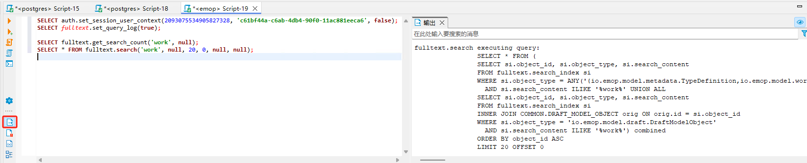

# 全文检索(Fulltext Search)

## 概述

EMOP 平台提供了强大的全文检索功能，支持跨多种业务对象的文本搜索、搜索高亮显示以及智能搜索建议。本文介绍如何使用全文检索功能以及如何为您的业务对象启用全文索引。

## 核心概念

### 1. 全文索引字段

全文检索通过标记特定字段来实现，这些字段会被索引用于文本搜索。

### 2. 搜索建议

系统会根据索引内容自动提供智能搜索建议，帮助用户快速找到所需内容。

## 启用全文检索

### 1. 使用注解标记字段

在Java模型类中，使用`@FullTextSearchField`注解标记需要全文检索的字段：

```java
public class Document extends AbstractModelObject {
    @QuerySqlField
    @FullTextSearchField
    private String title;
    
    @QuerySqlField
    @FullTextSearchField
    private String content;
    
    @QuerySqlField
    @FullTextSearchField
    private String summary;
}
```
### 2. 使用DSL定义全文检索字段

也可以通过DSL来定义全文检索字段：

```javascript
create type sample.Document extends AbstractModelObject {
    // 定义全文检索字段，带权重
    fullTextSearchFields: [
        title,
        content,
        summary
    ]
}
```

### 3. 预置全文检索字段

平台内置的`AbstractModelObject`已经预先设置了常用字段的全文检索能力：

```java
@FullTextSearchField  // 名称字段
private String name;

@FullTextSearchField  // 描述字段
private String description;
```

`BusinessCodeTrait`也已经配置了高权重的编码字段：

```java
@FullTextSearchField// 编码字段
private String code;
```

## 使用全文检索


### 1. 使用API进行搜索

使用`FullTextSearchService`服务进行搜索：

```java
// 获取搜索服务
FullTextSearchService searchService = S.service(FullTextSearchService.class);

// 执行基本搜索
FullTextSearchService.SearchResult results = searchService.search("发动机设计", Pagination.of(0, 20));

// 执行带聚合的搜索
FullTextSearchService.SearchResult resultsWithAgg = searchService.search(
"发动机设计",
null,           // 过滤器
true,           // 启用聚合
Pagination.of(0, 20)
);

// 获取搜索建议
List<String> suggestions = searchService.getSuggestions("发动机", 5);

// 立刻同步索引
searchService.syncImmidiately();
```

### 2. 使用Q语法糖进行搜索

EMOP提供了方便的`Q`语法糖进行全文检索：

```java
// 执行全文检索
FullTextSearchService.SearchResult results = 
    Q.fullTextSearch("发动机设计").search();

// 获取搜索建议
List<String> suggestions = 
    Q.fullTextSearch("发动").maxSuggestions(10).suggestions();
```

### 3. 处理搜索结果

```java
// 遍历搜索结果
for (FullTextSearchService.SearchResultItem item : results.getItems()) {
    // 获取对象类型
    String objectType = item.getObjectType();
    
    // 获取原始模型对象
    ModelObject obj = item.retrieveModelObject();
    
    // 获取高亮字段（带有HTML标记的高亮文本）
    Map<String, List<String>> highlights = item.getHighlights();
    
    // 处理高亮内容
    if (highlights.containsKey("content")) {
        for (String snippet : highlights.get("content")) {
            System.out.println("高亮片段: " + snippet);
        }
    }
    
    // 处理不同类型的对象
    if (obj instanceof Document) {
        Document doc = (Document) obj;
        System.out.println("找到文档: " + doc.getTitle());
    } else if (obj instanceof ItemRevision) {
        ItemRevision rev = (ItemRevision) obj;
        System.out.println("找到零件: " + rev.getCode());
    }
}

// 获取搜索结果总数
long totalHits = results.getTotalHits();

// 处理聚合结果
if (results.getAggregations() != null) {
    Map<String, Map<String, Long>> aggregations = results.getAggregations();
    Map<String, Long> objectTypeAgg = aggregations.get("_objectType");
    
    for (Map.Entry<String, Long> entry : objectTypeAgg.entrySet()) {
        System.out.println("对象类型: " + entry.getKey() + ", 数量: " + entry.getValue());
    }
}
```

### 4. 高级过滤和分页

```java
// 使用过滤器
Map<String, Object> filters = new HashMap<>();
filters.put("_objectType", Arrays.asList(
    "io.emop.model.common.ItemRevision",
    "io.emop.model.common.Document"
));

// 使用排序
List<Pagination.Sort> sorts = Arrays.asList(
    new Pagination.Sort("id", Pagination.Sort.Direction.DESC)
);
Pagination pagination = new Pagination(20, 0, sorts);

// 执行高级搜索
FullTextSearchService.SearchResult results = searchService.search(
    "设计图纸", 
    filters, 
    true, 
    pagination
);
```
### 5. 权限过滤
针对配置了权限的对象，全文检索在关键字匹配的基础上，默认会应用RLS进行进一步的过滤。

### 6. 增量索引更新
数据更新后至多`5秒`可通过全文检索进行搜索，针对部分高实时性要求的场景，在代码中直接调用`searchService.syncImmediately();`进行立即同步。
默认系统会自动监听对象的创建、更新和删除操作，通过触发器将变更记录到同步任务表，后台定时任务（每5秒）处理这些任务，实时更新全文索引。

### 7. 索引优化
- **GIN索引**：使用PostgreSQL的`GIN`索引，优化文本搜索性能，如果遭遇性能问题，建议重建`fulltext.search_index`相关索引。

### 8. 为什么采用pg_bigm插件而不是Elasticsearch等专用数据库
- **简单**：运维成本低，没有那么多组件
- **时效**：时效性更高，同一数据库
- **数据一致性**：同一数据库，数据库一致性更高，发生问题的概率更低
- **性能**：查询性能没有Elasticsearch高但是也不会差很多，数据同步性能会更高
- **权限**：能与现在的OLTP数据打通，这样在权限过滤时更简单可高和性能更好

## 全文检索调试指南

### 1. 开启查询日志

当需要调试搜索性能或查看实际执行的SQL时，可以开启查询日志：

```sql
-- 开启查询日志
SELECT fulltext.set_query_log(true);

-- 查看当前日志状态
SELECT fulltext.get_query_log_status();

-- 关闭查询日志
SELECT fulltext.set_query_log(false);
```

### 2. 调试搜索查询

开启日志后，执行搜索会在PostgreSQL日志中输出详细的执行SQL：

```sql
-- 设置用户会话上下文（模拟登录用户, 这个可以从 server 的 DEBUG 控制台获取）
SELECT auth.set_session_user_context(2093075534905827328, 'c61bf44a-c6ab-4db4-90f0-11ac881eeca6', false);

-- 执行搜索计数（查看匹配的记录总数）
SELECT fulltext.get_search_count('work', null);

-- 执行实际搜索
SELECT * FROM fulltext.search('work', null, 20, 0, null, null);
```

**SQL输出示例：**
```
fulltext.search executing query: 
                SELECT * FROM (
                SELECT si.object_id, si.object_type, si.search_content
                FROM fulltext.search_index si
                WHERE si.object_type = ANY('{io.emop.model.metadata.TypeDefinition,io.emop.model.workflow.UserTask,io.emop.model.aduit.AuditRecord,io.emop.integrationtest.domain.FactoryEntity,io.emop.model.material.Material,io.emop.model.common.ItemRevision,io.emop.model.classification.ClassificationHierarchy,io.emop.model.common.GenericModelObject,io.emop.model.common.CodeSequence,io.emop.model.relation.Relation,io.emop.model.classification.ClassificationNode,io.emop.model.metadata.ValueDomainData,io.emop.model.metadata.DataSourceDefinition,io.emop.integrationtest.domain.SampleDocument,io.emop.integrationtest.domain.SampleMaterial,io.emop.integrationtest.domain.SampleFolder,io.emop.model.document.Folder,workflow.BpmnTemplate,io.emop.integrationtest.domain.SampleTask,material.HanslaserMaterial,io.emop.integrationtest.domain.SampleDataset,io.emop.integrationtest.domain.UserLocationEntity,io.emop.integrationtest.domain.SampleMaterialReference,io.emop.model.bom.BomTransformRecord,io.emop.model.bom.BomLine,io.emop.model.auth.Role,io.emop.model.auth.UserPermissions,io.emop.model.auth.User,io.emop.model.auth.Group,io.emop.model.document.File,io.emop.model.document.Document,io.emop.integrationtest.domain.SampleDepartment,io.emop.model.bom.BomView,io.emop.model.cad.CADComponent,workflow.DmnTemplate,workflow.FormTemplate,workflow.WorkflowTemplate,common.Position,material.AircraftProduct,bom.AircraftBomLine,material.AircraftMaterial,common.Station}')
                  AND si.search_content ILIKE '%work%' UNION ALL 
                SELECT si.object_id, si.object_type, si.search_content
                FROM fulltext.search_index si
                INNER JOIN COMMON.DRAFT_MODEL_OBJECT orig ON orig.id = si.object_id
                WHERE si.object_type = 'io.emop.model.draft.DraftModelObject'
                  AND si.search_content ILIKE '%work%') combined
                ORDER BY object_id ASC
                LIMIT 20 OFFSET 0
```
**DBeaver GUI:**
[](../images/db_output.png)

### 3. 检查RLS权限状态

查看哪些对象类型启用了行级安全（RLS）：

```sql
-- 查看所有类型的RLS状态
SELECT * FROM fulltext.get_rls_status() 
ORDER BY has_rls DESC, index_count DESC;
```

**输出说明：**
- `has_rls`: 是否启用了行级安全
- `index_count`: 该类型在索引中的记录数
- `table_schema`、`table_name`: 对应的数据表信息

### 4. 监控索引同步状态

```sql
-- 查看待同步的任务
SELECT * FROM fulltext.sync_task 
WHERE status = 'PENDING' 
ORDER BY created_time DESC;

-- 查看同步任务处理历史
SELECT * FROM fulltext.sync_task 
WHERE created_time > NOW() - INTERVAL '1 hour'
ORDER BY created_time DESC;

-- 手动触发索引同步
SELECT fulltext.process_sync_tasks();
```

### 5. 性能分析

```sql
-- 分析慢查询（开启查询日志后）
SELECT fulltext.set_query_log(true);

-- 执行查询并记录时间
\timing on
SELECT COUNT(*) FROM fulltext.search('复杂查询关键词', null, 100, 0, null, null);
\timing off

-- 检查索引使用情况
EXPLAIN (ANALYZE, BUFFERS) 
SELECT * FROM fulltext.search_index 
WHERE search_content ILIKE '%关键词%';
```

### 6. 常见问题调试

#### 问题1：搜索结果为空
```sql
-- 检查索引是否存在数据
SELECT object_type, COUNT(*) 
FROM fulltext.search_index 
GROUP BY object_type 
ORDER BY COUNT(*) DESC;

-- 检查特定类型的索引内容
SELECT object_id, object_type, LEFT(search_content, 100) as content_preview
FROM fulltext.search_index 
WHERE object_type = 'your.object.Type'
LIMIT 10;
```

#### 问题2：权限过滤结果不正确
```sql
-- 检查当前用户会话
SELECT auth.get_current_user_id(), auth.get_current_session_id();

-- 检查RLS策略是否正确应用
SELECT * FROM fulltext.get_rls_status() 
WHERE object_type = 'your.object.Type';

-- 直接测试原表的RLS
SELECT COUNT(*) FROM your_schema.your_table;
```

#### 问题3：索引更新不及时
```sql
-- 检查触发器是否正常工作
SELECT * FROM fulltext.sync_task 
WHERE object_type = 'your.object.Type'
AND created_time > NOW() - INTERVAL '10 minutes'
ORDER BY created_time DESC;

-- 手动重建特定类型的索引
SELECT fulltext.rebuild_index_for_type('your.object.Type');
```
