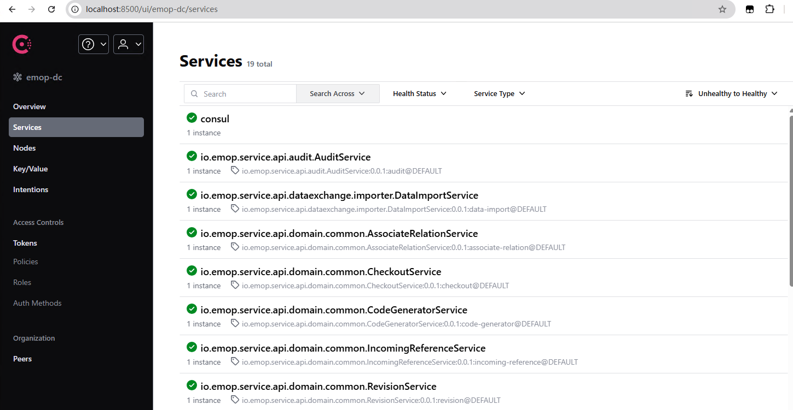

# EMOP业务开发环境配置

EMOP是一个基于微服务架构的企业级业务平台，集成了PLM等核心业务功能。本文档将指导你完成开发环境的搭建，包括

两个核心服务及必须的中间件服务：

-  EMOP Server：提供平台运行时(含插件)环境和分布式存储能力
- PLM服务：提供产品全生命周期管理的核心业务功能
- 中间件服务: 对象存储、缓存、图数据库、登录、全文检索、文档预览等

两个可选服务:

- 基础服务(foundation)：用户管理、权限管理、流程服务
- 数据集成服务(datahub)：平台及业务域数据集成(同步、质量控制、清洗)服务

## 环境要求

- JDK 17+
- Maven 3.8+
- Node.js 21.0.0+
- Docker及Docker-compose环境，Windows环境下推荐使用Docker Desktop

## EMOP DNS 路由规则说明

**重要提示**：EMOP 系统的很多路由都依赖 DNS 域名解析来实现服务发现和访问。

### DNS 域名构成规则

EMOP 服务的域名遵循以下规则：

```
{service-name}-{environment}.emop.{customer-domain}
```

**规则说明**：
- `service-name`：服务名称（如：server、plm、foundation、datahub等）
- `environment`：环境名称（如：dev、test、preprod、prod等）
- `emop`：固定的产品标识
- `customer-domain`：客户域名

### 域名示例

以开发环境为例，常见的服务域名包括：

```bash
# 核心服务
server-dev.emop.emopdata.com          # EMOP Server服务
plm-dev.emop.emopdata.com             # PLM业务服务
foundation-dev.emop.emopdata.com      # 基础服务

# 数据库服务
emop-db-master-dev.emop.emopdata.com  # 主数据库
emop-db-slave1-dev.emop.emopdata.com  # 从数据库1
emop-db-slave2-dev.emop.emopdata.com  # 从数据库2

# 中间件服务
keycloak-dev.emop.emopdata.com        # 认证服务
storage-dev.emop.emopdata.com         # 对象存储
cache-dev.emop.emopdata.com           # 缓存服务
```

### 客户域名配置

**默认域名**：`emopdata.com`

**自定义域名**：如需使用其他域名（如 `example.com`），需要进行以下配置：

1. **修改 Docker 环境变量，包含除服务名以外的所有信息**：
   ```bash
   # 编辑 docker/.env 文件
   EMOP_DOMAIN=dev.emop.example.com
   ```

2. **设置全局环境变量，包含除服务名以外的所有信息**：
   ```bash
   export EMOP_DOMAIN=dev.emop.example.com
   ```

3. **修改应用配置，包含除服务名以外的所有信息**：
   ```yaml
   # 在相关的 application.yml 中配置
   EMOP_DOMAIN: dev.emop.example.com
   ```

4. **更新 hosts 文件或内网DNS配置**：
   ```bash
   # 将所有 emopdata.com 替换为 example.com
   127.0.0.1 server-dev.emop.example.com
   127.0.0.1 plm-dev.emop.example.com
   # ... 其他服务域名
   ```
5. **SSL证书**：
   
   EMOP建议使用`HTTPS`对外提供Web服务，因此客户需要提供对应的泛域名证书，例如 `*.emop.example.com`
   默认提供 `*.emop.emopdata.com` 证书，但是3个月需要置换一次

### 注意事项

- 域名配置必须在所有相关配置文件中保持一致
- 修改域名后需要重启相关服务
- 确保 DNS 解析或 hosts 文件配置正确
- 生产环境建议使用真实的 DNS 解析而非 hosts 文件

## 后端环境

### 1. 获取代码
```bash
git clone git@codeup.aliyun.com:6340e441d4fad3d161e94890/emop3.git
cd emop3
```

### 2. Maven配置
Maven构建后的制品都发布在云效中，在 settings.xml 中添加私服配置，下面是一个完整的配置，需要申请对应的制品仓库的权限，替换其中的`your-username`和`your-password`。

注意该账号并不是您的阿里云控制台登录账号，而是对应的制品仓库中的账号，在[这里](https://packages.aliyun.com/system-settings)获取并确认能访问`repo-emop3`仓库。
```xml
<?xml version="1.0" encoding="UTF-8"?>
<settings xmlns="http://maven.apache.org/SETTINGS/1.0.0"
          xmlns:xsi="http://www.w3.org/2001/XMLSchema-instance"
          xsi:schemaLocation="http://maven.apache.org/SETTINGS/1.0.0 http://maven.apache.org/xsd/settings-1.0.0.xsd">
    <mirrors>
        <mirror>
            <id>mirror</id>
            <mirrorOf>central,jcenter,!emop3-releases,!emop3-snapshots</mirrorOf>
            <name>mirror</name>
            <url>https://maven.aliyun.com/nexus/content/groups/public</url>
        </mirror>
    </mirrors>
    <servers>
        <server>
            <id>repo-emop3</id>
            <username>your-username</username>
            <password>your-password</password>
        </server>
    </servers>
    <profiles>
        <profile>
            <id>emop3</id>
            <properties>
                <repo.emop3.release.url>https://packages.aliyun.com/6340e441d4fad3d161e94890/maven/repo-emop3</repo.emop3.release.url>
                <repo.emop3.snapshot.url>https://packages.aliyun.com/6340e441d4fad3d161e94890/maven/repo-emop3</repo.emop3.snapshot.url>
            </properties>
            <repositories>
                <repository>
                    <id>repo-emop3</id>
                    <url>https://packages.aliyun.com/6340e441d4fad3d161e94890/maven/repo-emop3</url>
                    <releases>
                        <enabled>true</enabled>
                    </releases>
                    <snapshots>
                        <enabled>true</enabled>
                    </snapshots>
                </repository>
                <repository>
                    <id>central</id>
                    <url>https://maven.aliyun.com/nexus/content/groups/public</url>
                    <releases>
                        <enabled>true</enabled>
                    </releases>
                    <snapshots>
                        <enabled>false</enabled>
                    </snapshots>
                </repository>
            </repositories>
            <pluginRepositories>
                <pluginRepository>
                    <id>central</id>
                    <url>https://maven.aliyun.com/nexus/content/groups/public</url>
                    <releases>
                        <enabled>true</enabled>
                    </releases>
                    <snapshots>
                        <enabled>false</enabled>
                    </snapshots>
                </pluginRepository>
            </pluginRepositories>
        </profile>
    </profiles>
    <activeProfiles>
        <activeProfile>emop3</activeProfile>
    </activeProfiles>
</settings>
```

### 3. 编译项目
```bash
# 编译平台核心
cd emop-server
mvn clean install

# 编译业务服务
cd ../applications
mvn clean install -DskipTests

# 编译基础服务项目(可选)
cd emop-foundation
mvn clean install -DskipTests

# 编译datahub服务(可选)
cd emop-datahub
mvn clean install
```

### 4. 数据库集群配置与启动

在启动后端服务之前，需要首先配置和启动PostgreSQL数据库集群，因为所有后端服务都依赖数据库。

#### 登录镜像仓库
```bash
# docker登录
$ sudo docker login --username=eingsoft2017 registry.cn-shenzhen.aliyuncs.com
```
::: warning ⚠️注意
docker版本要大于`27`, 如果操作系统自带版本太低建议卸载后从新安装

`sudo apt install docker.io`
```
beam@beam-Latitude-7400:~$ docker -v
Docker version 27.5.1, build 27.5.1-0ubuntu3~22.04.2
beam@beam-Latitude-7400:~$ docker version
Client:
 Version:           27.5.1
 API version:       1.47
...
Server:
 Engine:
  Version:          27.5.1
  API version:      1.47 (minimum version 1.24)
  Go version:       go1.22.2
```
  :::

::: warning ⚠️注意
- docker登录密码 `emop@2025`, 密码会不定期更新
- 命令行`sudo`有可能需要先输入操作系统的`root`或`Administrator`密码, 不要与 docker 的登录密码混淆了
  :::

::: warning ⚠️注意
- 由于环境差异性比较大，要求针对每个跑完的 docker-compose， 都要检查对应的 log， 确认控制台没有错误
- 一些典型的问题：
  - wsl情况下，对应的 docker 目录下 .sh 文件为windows格式，需要使用命令行工具或IDE转为linux的格式，命令行工具可以使用`dos2unix`命令行或`Editplus`GUI工具。
  - 完全linux情况下， .sh 文件没有 execute 的权限
  - 完全linux情况下， 针对低端口的监听会需要权限，如果不使用`sudo`，也可以临时将权限放开`sudo sysctl net.ipv4.ip_unprivileged_port_start=0`
  :::

#### Docker网络配置

首先，确保创建EMOP服务网络：

```bash
docker network create emop-network
```

#### 配置本地hosts域名解析

为简化服务访问和灵活切换服务指向，配置本地hosts文件：

```
# 核心应用服务映射（根据实际部署位置调整IP）
127.0.0.1 server-dev.emop.emopdata.com
127.0.0.1 frontend-dev.emop.emopdata.com
127.0.0.1 foundation-dev.emop.emopdata.com
127.0.0.1 plm-dev.emop.emopdata.com
127.0.0.1 datahub-dev.emop.emopdata.com
127.0.0.1 cad-integration-dev.emop.emopdata.com

# 基础服务域名映射
127.0.0.1 dev.emop.emopdata.com
127.0.0.1 graph-dev.emop.emopdata.com
127.0.0.1 fulltext-dev.emop.emopdata.com
127.0.0.1 storage-dev.emop.emopdata.com
127.0.0.1 minioproxy-dev.emop.emopdata.com
127.0.0.1 keycloak-dev.emop.emopdata.com
127.0.0.1 documentserver-dev.emop.emopdata.com
127.0.0.1 kafka-dev.emop.emopdata.com
127.0.0.1 camunda-zeebe-dev.emop.emopdata.com
127.0.0.1 camunda-operate-dev.emop.emopdata.com
127.0.0.1 cache-dev.emop.emopdata.com
127.0.0.1 registry-dev.emop.emopdata.com
127.0.0.1 datahub-db-dev.emop.emopdata.com
127.0.0.1 keycloak-proxy-dev.emop.emopdata.com

# 数据库集群域名映射
127.0.0.1 emop-db-master-dev.emop.emopdata.com
127.0.0.1 emop-db-slave1-dev.emop.emopdata.com
127.0.0.1 emop-db-slave2-dev.emop.emopdata.com
```

> **注意**：多机开发时，请将IP地址替换为实际服务所在的机器IP

#### 启动数据库集群

PostgreSQL数据库集群是系统运行的基础，需要首先启动：

```bash
cd emop3/docker
docker-compose -f docker-compose-database.yml up -d
```

数据库集群包含：
- **主库(emop-db-master)**：监听端口5432，负责读写操作
- **从库1(emop-db-slave1)**：监听端口5431，负责读操作
- **从库2(emop-db-slave2)**：监听端口5430，负责读操作

> **说明**：数据库集群启动后，可通过以下连接信息访问：
> - 主库：`jdbc:postgresql://emop-db-master-dev.emop.emopdata.com:5432/emop`
> - 用户名/密码：`emop/EmopIs2Fun!`

:::warning 🔔提醒
- 初始化数据库集群时，主节点会初始化配置后重启，会导致从库也会停止服务，如果docker里面显示从库没有自动运行，可以手工启动一下从库的容器。
- 如果在windows环境下，docker启动报类似`/docker-entrypoint-initdb.d/init-slave.sh: cannot execute: required file not found` 错误，那是因为shell的换行符是windows格式的，需要使用命令行工具或IDE转为linux的格式，命令行工具可以使用`dos2unix`命令行或`Editplus`GUI工具。
:::

### 5. 中间件与网关服务配置

在数据库集群启动完成后，再启动必要的中间件服务，因为后端服务依赖这些中间件。

#### 启动网关服务（Kong）

Kong网关是必需的服务，用于路由请求到各个微服务：

```bash
cd emop3/docker
docker-compose -f docker-compose-gateway-dev.yml up -d
```

网关服务会监听本地的80和443端口，提供HTTP和HTTPS访问。

#### 启动认证服务（Auth/Keycloak）

认证服务负责用户登录验证，是系统运行的必要组件：

```bash
cd emop3/docker
docker-compose -f docker-compose-auth.yml up -d
```

> **说明**：认证服务启动后可通过 http://keycloak-dev.emop.emopdata.com:9180/auth 访问管理界面。

#### 启动中间件服务

中间件包含Redis、MinIO、OnlyOffice等服务，部分EMOP功能依赖这些服务。

```bash
cd emop3/docker
docker-compose -f docker-compose-middleware.yml up -d
```

> **提示**：如果资源受限，可选择性启动部分服务，但可能导致某些功能不可用。

:::warning 🔔提醒
流程引擎 zeebe 所在的 docker (camunda-zeebe) 需要能与 foundation 服务相互访问，因为流程模板中的一些逻辑需要 serialize 到 foundation 服务中执行.
:::

### 6. 启动后端服务

在数据库集群、中间件服务启动完成后，再启动后端应用服务。

#### 启动EMOP Server（插件开发）

针对Linux 及 Mac 环境下启动脚本请自行使用AI工具翻译
```bash
cd applications/server-plugins
./startEMOPServer.bat
```
启动脚本`startEMOPServer.bat`说明：

-   启动脚本会将`emop3/applications/server-plugin/target/classes`及`emop3/applications/server-plugin-api/target/classes`两个目录下的class文件加入classpath，在IDE中修改源代码后，使用脚本重启服务即可。注意暂时不支持`springboot dev tool`的热加载，遇到class版本的问题，后续会考虑加入`hotswap`
-  Remote Debug 配置说明：
    -   脚本默认开启了远程调试，监听端口为 5001
    -   在 IDE 中配置 Remote JVM Debug：
        -   IDEA: Run -> Edit Configurations -> + -> Remote JVM Debug
        -   配置 Host: `localhost`, Port: `5001`
        -   使用 IDE 的 Debug 按钮连接即可开始调试
    -   如需修改调试端口，请修改脚本中的 `JAVA_OPTS` 参数：
        ```
        -agentlib:jdwp=transport=dt_socket,server=y,suspend=n,address=*:5001
        ```
-   开发环境配置默认即可，通常无需修改

:::warning 🔔启动性能
EMOP Server启动的时候会从java class定义映射到元数据，然后再将元数据映射到数据库schema，因此启动过程比较长，第一次启动完成后，初始化了对应的数据库的schema后，可以修改`startEMOPServer.bat`中的以下三个启动参数为true，以加快启动速度：
- skipClass2MetadataSyncChecking：跳过class定义到元数据的映射
- skipMetadata2TableSyncChecking：跳过元数据到数据库的映射
- skipMetadataSelfChecking：跳过元数据定义自检查

当修改了 plugin 中的存储class定义，可以把上面几个参数设置为`false`，重启后自动更新对应的元数据和表结构。
:::
#### IDE中启动`plm`服务
-   使用IDE加载 `emop3/applications` maven 项目
-   IntelliJ IDEA:
    -   项目加载后可以在 Run/Debug Configurations 中看到两个启动项：
        1.  `EmopPLMStarter` - PLM 服务主启动类
        2.  `PluginIntegrationTest` - 插件集成测试启动类
    -   选择 `EmopPLMStarter` 启动配置
    -   主类是`applications/plm/plm-starter`项目下`io.emop.plm.EmopPLMStarter`

#### IDE中运行集成测试
`server-plugin-integration-test` 用于进行插件的集成测试，集成测试依赖EMOP Server的启动。

:::warning 🔔提醒
所有plugin所有plugin service都应该有对应的集成测试用于保证领域模型及API的质量及稳定性，因为会放到EMOPService中运行
:::

-   位置：`emop3/applications/server-plugins/plugin-integration-test`
-   主要功能：
    -   提供插件开发的测试环境
    -   包含常用的测试用例和工具类
    -   支持模拟 PLM 服务的各种场景

#### 启动EMOP基础服务（按需启动）
如果涉及用户管理、流程等基础服务，需要启动foundation服务。注意这个服务依赖前面启动的中间件服务及EMOP Server服务。

```bash
cd emop-foundation/foundation-starter
./startFundationServer.bat
```

### 7. 验证服务

启动成功后可访问：

- [EMOP Server Swagger Doc](http://localhost:870/webconsole/api)
- [PLM Swagger Doc](http://localhost:890/plm/api)
- [基础服务 Swagger Doc](http://localhost:880/foundation/api)

启动成功后可通过注册中心consul查看emop server提供的核心的 rpc 服务列表：

http://localhost:8500/

[](../images/business/core-services.png)

### 8. 环境数据初始化
该项目会初始化生产环境数据及部分内置测试数据，可重复跑。
```bash
cd emop-server/starter/emop-server-starter/emop-server-setup
java -jar target/emop-server-setup-0.0.1-SNAPSHOT.jar
```

### 9. 浏览器访问
完成后端环境配置后，可通过Kong网关访问：
```bash
https://emop.emopdata.com

// 测试登录账号： demo/123456
```

## 前端环境

### 1. 依赖安装

从项目结构可以看到，前端相关目录位于 `emop3/web` 文件夹下，包含以下子项目：

-   platform：基础平台
-   platform-ai：AI 相关功能(可暂时跳过)
-   plm：PLM 业务模块

需要分别在三个子项目中安装依赖：

```
# 安装公共依赖 
cd web
npm  install

# 安装 platform 依赖 
cd packages/platform
npm  install

# 安装 platform-ai 依赖, 暂时可跳过
cd  ../platform-ai 
npm  install   

# 安装 plm 依赖 
cd  ../plm 
npm  install
```

### 2. 启动开发服务器

在 `emop3/web/packages/plm` 项目目录下启动开发服务器：

```
npm run dev
```

### 3. 访问应用

-   开发服务器默认运行在 `http://localhost:5173/web`
-   组件预览页面：`http://localhost:5173/web/test`

正常是需要登录的，可以继续往后，把中间件等内容安装完毕后通过 `http://dev.emop.emopdata.com` 页面进行登录

### 4. 开发提示

-   项目使用 TypeScript 开发
-   使用 Vite 作为构建工具和开发服务器
-   Element Plus组件作为基础UI库
-   组件库展示页面提供了可用的组件预览
-   `.env.development` 开发环境变量配置

请确保后端服务（EMOP Server 和 PLM 服务）已经启动，以便前端能够正常调用 API。

## 其他

### 1. 服务路由优先级策略

当多个环境中存在相同服务时，访问优先级如下：
1. 容器内部网络访问（服务间通信首选）
2. 本地hosts文件映射的服务地址

**排查路由问题**：

如遇服务访问问题，可通过以下方式排查：

```bash
# 查看Kong网关日志
docker logs kong-dev

# 检查服务可达性
curl -v http://server-dev.emop.emopdata.com:870/webconsole/public/health
```

### 2. 开发环境整体架构

```
+----------------------+     +-------------------+
|    开发者浏览器      |     |  开发者IDE        |
+----------+-----------+     +--------+----------+
           |                          ^
           v                          v
+----------+--------------------------+----------+
|                  Kong网关                      |
+----+---------------+---------------+----------+
     |               |               |
     v               v               v
+----+-----+  +------+----+  +-------+----+
| 前端服务  |  | EMOP Server|  | Auth服务   |
+----+-----+  +------+----+  +------------+
     ^               ^
     v               v
+----+---------------+----+
|    中间件服务集群       |
| (Document Server, Redis, MinIO等)   |
+------------------------+
     ^
     v
+----+---------------+----+
|    PostgreSQL集群      |
| (主库 + 2个从库)        |
+------------------------+
```

### 3. 环境初步验证
具体自动化验证脚本暂时忽略，如果您能正常登录EMOP，则证明您的开发环境已经搭建完成，按需使用您习惯的IDE进行开发即可。

### 4. GUI工具
- 如果使用Docker Desktop，可以通过Docker Desktop的GUI来进行服务管理
- 通过 middleware 中的 `portainer` web console查看， https://localhost:9443/ 初次登录会要求输入密码，有可能初次初始化化后需要重启一下容器，看容器日志。

### 5. 数据库连接问题

- 检查数据库容器状态：`docker ps -a | grep emop-db`
- 检查数据库连接：`docker exec -it emop-db-master psql -U emop -d emop -c "SELECT version();"`
- 查看数据库日志：`docker logs emop-db-master`
- 测试从库连接：`docker exec -it emop-db-slave1 psql -U emop -d emop -c "SELECT pg_is_in_recovery();"`

### 6. 服务无法访问

- 检查容器状态：`docker ps -a`
- 检查服务健康状态：访问服务的health端点
- 检查网关路由：`curl -v -H "Host: dev.emop.emopdata.com" localhost/webconsole/public/health`
- 检查hosts文件配置是否正确

### 7. 服务间无法通信

- 验证Docker网络：`docker network inspect emop-network`
- 检查服务容器是否加入emop-network
- 测试服务间连通性：`docker exec -it emop-server ping keycloak-dev.emop.emopdata.com`
- 测试数据库连通性：`docker exec -it emop-server ping emop-db-master-dev.emop.emopdata.com`