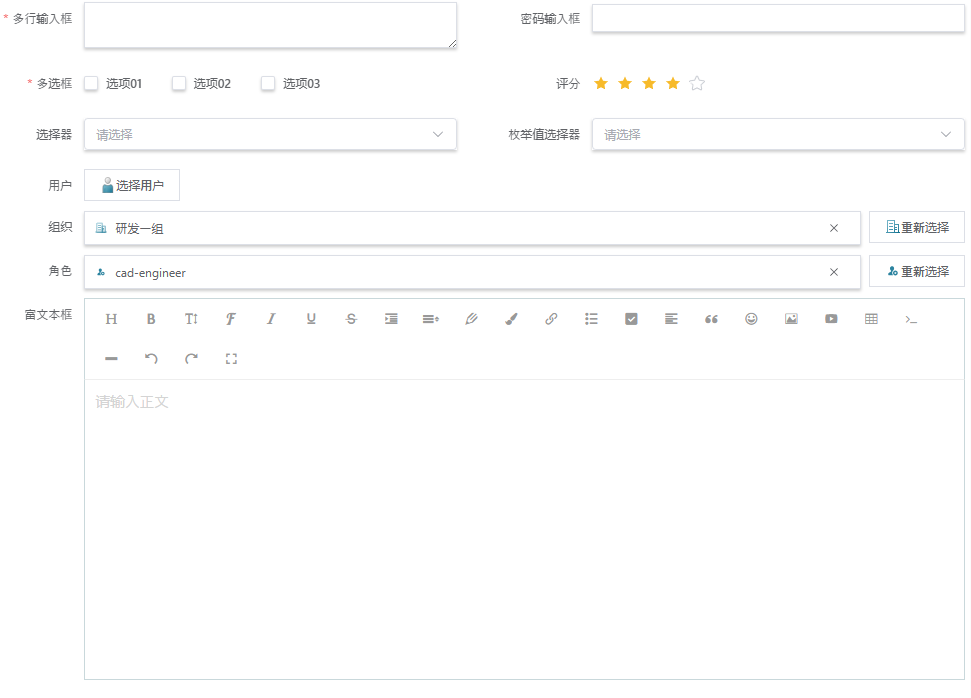
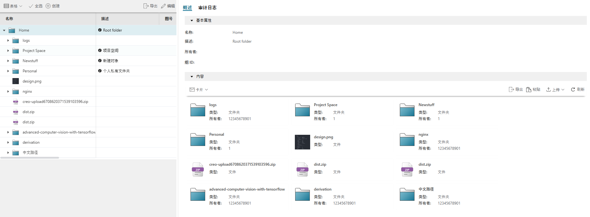
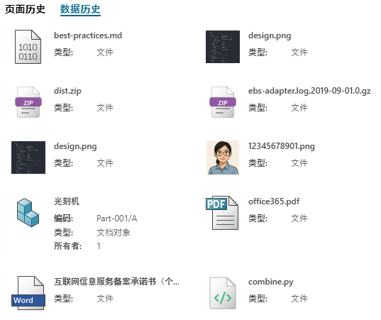

# EMOP 前端渲染定义

## 1. 概述

EMOP前端渲染系统是一个基于约定的自动渲染框架，用于为不同类型的业务对象提供各种渲染方式。系统支持表单、详情、卡片、预览等多种渲染类型，并能自动处理对象类型的继承关系。

**核心设计原则：**
- 约定优于配置
- 自动处理继承关系
- 渐进增强（从默认到完全自定义）
- 低维护成本

## 2. 渲染类型

系统默认支持以下渲染类型：

| 渲染类型 | 描述 | 常见用途 |
|---------|------|---------|
| form | 对象编辑表单 | 创建/编辑对象属性 |
| detail | 对象详情页面 | 查看对象完整信息 |
| card | 对象卡片视图 | 在列表中显示对象 |

### 2.1 Form渲染
示例如下：
[](./images/form-view.png)

### 2.2 Detail渲染
图示页面的右侧：
[](./images/detail-view.png)

### 2.3 Card渲染
示例如下：
[](./images/card-view.png)


## 3. 文件命名与位置约定

### 3.1 Vue组件

Vue组件用于完全自定义渲染方式，遵循以下命名约定：

```
/src/renderers/{path}/{TypeName}.{renderType}.vue
```

其中 `{path}` 可以是以下三个值之一：
- `platform`: 平台核心组件
- `plm`: PLM应用组件
- `custom`: 客户自定义组件

**例如：**
- `/src/renderers/platform/SimpleModelObject.form.vue` - 平台基类表单
- `/src/renderers/plm/BomLine.card.vue` - PLM BOM行卡片
- `/src/renderers/custom/CustomDocument.detail.vue` - 客户自定义文档详情

### 3.2 Form-Create JSON配置

使用form-create的JSON配置存储在Minio中, 该JSON由Form页面设计器进行设计或者AI自动生成：

```
/storage/public/forms/{TypeName}.form.json
```

**例如：**
- `/storage/public/forms/ItemRevision.form.json`

## 4. 渲染器解析机制

系统会按照以下顺序查找并使用渲染器：

1. 查找当前对象类型的匹配Vue组件
2. 查找当前对象类型的匹配JSON配置
3. 使用TypeDefinition获取父类型，重复步骤1-2

```
类型继承示例：PdfDocument -> Document -> AbstractModelObject
查找顺序：
1. PdfDocument特定渲染器
2. Document渲染器
3. AbstractModelObject渲染器(平台初始化时设置)
```

## 5. 实现指南

### 5.1 创建表单渲染器

#### 方法A：使用Form-Create JSON（推荐）

1. 创建JSON配置文件：
   ```
   /storage/public/forms/PdfDocument.form.json
   ```

2. 配置文件内容示例，可以由设计器自动生成：
   ```json
   [
     {"type":"input", "field":"title", "title":"文档标题"},
     {"type":"input", "field":"author", "title":"作者"},
     {"type":"upload", "field":"pdfFile", "title":"PDF文件"}
   ]
   ```

#### 方法B：使用Vue组件

1. 创建Vue组件：
   ```
   /src/renderers/plm/PdfDocument.form.vue
   ```

2. 组件内容示例：
   ```vue
   <template>
     <div class="pdf-document-form">
       <el-form :model="formData" label-width="120px">
         <el-form-item label="文档标题">
           <el-input v-model="formData.title" />
         </el-form-item>
         <el-form-item label="作者">
           <el-input v-model="formData.author" />
         </el-form-item>
         <el-form-item label="PDF文件">
           <el-upload {...pdf-upload-props} />
         </el-form-item>
       </el-form>
     </div>
   </template>

   <script>
   export default {
     props: {
       modelObject: Object
     },
     data() {
       return {
         formData: { ...this.modelObject }
       };
     }
   }
   </script>
   ```

### 5.2 创建详情渲染器

创建Vue组件：
```
/src/renderers/plm/Document.detail.vue
```

```vue
<template>
  <div class="document-detail">
    <el-descriptions title="文档信息" border>
      <el-descriptions-item label="标题">{{ modelObject.title }}</el-descriptions-item>
      <el-descriptions-item label="作者">{{ modelObject.author }}</el-descriptions-item>
      <el-descriptions-item label="创建日期">
        {{ formatDate(modelObject.createDate) }}
      </el-descriptions-item>
    </el-descriptions>

    <div class="document-content">
      <h3>内容</h3>
      <p>{{ modelObject.content }}</p>
    </div>
  </div>
</template>
```

### 5.3 创建卡片渲染器

创建Vue组件：
```
/src/renderers/plm/Document.card.vue
```

```vue
<template>
  <el-card class="document-card">
    <template #header>
      <div class="card-header">
        <span>{{ modelObject.title }}</span>
        <el-tag size="small">{{ modelObject.status }}</el-tag>
      </div>
    </template>
    <div class="card-body">
      <p class="update-info">
        更新于: {{ formatDate(modelObject.updateDate) }}
      </p>
    </div>
  </el-card>
</template>
```

## 6. 扩展渲染类型

添加新的渲染类型很简单，只需遵循命名约定并创建相应的渲染器：

### 例：添加"timeline"渲染类型

1. 创建默认渲染器：
   ```
   /src/renderers/common/AbstractModelObject.timeline.vue
   ```

2. 在应用中使用：
   ```vue
   <emop-renderer
     :modelObject="document"
     render-type="timeline"
   />
   ```

## 7. 开发工具与调试

系统提供以下开发工具帮助理解和调试渲染过程：

### 7.1 继承树可视化工具

使用全局 `RenderDebug` 对象查看继承链和可用渲染器：

```javascript
// 在开发者控制台使用
RenderDebug.showResolutionPath('Document', 'form');
```

输出示例：
```
类型: Document
继承链长度: 6
加载的组件模块数: 12
├── [self] io.emop.model.document.Document
│   ├── form 渲染器:
│   │   ├── 表单配置:
│   │   │   └── /storage/public/forms/Document.form.json ✗
│   │   └── Vue组件:
│   │       └── 未找到匹配 Document.form.vue 的组件 ✗
├── [parent] io.emop.model.common.ItemRevision
│   ├── form 渲染器:
│   │   ├── 表单配置:
│   │   │   └── /storage/public/forms/ItemRevision.form.json ✗
│   │   └── Vue组件:
│   │       └── 未找到匹配 ItemRevision.form.vue 的组件 ✗
├── [parent] io.emop.model.common.AbstractModelObject
│   ├── form 渲染器:
│   │   ├── 表单配置:
│   │   │   └── /storage/public/forms/AbstractModelObject.form.json ✗
│   │   └── Vue组件:
│   │       └── 未找到匹配 AbstractModelObject.form.vue 的组件 ✗
├── [parent] io.emop.model.common.SimpleModelObject
│   ├── form 渲染器:
│   │   ├── 表单配置:
│   │   │   └── /storage/public/forms/SimpleModelObject.form.json ✗
│   │   └── Vue组件:
│   │       └── ../../../renderers/platform/SimpleModelObject.form.vue ✓
├── [parent] io.emop.model.common.RuntimeObject
│   ├── form 渲染器:
│   │   ├── 表单配置:
│   │   │   └── /storage/public/forms/RuntimeObject.form.json ✗
│   │   └── Vue组件:
│   │       └── 未找到匹配 RuntimeObject.form.vue 的组件 ✗
└── [root] io.emop.model.common.KeyValueObject
    ├── form 渲染器:
    │   ├── 表单配置:
    │   │   └── /storage/public/forms/KeyValueObject.form.json ✗
    │   └── Vue组件:
    │       └── 未找到匹配 KeyValueObject.form.vue 的组件 ✗
```

清除渲染器缓存：
```javascript
// 在开发者控制台使用
RenderDebug.clearCache();
```

## 8. 最佳实践

### 8.1 确定使用渲染方式的指导原则

- **简单场景**：不做任何配置，使用继承的渲染方式即可
- **中等复杂度**：使用设计器创建表单JSON配置
- **高度复杂**：使用自定义Vue组件

### 8.2 渲染器组织原则

- 平台核心组件放在 `platform` 目录
- PLM应用组件放在 `plm` 目录
- 客户自定义组件放在 `custom` 目录

## 9. 完整示例：文档管理系统

### 9.1 类型定义（DSL）

```javascript
create type document.Document extends SimpleModelObject {
  attribute title: String {
    required: true
  }
  attribute author: String
  attribute content: String
  attribute createDate: Date
  attribute updateDate: Date
  attribute status: String {
    valueDomain: enum
  }
}

create type document.PdfDocument extends document.Document {
  attribute pdfFile: String {
    required: true
  }
  attribute pageCount: Integer
}
```

### 9.2 渲染器实现

**Document表单**：
```
/storage/public/forms/plm/Document.form.json
```

**Document详情页**：
```
/src/renderers/plm/Document.detail.vue
```

**Document卡片**：
```
/src/renderers/plm/Document.card.vue
```

### 9.3 在应用中使用

```vue
<!-- 创建表单 -->
<emop-renderer
  :modelObject="newDocument"
  render-type="form"
  @submit="handleSubmit"
/>

<!-- 详情页 -->
<emop-renderer
  :modelObject="document"
  render-type="detail"
/>

<!-- 列表中的卡片 -->
<div class="document-list">
  <emop-renderer
    v-for="doc in documents"
    :key="doc.id"
    :modelObject="doc"
    render-type="card"
    @click="viewDocument(doc)"
  />
</div>
```

## 10. 常见问题解答

### Q: 如何知道系统使用了哪个渲染器？
A: 在开发环境下，使用渲染调试工具或查看组件信息提示。

### Q: 如何为特定对象类型覆盖父类的渲染行为？
A: 创建与该对象类型匹配的渲染器文件，遵循命名约定即可。

### Q: 支持哪些渲染类型？
A: 系统默认支持form、detail、card几种类型，可以根据需要扩展。

### Q: 如何处理复杂的表单逻辑？
A: 对于复杂场景，建议使用Vue组件而非JSON配置，以获得更灵活的控制能力。

## 附录：快速参考

### 文件命名约定
```
Vue组件：/{schema}/{TypeName}.{renderType}.vue
JSON配置：/storage/public/forms/{schema}/{TypeName}.form.json
```

### 渲染组件使用
```vue
<emop-renderer
  :object="modelObject"
  render-type="form|detail|card"
  @event="handler"
/>
```

### 渲染调试
```javascript
// 控制台调试命令
RenderDebug.showResolutionPath('document.PdfDocument', 'form');
```
