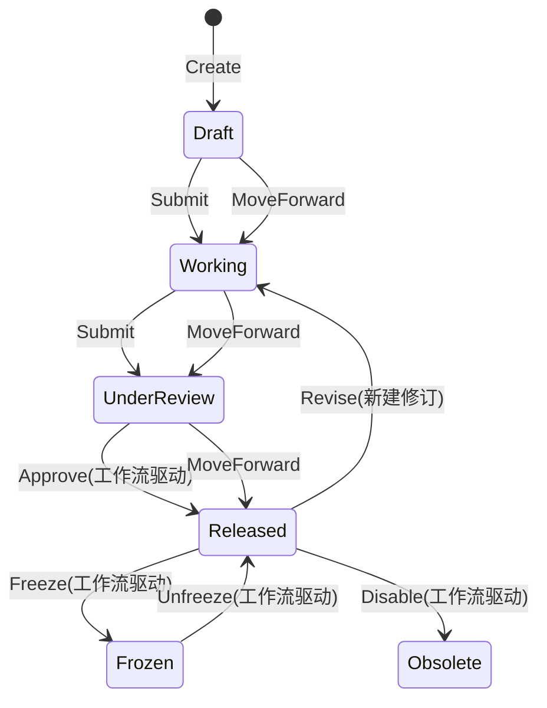
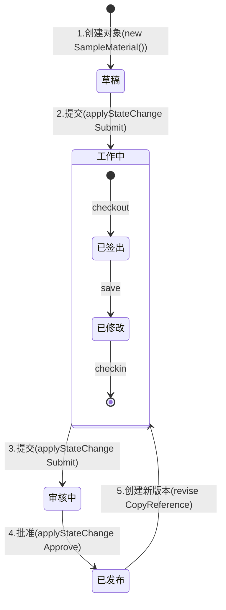

# 业务对象状态管理

## 概述

介绍如何在EMOP中实现和使用对象状态管理。平台中的状态管理主要包含三个维度：

1. **Checkout/Checkin (签出/签入)**：并发控制机制
2. **Revise (修订)**：版本控制机制
3. **Lifecycle State (生命周期状态)**：业务状态控制机制
4. **DraftModelObject (草稿对象)**：专门用于存储任意类型草稿状态的对象类型

这三种机制协同工作，共同确保数据的一致性、可追溯性和业务流程的正确性。

## 基本概念

### 1. Checkout/Checkin
控制对象的并发访问：
- Checkout：获取对象的独占编辑权限
- Checkin：释放编辑权限，保存修改

### 2. Revise
管理对象的版本演进：
- 每个修订版本有唯一的修订号(revId)
- 同一对象的不同修订版本共享相同的编码(code)
- 支持CopyRule：定义创建新版本时的关系复制规则

### 3. Lifecycle State
对象在业务流程中的状态标识：
- 系统预置了常用状态：Draft、Working、UnderReview、Released等
- 每个状态都有明确的属性定义：isEditable, isReleased, isRevisable等
- 状态流转受限于预定义的规则

### 4. DraftModelObject
草稿对象：
- 用于保存任意对象的草稿状态：保存key-value形式，忽略对应对象的必填项
- 私有可见性：针对`DraftModelObject`只有自己能搜索和修改编辑
- 转换为正式对象：可通过 `DraftModelObjectService`转换为真正的对象，状态为 `Working`

## 对象状态说明

系统预置了以下状态及转换规则：



### 1. 状态定义

每个状态都有明确的属性和业务含义：

| 状态 | isEditable | isReleased | isRevisable | 说明                                                      |
|------|------------|------------|-------------|---------------------------------------------------------|
| Draft | true | false | false | 初始状态，可自由编辑，且只有自己可见，针对Draft表单保存时会忽略必填校验，不可以提交工作流，真实保存对象为`DraftModelObject` |
| Working | true | false | false | 工作状态，权限内人员可见，签出后其他人不可编辑                                 |
| UnderReview | false | false | false | 审核状态，不可编辑                                               |
| Released | false | true | true | 发布状态，可以创建新版本                                            |
| Frozen | false | true | false | 冻结状态，完全锁定                                               |
| Obsolete | false | false | false | 废弃状态                                                    |

### 2. 状态转换事件

系统支持以下状态转换事件：

- Create：创建新对象
- Submit：提交审核
- Approve：审批通过
- Revise：创建新版本
- Freeze：冻结对象
- Unfreeze：解除冻结
- MoveForward：向前推进状态
- Disable：废弃对象

### 3. 工作流驱动状态转换

在系统中，某些关键的状态转换必须通过工作流驱动，不能由用户手动触发。这种机制确保了关键业务操作的合规性和可追溯性。

#### 3.1 工作流驱动的状态转换

以下状态转换必须通过工作流驱动：

| 起始状态 | 目标状态 | 事件 | 指定流程 | 说明 |
|---------|---------|------|---------|------|
| UnderReview | Released | Approve |  | 审核通过 |
| Working | Released | Approve |  | 直接审批发布 |
| Released | Frozen | Freeze |  | 冻结已发布对象，必须经过变更管理流程 |
| Frozen | Released | Unfreeze |  | 解冻对象，必须经过变更管理流程 |
| Released | Obsolete | Disable |  | 废弃已发布对象，必须经过废弃流程 |

#### 3.2 配置方法

##### 3.2.1 基本工作流要求

在`lifecycle.yml`中，通过`workflowRequired`属性指定工作流驱动的状态转换：

```yaml
- from: UnderReview
  to: Released
  event: Approve
  workflowRequired: true  # 必须通过工作流驱动
```

##### 3.2.2 指定特定流程驱动

要限制特定状态转换只能由特定流程驱动，可以在`condition`属性中使用条件表达式：

```yaml
- from: UnderReview
  to: Released
  event: Approve
  workflowRequired: true
  condition: "workflow.processDefinitionKey == 'ReviewProcess'"  # 仅允许审批流程驱动
```

这样可以确保该状态转换只能由指定的工作流流程触发，系统会在状态转换前验证当前工作流上下文是否满足条件。

#### 3.3 条件表达式（condition）

`condition`属性用于定义状态转换的额外条件，它可以控制在满足特定条件下才允许状态转换。条件表达式支持多种用法：

##### 3.3.1 对象属性条件

```yaml
- from: Released
  to: Working
  event: Revise
  condition: "document.hasReferences != true"  # 仅当文档没有被引用时可以修订
```

##### 3.3.2 工作流条件

```yaml
- from: Released
  to: Frozen
  event: Freeze
  workflowRequired: true
  condition: "workflow.processDefinitionKey == 'ChangeManagement'"  # 仅允许变更管理流程驱动
```

##### 3.3.3 用户角色条件

```yaml
- from: Working
  to: Released
  event: Approve
  workflowRequired: true
  condition: "currentUser.hasRole('ProductManager')"  # 仅产品经理可批准
```

##### 3.3.4 组合条件

```yaml
- from: Released
  to: Obsolete
  event: Disable
  workflowRequired: true
  condition: "workflow.processDefinitionKey == 'ObsoleteProcess' && document.usageCount == 0"  # 必须是废弃流程且对象未被使用
```

:::info 注意事项
1. 工作流驱动的状态转换必须通过`applyStateChangeWithWorkflow`方法执行
2. 尝试手动触发需要工作流驱动的状态转换将抛出`IllegalArgumentException`异常
3. 工作流上下文中应包含足够的审计信息，包括操作人和操作时间
4. 对于有特定流程要求的状态转换，必须在工作流上下文中提供相应的流程标识信息
:::

### 4. 状态属性说明

#### 4.1 isEditable

控制对象是否可以被编辑：
- 当为`true`时，用户可以签出并修改对象（Draft、Working状态）
- 当为`false`时，对象被锁定不允许修改（UnderReview、Released、Frozen、Obsolete状态）

业务影响：
- 控制对象的签出权限
- 决定UI界面上是否显示编辑按钮
- 防止已审核或发布的对象被意外修改

#### 4.2 isReleased

表示对象是否已正式发布可用于生产环境：
- 当为`true`时，对象可以被引用到正式业务流程中（Released、Frozen状态）
- 当为`false`时，表示对象尚未准备好用于生产（Draft、Working、UnderReview、Obsolete状态）

业务影响：
- 控制对象是否可用于生产环境
- 影响对象在查询结果中的显示
- 决定对象是否可以被其他对象引用

#### 4.3 isRevisable

决定对象是否可以创建新的修订版本：
- 当为`true`时，允许基于当前对象创建新版本（Released状态）
- 当为`false`时，禁止版本迭代（其他所有状态）

业务影响：
- 控制版本迭代的流程
- 决定UI界面上是否显示"创建新版本"按钮
- 确保只有经过正式发布的对象才能创建新版本

:::info 配置文件
可以修改`lifecycle.yml`后调整整个系统的对象状态变更流程，包括状态属性、条件表达式和工作流要求
:::

## 开发指南

### 1. 签出/签入的使用


#### 签出对象
```java
// 签出对象（设置60分钟过期）
ModelObject obj = S.service(CheckoutService.class).checkout(modelObject, "Initial modification", 60);
// 签出对象（永不过期）
ModelObject obj = S.service(CheckoutService.class).checkout(modelObject, "Initial modification");

// 批量签出
List<ModelObject> modelObjects = ...
List<ModelObject> objs = S.service(CheckoutService.class).checkout(modelObjects, "Batch modification", 60);
```

#### 签入对象
```java
// 签入单个对象
ModelObject obj = S.service(CheckoutService.class).checkin(modelObject, "Completed modification");

// 批量签入
List<ModelObject> modelObjects = ...
List<ModelObject> objs = S.service(CheckoutService.class).checkin(modelObjects, "Batch modification completed");

// 强制签入（管理员使用）
S.service(CheckoutService.class).forceCheckin(modelObject);
```

### 2. 修订版本管理

#### 创建新修订版本
```java
// 基本创建（不复制关系）
ModelObject newRevision = S.service(RevisionService.class).revise(revision, CopyRule.NoCopy);
// 默认行为（不复制关系）
ModelObject newRevision = S.service(RevisionService.class).revise(revision);

// 复制引用关系
ModelObject newRevision = S.service(RevisionService.class).revise(revision, CopyRule.CopyReference);

// 复制对象和关系
ModelObject newRevision = S.service(RevisionService.class).revise(revision, CopyRule.CopyObject);

// 批量创建新版本
List<ModelObject> newRevisions = S.service(RevisionService.class).revise(revisions, CopyRule.CopyReference);
```

#### 查询修订版本
```java
// 查询特定版本
ModelObject rev = S.service(RevisionService.class).queryRevision(
    new CriteriaByCodeAndRevId<>(ItemRevision.class.getName(), "CODE-001", "A"));

// 查询最新版本
ModelObject latest = S.service(RevisionService.class).queryLatestRevision(
    new CriteriaByRevCode<>(ItemRevision.class.getName(), "CODE-001"));
```

### 3. 生命周期状态管理

#### 状态转换
```java
// 通过事件执行状态转换
LifecycleState state = material.stateChange("Submit", context);

// 或者使用LifecycleService执行状态转换
material = S.service(LifecycleService.class).applyStateChange(material, "Submit"); 

// 判断当前状态
LifecycleState currentState = material.currentState();
assertEquals("Working", currentState.getName());
assertEquals(true, currentState.isRevisable());
assertEquals(false, currentState.isEditable());
```

#### 检查状态转换是否需要工作流驱动：

```java
boolean needWorkflow = S.service(LifecycleService.class)
    .isWorkflowRequired(modelObject, "Approve");
```

#### 在工作流中执行状态转换：

```java
// 创建工作流上下文
WorkflowContext workflowContext = new WorkflowContext();
workflowContext.setWorkflowInstanceId("WF-2023-001");
workflowContext.setNodeId("ApprovalNode");
workflowContext.setOperatorId("admin");
workflowContext.setOperationTime(new Date());

// 设置流程标识（用于条件验证）
workflowContext.put("processDefinitionKey", "ReviewProcess");

// 执行工作流驱动的状态转换
modelObject = S.service(LifecycleService.class)
    .applyStateChangeWithWorkflow(modelObject, "Approve", workflowContext);
```

### 4. 综合示例
以下是一个完整的工作流程示例，展示了如何协同使用签出/签入、状态管理和版本控制：


对应代码如下
```java
public class ComplexWorkflowExample {
    private final CheckoutService checkoutService = S.service(CheckoutService.class);
    private final RevisionService revisionService = S.service(RevisionService.class);
    private final ObjectService objectService = S.service(ObjectService.class);
    
    public void processDocument() {
        // 1. 创建材料对象
        SampleMaterial material = new SampleMaterial(SampleMaterial.class.getName());
        material.setCode("MATERIAL-001");
        material.setRevId("A");
        material.setName("Initial Material");
        material = objectService.save(material);
        
        // 2. 检查初始状态
        assertEquals("Draft", material.currentState().getName());
        
        // 3. 签出并修改
        material = checkoutService.checkout(material, "Initial modification", 60);
        material.setName("Sample Material v1");
        material = objectService.save(material);
        
        // 4. 签入并提交审核
        material = checkoutService.checkin(material, "Completed modification");
        material = S.service(LifecycleService.class).applyStateChange(material, "Submit"); // Draft -> Working
        material = S.service(LifecycleService.class).applyStateChange(material, "Submit"); // Working -> UnderReview
        
        // 5. 批准并发布
        material = S.service(LifecycleService.class).applyStateChange(material, "Approve"); // UnderReview -> Released
        assertEquals("Released", material.currentState().getName());
        
        // 6. 创建新版本
        SampleMaterial newRevision = revisionService.revise(material, CopyRule.CopyReference);
        assertEquals("B", newRevision.getRevId());
        assertEquals("Working", newRevision.currentState().getName());
    }
}
```


## 常见问题

### 1. 无法签出对象
- 检查对象的当前状态是否允许编辑(isEditable)
- 确认对象未被其他用户签出
- 验证当前用户是否有签出权限

### 2. 状态转换失败
- 检查当前状态是否允许执行目标事件
- 确认所有必要的前置条件都已满足
- 查看具体的错误信息和堆栈跟踪

### 3. 创建新版本失败
- 检查对象是否处于可修订状态(isRevisable)
- 确认业务键的唯一性约束
- 验证关系复制规则的正确性