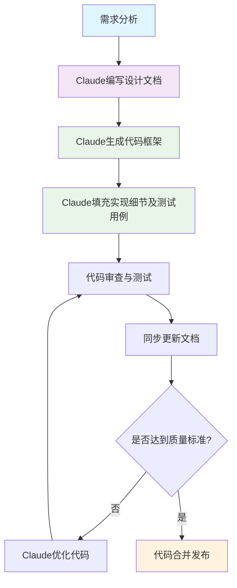
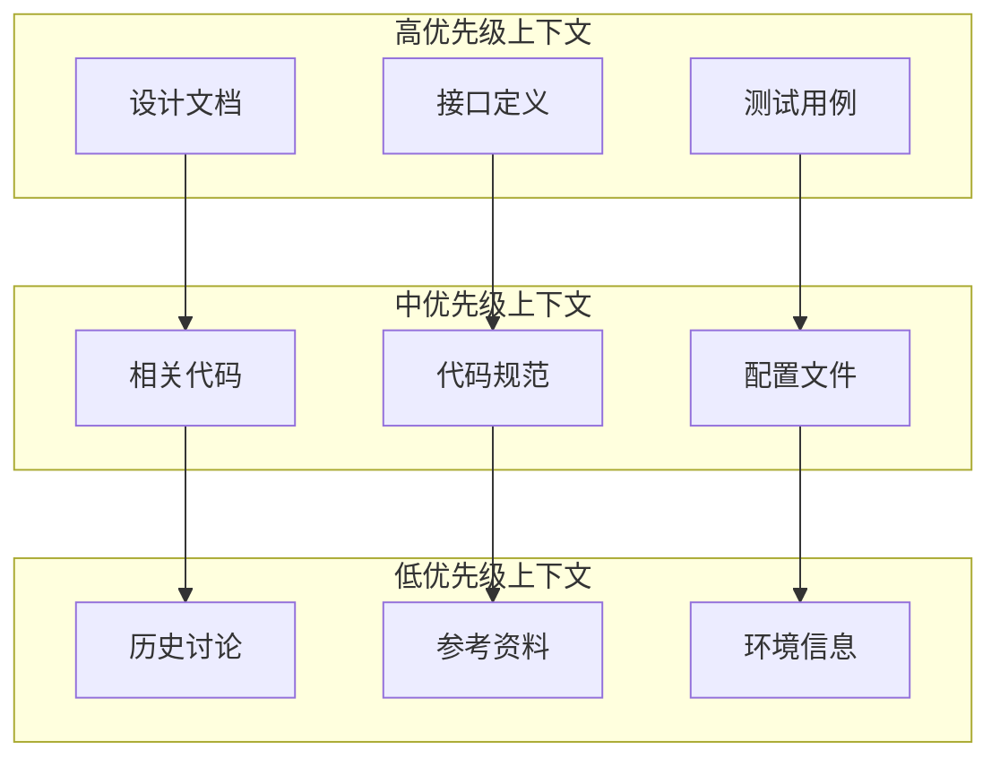
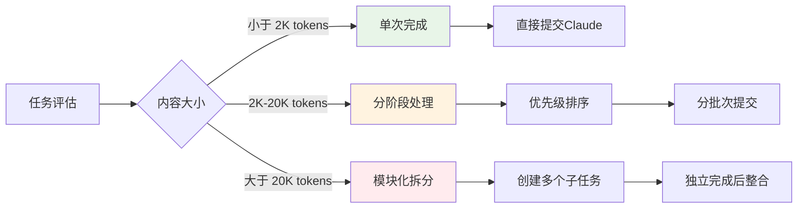

# AI辅助编程实践
为什么选择AI原生开发？
```
┌─────────────────────────────────────────────────────────┐
│ ✅ AI代码效率极大提升                                    │
│ ✅ AI代码通常遵循最佳实践和业界标准                        │
│ ✅ 代码结构清晰，符合人类直觉和理解习惯                    │
│ ✅ AI修改AI生成的代码更容易，保持一致性                    │
│ ✅ 内置错误处理和边界条件考虑                             │
│ ✅ 自然的代码注释和文档                                   │
└─────────────────────────────────────────────────────────┘
```
## 核心指标与目标

### 量化指标仪表板
```
🎯 AI辅助目标
┌──────────────────────────┐
│ AI代码率        ≥85%      │
│ 文档代码同步率  ≥95%      │
│ 首次编译通过率  ≥60%      │
│ 首次功能正确率   ≥70%     │
└─────────────────────────┘
```

### AI代码率定义与计算
```
AI代码率 = (AI直接生成的代码行数 + AI辅助修改的代码行数) / 总代码行数 × 100%

计算范围：
- ✅ 包含：业务逻辑代码、配置代码、测试代码
- ❌ 排除：第三方库代码、自动生成的框架代码
```

### 指定AI模型：Claude
**强制要求：团队统一使用Claude最新模型进行代码生成和协作**

❌ 不要使用免费版工具

## 文档驱动开发流程

### 核心理念
**文档即提示词材料** - 高质量的文档是Claude生成高质量代码的关键输入


### 开发流程可视化

### 开发流程可视化



### 开发流程：文档优先
```
阶段划分：需求分析 → 设计文档 → 框架生成 → 细节实现 → 质量保证 → 发布上线
时间占比：   10%   →   20%   →   25%   →   30%   →   10%   →   5%
AI参与度：   30%   →   80%   →   90%   →   90%   →   80%   →   20%
```

### 必须遵守的工程实践

#### 1. 全新模块开发：文档先行
**强制要求：任何新模块开发前必须先完成设计文档**

#### 2. 从粗到细的AI协作模式
**阶段1：框架生成**
```
给AI的输入：完整设计文档 + 项目代码规范
AI输出：代码框架、接口定义、基础结构
```

**阶段2：细节填充**
```
给AI的输入：具体功能文档 + 相关测试用例 + 现有代码上下文
AI输出：具体业务逻辑实现
```

**阶段3：优化完善**
```
给AI的输入：性能要求 + 代码审查反馈 + 测试结果
AI输出：性能优化代码、Bug修复
```

## 上下文管理策略

### Claude输入内容大小最佳实践

#### 输入内容分级管理
```
📊 内容大小指导原则

轻量级任务 (< 2K tokens)
├── 简单函数实现
├── 代码片段优化  
└── 快速问题解答

中等任务 (2K - 20K tokens)  
├── 模块功能实现
├── 完整类的设计
└── 复杂逻辑处理

重量级任务 (20K - 100K+ tokens)
├── 完整模块设计
├── 架构级别讨论
└── 大规模重构
```

#### 上下文优先级矩阵


### 必须提供给Claude的上下文材料
1. **设计文档** - 核心业务逻辑和架构信息
2. **接口文档** - 明确的输入输出定义
3. **测试用例** - 预期行为的具体示例
4. **相关代码** - 同模块或依赖模块的现有实现
5. **代码规范** - 团队统一的编码标准
6. **错误案例** - 之前遇到的问题和解决方案

### 提示词结构化表达最佳实践

#### 标准提示词模板结构
```
📝 Claude交互标准模板

## 任务类型：[代码生成/代码审查/问题解决/架构设计]

## 上下文信息：
### 项目信息
- 技术栈：[具体框架和版本]
- 模块位置：[在项目中的位置]
- 依赖关系：[相关模块和接口]

### 业务需求
- 功能描述：[要实现什么]
- 业务价值：[为什么需要这个功能]
- 用户场景：[谁在什么情况下使用]

### 技术要求
- 性能指标：[响应时间、并发量等]
- 安全要求：[权限控制、数据加密等]
- 兼容性：[浏览器、设备、系统等]

## 具体任务：
[详细的任务描述]

## 期望输出：
- 代码格式：[语言、风格、注释要求]
- 文档要求：[是否需要说明文档]
- 测试要求：[单元测试、集成测试等]

## 质量标准：
- 可读性：[代码风格和注释]
- 可维护性：[模块化、扩展性]
- 可测试性：[测试覆盖率要求]
```

#### 提示词质量检查表
```
✅ 结构化检查清单

信息完整性：
□ 任务目标明确
□ 技术栈清晰
□ 业务背景充分
□ 质量要求具体

格式规范性：
□ 使用标准模板
□ 层次结构清晰
□ 关键信息突出
□ 代码块格式正确

上下文充分性：
□ 相关文档齐全
□ 依赖关系明确
□ 测试用例完整
□ 参考代码准确
```
### 上下文组织模板（基于结构化提示词）
```
## 任务类型：代码生成

## 上下文信息：
### 项目信息
- 技术栈：Spring Boot 2.7 + MySQL 8.0 + Redis 6.0
- 模块位置：用户管理模块 - 认证子系统
- 依赖关系：依赖用户信息服务、短信验证服务

### 业务需求
- 功能描述：实现多方式用户登录验证
- 业务价值：提升用户体验，增强账户安全
- 用户场景：移动端用户快速登录访问应用

### 技术要求
- 性能指标：登录接口响应时间<200ms，支持1000并发
- 安全要求：JWT token，密码BCrypt加密，防暴力破解
- 兼容性：支持iOS/Android原生调用

## 具体任务：
[详细的功能实现要求]

## 设计文档参考：
[粘贴相关设计文档片段]

## 接口定义：
[输入输出参数定义]

## 测试用例：
[期望的测试场景和结果]

## 相关代码：
[现有相关实现代码]

## 期望输出：
- 代码格式：Java，遵循阿里巴巴编码规范
- 文档要求：需要方法注释和接口文档
- 测试要求：单元测试覆盖率80%+

## 质量标准：
- 可读性：清晰的变量命名，完整的注释
- 可维护性：合理的类设计，易于扩展
- 可测试性：依赖注入，便于mock测试
```

## 实践对比：好的vs不好的例子

### 使用Claude进行需求描述

#### ❌ 不好的实践（非结构化）
```
帮我写一个用户登录的功能
```

#### ✅ 好的实践（结构化提示词 + Claude）
```
## 任务类型：代码生成

## 上下文信息：
### 项目信息
- 技术栈：Spring Boot 2.7 + MySQL 8.0 + Redis 6.0
- 模块位置：EMOP用户管理模块 - 认证子系统  
- 依赖关系：用户信息服务、短信验证服务、权限管理服务

### 业务需求
- 功能描述：支持手机号+密码登录和短信验证码登录
- 业务价值：提升用户登录体验，增强账户安全性
- 用户场景：EMOP平台用户通过移动端快速安全登录

### 技术要求
- 性能指标：登录接口响应时间<200ms，支持1000QPS
- 安全要求：JWT token（7天有效期），密码BCrypt加密，连续失败3次锁定30分钟
- 兼容性：支持iOS/Android原生应用调用

## 具体任务：
实现UserAuthService.login()方法，包含：
1. 手机号格式验证
2. 密码登录逻辑（含失败次数控制）
3. 短信验证码登录逻辑
4. JWT token生成和Redis缓存
5. 登录日志记录

## 接口定义：
POST /api/v1/auth/login
Request: {mobile: string, password?: string, smsCode?: string, loginType: "password"|"sms"}
Response: {success: boolean, token?: string, userInfo?: object, expiresIn?: number, errorCode?: string}

## 测试用例：
1. 正常密码登录：正确手机号+密码 → 返回token和用户信息
2. 正常短信登录：正确手机号+验证码 → 返回token和用户信息  
3. 密码错误：错误密码 → 返回401错误，失败次数+1
4. 账户锁定：连续3次失败 → 返回423错误，30分钟锁定
5. 短信码过期：使用过期验证码 → 返回400错误

## 期望输出：
- 代码格式：Java，遵循EMOP团队编码规范
- 文档要求：完整的方法注释和接口文档
- 测试要求：JUnit单元测试，覆盖率≥80%

## 质量标准：
- 可读性：清晰的变量命名，完整的中文注释
- 可维护性：合理的异常处理，易于扩展新的登录方式
- 可测试性：依赖注入设计，便于mock外部服务
```

### AI原生代码优势示例

#### 传统手写代码的问题
```java
// 手写代码常见问题
public String login(String phone, String pwd) {
    if(phone == null) return "error";  // 错误处理不完整
    // 没有参数验证
    // 硬编码字符串
    // 缺少日志记录
    // 没有异常处理
}
```

#### Claude生成的AI原生代码
```java
/**
 * 用户登录认证服务
 * @param loginRequest 登录请求对象
 * @return 登录响应结果
 * @throws LoginException 登录异常
 */
@Override
public LoginResponse login(LoginRequest loginRequest) throws LoginException {
    // 参数验证
    validateLoginRequest(loginRequest);
    
    try {
        // 获取用户信息
        User user = userService.findByMobile(loginRequest.getMobile());
        if (user == null) {
            throw new LoginException(ErrorCode.USER_NOT_FOUND, "用户不存在");
        }
        
        // 检查账户状态
        checkAccountStatus(user);
        
        // 执行认证逻辑
        AuthResult authResult = performAuthentication(user, loginRequest);
        
        // 生成令牌
        String token = jwtTokenService.generateToken(user);
        
        // 记录登录日志
        loginLogService.recordLoginSuccess(user.getId(), loginRequest.getClientInfo());
        
        return LoginResponse.success(token, user.toUserInfo());
        
    } catch (LoginException e) {
        // 记录失败日志
        loginLogService.recordLoginFailure(loginRequest.getMobile(), e.getErrorCode());
        throw e;
    } catch (Exception e) {
        log.error("登录过程发生未预期异常", e);
        throw new LoginException(ErrorCode.INTERNAL_ERROR, "系统异常，请稍后重试");
    }
}
```

**AI原生代码的优势体现：**
- ✅ 完整的参数验证和异常处理
- ✅ 清晰的中文注释和文档
- ✅ 标准的错误码和日志记录
- ✅ 合理的方法拆分和职责分离
- ✅ 符合最佳实践

### 使用Claude进行代码审查

#### ❌ 不好的实践（模糊请求）
```
这段代码有问题吗？
[粘贴一大段代码]
```

#### ✅ 好的实践（结构化审查请求）
```
## 任务类型：代码审查

## 上下文信息：
### 项目信息
- 技术栈：Spring Boot 2.7 + MySQL 8.0
- 模块位置：EMOP订单管理 - 支付处理模块
- 依赖关系：库存服务、支付网关、用户服务

### 业务需求
- 功能描述：用户订单支付处理，涉及库存扣减和支付状态更新
- 业务价值：确保订单支付的原子性和一致性
- 用户场景：用户下单后进行在线支付

## 具体任务：
请审查PaymentService.processPayment()方法的实现

## 重点关注：
1. 并发安全性 - 多个用户同时购买同一商品的库存扣减
2. 事务一致性 - 支付失败后的库存回滚机制  
3. 异常处理 - 第三方支付接口调用失败的处理
4. 性能优化 - 数据库查询和缓存使用
5. 安全性 - 支付金额验证和防重复支付

## 相关文档：
[链接到支付流程设计文档]

## 代码：
[粘贴具体的PaymentService代码]

## 已知问题：
- 担心库存扣减可能存在超卖问题
- 不确定分布式事务的边界设置是否合理
- 支付回调处理的幂等性需要确认

## 期望输出：
- 问题识别：具体的代码问题和风险点
- 改进建议：具体的优化方案和最佳实践
- 代码示例：关键部分的改进代码
```

### 使用Claude进行Bug修复

#### ❌ 不好的实践（信息不足）
```
我的代码报错了，帮我看看
Error: NullPointerException
```

#### ✅ 好的实践（完整问题诊断，按需简化）
```
## 任务类型：问题解决

## 上下文信息：
### 项目信息  
- 技术栈：Spring Boot 2.7 + MySQL 8.0 + Redis 6.0
- 模块位置：EMOP订单管理 - 订单查询服务
- 依赖关系：用户服务、商品服务、支付服务

### 问题描述
- 功能：用户查询个人订单列表
- 现象：偶发性空指针异常，约5%的请求失败
- 影响：用户无法正常查看订单，客户投诉增加

## 错误信息：
java.lang.NullPointerException: Cannot invoke "getOrderId()" on null object
at com.emop.service.OrderService.buildOrderListResponse(OrderService.java:145)
at com.emop.service.OrderService.getOrderList(OrderService.java:89)
at com.emop.controller.OrderController.queryOrderList(OrderController.java:45)

## 环境信息：
- JDK版本：OpenJDK 11.0.16
- Spring Boot版本：2.7.2
- 数据库：MySQL 8.0.30
- 部署环境：Docker容器，4C8G配置

## 重现步骤：
1. 用户登录EMOP平台
2. 访问"我的订单"页面
3. 筛选条件选择"已完成"状态
4. 点击查询按钮
5. 大概率在第一次查询时正常，刷新页面时偶发异常

## 相关代码：
[粘贴OrderService.java的相关方法]

## 数据情况：
- 测试用户ID：10001，共有18个订单
- 订单状态分布：待支付(2)，已支付(5)，已完成(8)，已取消(3)
- 订单创建时间：近30天内
- 数据库查询SQL执行正常，返回数据完整

## 日志信息：
[粘贴相关的应用日志和数据库慢查询日志]

## 已尝试的解决方案：
1. 检查数据库连接池配置 - 无明显异常
2. 增加空值判断 - 问题依然存在
3. 添加详细日志 - 发现是在buildOrderListResponse方法中出错

## 期望输出：
- 根因分析：导致空指针异常的具体原因
- 解决方案：完整的修复代码
- 预防措施：避免类似问题的代码规范建议
```
### Claude多次尝试仍然无法解决问题

#### ❌ 一直将错误贴给Claude
```
错误堆栈
Error: NullPointerException
```

#### ✅ 好的实践（一）
- 新起一个会话重新开始，并且给足上下文信息
- 尝试阅读第三方框架的文档，初步理解技术细节后将关键样例代码、第三方框架版本等信息告知Claude
- 要求Claude进行联网搜索
#### ✅ 好的实践（二）
如果上序步骤仍然不行，则需要从上至下或从下至上的方式确认可工作版本
- 从上至下：将可能影响的组件或代码移除，直到能工作的版本，确认问题代码后修正
- 从下至上：先从最小可工作版本开始，通常是官方样例，然后逐步把功能往上垒

### 单个文件代码太长

#### ❌ 单个文件代码超过1500行

#### ✅ 将代码进行模块化拆分
- 模块化拆分
- 按需投喂上下文至Claude中
- Claude输出完整更新后的代码相对也比较快，增加交互效率，降低无关代码改动风险

## 工具和环境配置

### 输入内容管理最佳实践

内容大小控制策略

---

**记住：AI是工具，文档是桥梁，质量是目标**

这些实践需要团队持续执行和优化，收益会在实施过程中逐步体现。