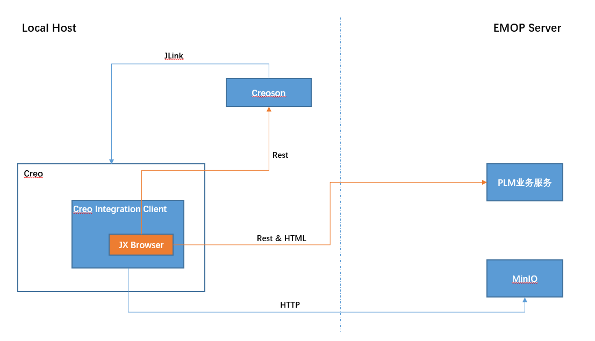
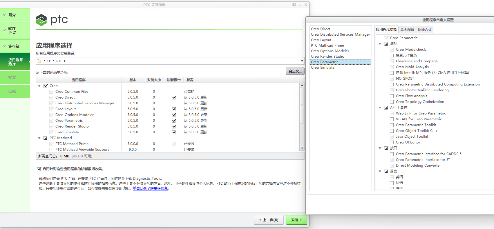
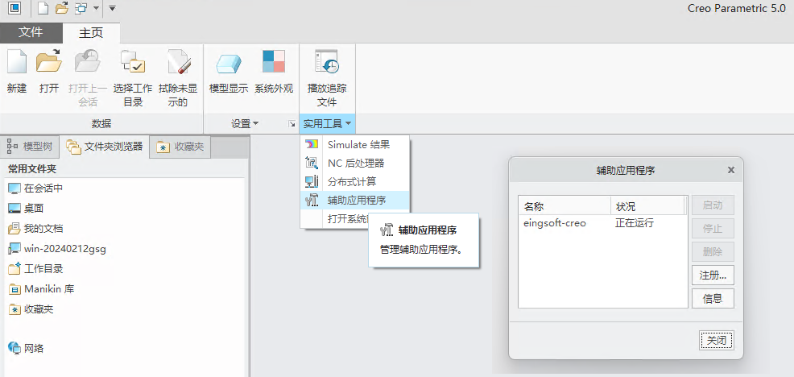

# Creo客户端开发指南

## 1. 概述

客户端需要安装 Creo 集成客户端，该客户端包含 creo定制化菜单，jlink 集成，以及一个内置的 jx browser浏览器，用来与服务器端的 `plm业务服务`进行页面展示及数据通信，同时 `plm业务服务`页面包含部分 js 用于与 jx browser 进行交互。

客户端同时需要安装改造后的` creoson` 服务，该服务会将 creo jlink 的很多 API 封装为 Rest， 提供给 Creo 集成客户端的 java 代码及 jx browser 中的 js 代码来操作 creo.

[](../../images/business/xcad/creo-integration-arch.png)

:::warning 🔔提醒
`creoson`是基于开源的[代码库](https://github.com/SimplifiedLogic/creoson)进行了较小的定制化开发，最稳定支持是Creo的3,4,5,6版本，2,7,8应该支持，9及以后版本按照官方文档，是在EMOP代码库之后更新的，需要merge github上的代码至EMOP定制化的Creoson项目
:::

## 2. 开发环境搭建

### 2.1 环境准备
在开始Creo客户端开发之前，确保您的开发环境满足以下要求：

- **操作系统**：Windows 10及以上
- **JDK版本**：
   - creo-integration-client 项目使用 JDK 17, 由于JxBrowser 7.24最低版本JDK 11
   - creoson 项目保留使用 JDK 8, 由于该项目仍然使用`ant`构建，对`lombok`支持不是太好, 后续可以考虑升级jdk版本
- **Ant**：官网下载最新版本
- **Maven**：官网下载最新版本
- **Creo安装**：确保已经安装Creo 3.0及以上版本
- **代码库**：客户端代码库涉及两部分
   - `xcad-client/creo-integration-client`
   - `xcad-client/creoson`

### 2.2 Creo环境确认
1. 确保 Creo 能正常打开，同时检查 `JLink` 已正确安装(文件`PTC\Creo 5.0.5.0\Common Files\text\java\pfcasync.jar`存在)。
2. 如果`JLink`未安装请从其他相同版本的Creo文件夹下拷贝`PTC\Creo 5.0.5.0\Common Files\text\java`完整文件，或使用creo安装文件安装对应组件。

下图为Creo 5.0.5示意，选择`自定义... > Creo Parametric > 应用程序功能 > API工具包 > Java Object Tookit`
[](../../images/business/xcad/creo-integration-jlink.png)
### 2.3 项目编译

编译过程需要按照以下顺序进行：

#### 2.3.1 编译 creoson 项目

1. 打开 `xcad-client/creoson/build_vars.properties` 文件并根据本地环境正确设置以下内容：
```bash
# This file defines the locations of various files which the 
# developer will have to provide themselves, as they are not
# included with the source-code repository.

# 设置 Creo 安装目录下的 Common Files 路径
creo_common_dir=D:/PTC/Creo 5.0.5.0/Common Files

# Creo 4 的路径配置（如果使用 Creo 5，可以与上面相同）
creo_4_common_dir=D:/PTC/Creo 5.0.5.0/Common Files

# 包含 CreosonSetup-win32.zip 和 CreosonSetup-win64.zip 的目录
CreosonSetup_dir=D:/workspace/emop/emop3/xcad-client/creoson/setup

# 输出目录配置
out_dir=D:/workspace/emop/emop3/xcad-client/creoson/out

# 第三方依赖库目录配置
apache_commons_codec_dir=D:/workspace/emop/emop3/xcad-client/creoson/setup/third-party
jackson_dir=D:/workspace/emop/emop3/xcad-client/creoson/setup/third-party
```

2. 使用 ant 编译打包：
```bash
set ANT_HOME=D:\dev\apache-ant-1.9.14
set JAVA_HOME=D:\jdk-17.0.10
set PATH=%PATH%;%ANT_HOME%\bin;%JAVA_HOME%\bin
ant -f build-all.xml
```

编译完成后会在 out 目录生成以下 jar 包：
- creoson-intf-1.9.0.jar
- creoson-core-2.6.0.jar
- creofuncs-1.7.0.jar
- creo4funcs-1.7.0.jar
- creoson-jsonconst-1.4.0.jar
- creoson-json-1.4.0.jar
- creoson-1.3.0-javadoc.jar
- CreosonServer-2.2.0.jar


3. 启动 Creoson 服务

修改`xcad-client\creoson\eingsoft_creo_integration_start.bat`至正确配置：
```bash
set PROE_COMMON=D:\PTC\Creo 5.0.5.0\Common Files
set PROE_ENV=x86e_win64

rem set JAVA_HOME=%PROE_COMMON%\x86e_win64\obj\JRE
set JAVA_HOME=D:\jdk-17.0.10
set JSON_PORT=8088
set cp=%~dp0*;%~dp0out\*;%~dp0setup\third-party\*
```
命令行运行 `eingsoft_creo_integration_start.bat`启动`creoson`rest服务

#### 2.3.2 编译 creo-integration-client 项目

1. 进入 creo-integration-client 目录：
```bash
cd xcad-client/creo-integration-client
```

2. 执行 maven 构建：
```bash
mvn clean install
```
:::warning ⚠️注意事项
`creo-integration-client` 项目一定要使用 `JetBrains JDK 17` jbr_cef 进行打包，因为该 JDK 内置了 jcef 相关 library, 否则项目编译不过, 可从github上下载最新 `jdk 17` 的版本。
:::
### 2.4 添加`EMOP Tools`菜单至Creo

#### 2.4.1 环境变量配置

设置Windows环境变量`ES_CAD_HOME`，需要修改为正确的路径：

```bash
setx ES_CAD_HOME "D:\workspace\emop\emop3\xcad-client\creo-integration-client\ES_CAD_HOME"
```

验证环境变量：
```bash
echo %ES_CAD_HOME%
```

#### 2.4.2 `emop3\xcad-client\creo-integration-client\ES_CAD_HOME\config.properties`配置
```bash
CAD_WEB_SERVER=http://dev.emop.emopdata.com/
ES_CAD_CREOSON_URL=http://localhost:8088/creoson
EC_PRIMARY_KEY=ID
```

#### 2.4.3 Creo配置文件设置

1. 在Creo的`config.pro`文件(`PTC\Creo 5.0.5.0\Common Files\text`,不同版本稍有差异)中添加，需要修改为正确的路径：

```
protkdat D:\workspace\emop\emop3\xcad-client\creo-integration-client\ES_CAD_HOME\protk.dat
add_java_class_path D:\workspace\emop\emop3\xcad-client\creo-integration-client\target\lib\*
jlink_java_command D:\jbr_jcef-17.0.11-windows-x64-b1207.24\bin\java.exe -Xdebug -Xrunjdwp:transport=dt_socket,server=y,suspend=n,address=8000
```
:::warning ⚠️注意事项
`jlink_java_command` 一定要使用 `JetBrains JDK 17` 作为运行期 JVM，因为该 JDK 内置了 jcef 相关 library, 否则启动报错。
:::
:::info ℹ️说明
- `protkdat`：定义插件配置文件路径
- `add_java_class_path`：指定maven项目依赖的jar包路径
- `jlink_java_command`：定义jlink启动命令，开发环境支持远程调试
  :::

2. 配置protk.dat文件内容，需要修改为正确的路径：

```
name            eingsoft-creo
startup         java
java_app_class  io.emop.creointegration.App
java_app_classpath D:\workspace\emop\emop3\xcad-client\creo-integration-client\target\classes
text_dir        D:\workspace\emop\emop3\xcad-client\creo-integration-client\ES_CAD_HOME\text
java_app_start  start
java_app_stop   stop
allow_stop      true
delay_start     false
end
```
:::info ℹ️说明
- `java_app_class`：插件启动类
- `java_app_classpath`：classes目录
- `text_dir`：资源文件夹
  :::

3. 启动Creo
4. 确认插件`creo-eingsoft`启动成功
   [](../../images/business/xcad/creo-integration-plugin-status.png)

5. 确认`EMOP Tools`菜单出现
   [](../../images/business/xcad/creo-integration-toolbar.png)

:::info ℹ️说明
如果以上步骤有问题，参见后续的`常见问题及解决方案`部分
:::
## 3. 常见问题及解决方案

### 3.1 插件启动问题

如果`creo-eingsoft`插件启动失败，请检查：

1. Windows环境变量`ES_CAD_HOME`确认配置正确

2. 配置文件路径：
   - 确认`config.pro`中的路径配置正确
   - 验证`protk.dat`中的路径配置准确

3. Java环境：
   - 确认`jlink_java_command`配置的java路径正确
   - 检查`add_java_class_path`指向的`lib`目录是否包含所有依赖，并检查目录非空，运行`maven install`命令会自动抽取所有依赖的jar包至对应文件夹下

4. 日志排查：
   - 检查日志文件：`emop3\xcad-client\creo-integration-client\ES_CAD_HOME\logs`

5. Java[远程调试](#_4-开发调试)

### 3.2 菜单显示问题

如果`EMOP Tools`菜单未显示：

1. 检查Creo版本兼容性
2. 通过`文件->选项`手动添加菜单
3. 确认`protk.dat`配置正确加载

## 4. 开发调试

### 4.1 远程调试配置

1. IDE配置：
   - 创建Remote Debug配置
   - 设置调试端口：8000
   - 选择调试模式：Attach to remote JVM

2. 调试步骤：
   - 在IDE中设置断点，建议debug一下对应的io.emop.creointegration.App.start方法及方法之前的静态执行的内容
   - 启动Creo
   - 连接远程调试
   - 点击`启动`按钮
     [](../../images/business/xcad/creo-integration-plugin-status.png)

### 4.2 日志分析

日志文件位置：`emop3\xcad-client\creo-integration-client\ES_CAD_HOME\logs`

包含以下日志：
- 插件启动日志
- 操作记录日志
- 错误信息日志

建议通过日志分析来定位和解决问题。

## 5. 注意事项

1. 路径配置：
   - 所有配置文件中的路径都需要使用实际的开发环境路径
   - 路径中避免使用中文和特殊字符

2. 版本兼容：
   - 确保使用推荐的Creo版本(3.0-6.0)
   - 高版本Creo可能需要更新creoson代码