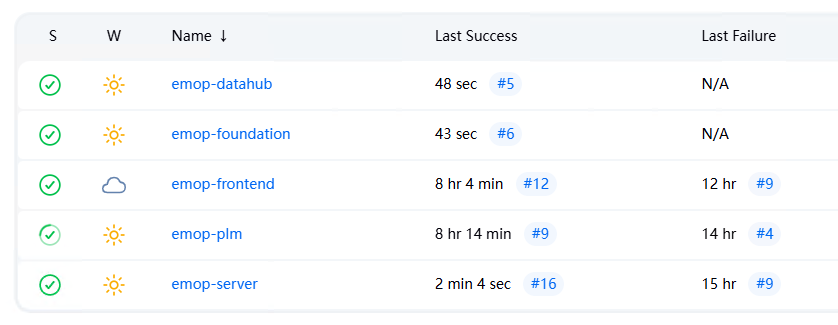

# Docker镜像构建与部署

通过容器化，我们可以实现一致的环境配置、简化部署流程、提高资源利用率，并支持灵活的水平扩展。
所有镜像统一发布至阿里云ACR服务中，使用公司账号统一登录。
```
网页版登录
https://cr.console.aliyun.com/cn-shenzhen/instance/repositories

docker登录
$ sudo docker login --username=eingsoft2017 registry.cn-shenzhen.aliyuncs.com
```
::: warning ⚠️注意
- 注意网页版只能公司阿里云主账号访问，其他账号无法通过网页访问, 请使用命令行登录
- docker登录密码 `emop@2025`, 密码会不定期更新
- 命令行`sudo`有可能需要先输入操作系统的`root`或`Administrator`密码, 不要与 docker 的登录密码混淆了
  :::

## 1. Docker镜像架构

EMOP系统的Docker架构包含以下几个核心组件：

- **EMOP Server**：核心服务和插件运行环境
- **PLM服务**：产品生命周期管理服务
- **基础服务**：用户管理、流程等基础功能
- **前端服务**：EMOP Web界面，CAD-Integration web界面，EMOP 开发文档，采用Nginx提供静态资源
- **中间件服务**：Redis、Minio、Document Server等支撑服务
- **Datahub服务**：平台及业务域数据集成(同步、质量控制、清洗)服务
- **CAD转图服务**：CAD模型转换服务，基于JobRunr任务调度框架
- **CI服务**：平台构建打包服务，包含前后端编译、镜像打包等内容

镜像依赖关系如下：

```
中间件服务 <---- EMOP Server <---- PLM服务
                 ^    ^      ^
                 |    |      |
             前端服务  Datahub服务  CAD转图服务
```

## 2. 镜像构建文件结构

为了便于维护和部署，我们采用了统一的目录结构：

```
docker/
├── build/                                 # 构建脚本目录
│   ├── build-all.sh                       # 全部构建脚本
│   ├── build-emop-server.sh               # EMOP Server构建脚本
│   ├── build-plm.sh                       # PLM服务构建脚本
│   ├── build-foundation.sh                # 基础服务构建脚本
│   ├── build-datahub.sh                   # Datahub服务构建脚本
│   ├── build-keycloak.sh                  # 认证服务构建脚本
│   ├── build-cad-model-conversion.sh      # CAD转图服务构建脚本
│   ├── build-cad-model-conversion-base-img.sh      # CAD转图服务基础镜像构建,包含转图的native程序
│   └── build-frontend.sh                  # 前端服务构建脚本
│
├── dockerfiles/                           # Dockerfile文件目录
│   ├── Dockerfile.emop-server             # EMOP Server的Dockerfile
│   ├── Dockerfile.plm                     # PLM服务的Dockerfile
│   ├── Dockerfile.foundation              # 基础服务的Dockerfile
│   ├── Dockerfile.datahub                 # Datahub服务的Dockerfile
│   ├── Dockerfile.frontend                # 前端服务的Dockerfile
│   ├── Dockerfile.keycloak-preconfigured  # 预配置好的认证服务
│   ├── Dockerfile.cad-model-conversion    # CAD转图服务的Dockerfile
│   └── scripts/                           # 容器内使用的脚本
│       ├── start-emop-server.sh           # EMOP Server启动脚本
│       ├── start-plm.sh                   # PLM服务启动脚本
│       ├── start-foundation.sh            # 基础服务启动脚本
│       └── start-cad-conversion.sh        # CAD转图服务启动脚本
│
├── configs/                               # 配置文件目录
│   ├── emop-server/                       # EMOP Server配置
│   ├── plm/                               # PLM配置
│   ├── foundation/                        # 基础服务配置
│   ├── datahub/                           # Datahub服务配置
│   ├── auth/                              # 认证服务的realm、内置的组织及用户等
│   ├── kong/                              # 网关服务配置
│   └── nginx/                             # Nginx配置(生产环境服务前端静态页面)
│
├── docker-compose-middleware.yml          # 中间件服务编排
├── docker-compose-datahub.yml             # Datahub服务编排
├── docker-compose-cad-conversion.yml      # CAD转图服务编排
├── docker-compose-auth.yml                # 认证及SSO服务
├── docker-compose-gateway-dev.yml         # 开发环境下网关
└── docker-compose.yml                     # 应用服务编排(emop-server、foundation、plm、frontend等)
```

## 3. 构建镜像

### 3.1 构建方式

EMOP镜像构建采用"预编译+镜像打包"的两阶段方式，而非在Docker中从源码开始构建。这种方式有以下优势：

- **构建速度更快**：避免在Docker构建阶段重复编译代码
- **镜像体积更小**：最终镜像不包含构建工具和源代码
- **更好的缓存利用**：只有应用变更时才需要重新构建
- **解耦构建与打包**：符合CI/CD最佳实践

### 3.2 构建参数

构建脚本支持以下环境变量参数：

| 参数 | 说明 | 默认值 |
|------|------|--------|
| VERSION | 镜像版本标签 | 1.0.0 |
| REGISTRY | 镜像仓库地址 | registry.cn-shenzhen.aliyuncs.com |
| REBUILD_JARS | 是否重新构建JAR包 | false |
| REBUILD_FRONTEND | 是否重新构建前端资源 | false |

### 3.3 构建步骤
::: warning ⚠️注意
docker文件夹下面的shell如果是在windows下(wsl内)，可能会因为编码问题提示找不到对应的shell，这个可能发生在docker内或docker外部，使用`dos2unix`转换一下编码。
```shell
dos2unix docker/dockerfiles/scripts/*.sh
dos2unix docker/build/*.sh
```
:::
#### 构建全部镜像

```bash
cd docker/build
# 修改 env.sh 可控制构建过程，是否重新构建jar包等
./build-all.sh
```

#### 单独构建特定服务

```bash
# 只构建EMOP Server
./build-emop-server.sh

# 只构建PLM服务
./build-plm.sh 

# 只构建前端
./build-frontend.sh

# 只构建Datahub
./build-datahub.sh

# 只构建CAD转图服务
./build-cad-model-conversion.sh
```

## 4. 部署服务

### 4.1 部署中间件

首先部署基础中间件服务：

```bash
docker-compose -f docker-compose-middleware.yml up -d
```

此命令会启动以下服务：
- Redis (高速缓存)
- Onlyoffice (文档预览)
- MinIO (对象存储)

### 4.2 部署应用服务

等待中间件服务就绪后，部署应用服务：

```bash
docker-compose -f docker-compose.yml up -d
```

此命令会启动以下服务：
- EMOP Server
- EMOP基础服务
- PLM服务
- 前端服务

### 4.3 部署Datahub服务

部署Datahub服务：

```bash
docker-compose -f docker-compose-datahub.yml up -d
```

此命令会启动以下服务：
- 集成进Spring Cloud Data Flow框架的EMOP Datahub服务

### 4.4 部署CAD转图服务

部署CAD转图服务, 注意这个依赖 `datahub` 中的 `datahub-db`：

```bash
docker-compose -f docker-compose-cad-conversion.yml up -d
```

此命令会启动以下服务：
- **emop-cad-model-conversion**: CAD模型转换REST API服务，基于`JobRunr`任务调度框架
- **emop-cad-conversion-cmd**: CAD转图命令行辅助容器，用于执行手动转换任务

#### 4.4.1 CAD转图服务特性

- **任务调度**: 基于JobRunr框架，提供可靠的异步任务处理
- **数据持久化**: 根据转图请求从minio中下载原始三维文件后, 转图并上传会minio及更新数据库数据

### 4.5 部署Auth(Keycloak)服务

部署Keycloak服务：

```bash
docker-compose -f docker-compose-auth.yml up -d
```

此命令会启动以下服务：
- keycloak-db 服务
- 预配置`emop-realm`的 keycloak 服务，包含emop内置用户及组织，配置文件位于源代码的 `docker/configs/auth` 目录中

启动完成后通过 `http://localhost:9180` 可访问 keycloak 的管理界面，默认账号为 `admin/EmopIs2Fun!`

::: tip 💡如何更新`emop-realm`默认配置
1. 界面应用 emop-realm 配置
2. 导出对应配置，下面的命令会导出所有配置
```
cd docker/configs/auth
docker exec -it auth-keycloak /opt/bitnami/keycloak/bin/kc.sh export --dir /opt/bitnami/keycloak/data/export --realm emop-realm --users realm_file
docker cp auth-keycloak:/opt/bitnami/keycloak/data/export/emop-realm-realm.json ./
```
3. 重新构建镜像
```
cd docker/build
./build-auth.sh
```
:::

### 4.6 环境变量配置

部署时可通过环境变量调整服务配置：

```bash
# 调整JVM参数
export EMOP_SERVER_JAVA_OPTS="-XX:+UseG1GC -Xms1g -Xmx4g"
export PLM_JAVA_OPTS="-XX:+UseG1GC -Xms512m -Xmx2g"

# 部署
docker-compose -f docker-compose.yml up -d
```

### 4.7 持久化数据

EMOP系统使用卷进行数据持久化, 以下是部分卷说明：

- `redis-data`: Redis数据
- `minio-data`: 对象存储数据

::: warning ⚠️注意
使用docker管理的存储，以加快整个平台的性能，注意需要定期备份这些存储
:::

### 4.8 容器管理GUI界面
使用`docker-compose`部署EMOP时，内置了一个轻量化的`portainer`使用GUI进行管理，首次访问该服务时会要求修改`admin`账号密码。
```
https://localhost:9443/
```

### 4.9 部署CI服务

部署Jenkins持续集成服务：

```bash
# 创建CI网络（如果不存在）
docker network create emop-ci-network

# 启动Jenkins服务
docker-compose -f docker-compose-ci.yml up -d
```

此命令会启动以下服务：
- Jenkins Master (持续集成服务)

#### 4.9.1 导入Jenkins数据

首次启动后，需要导入预配置的Jenkins数据：

```bash
# 下载预配置数据
wget http://www.eingsoft.com:81/jenkins-data-20250529.tar.gz

# 导入数据到Jenkins容器
docker cp jenkins-data-20250529.tar.gz emop-jenkins-master:/tmp/
docker exec emop-jenkins-master sh -c "cd /var/jenkins_home && rm -rf * && tar xzf /tmp/jenkins-data-20250529.tar.gz"
docker exec emop-jenkins-master rm /tmp/jenkins-data-20250529.tar.gz

# 重启Jenkins服务以加载配置
docker-compose -f docker-compose-ci.yml restart
```
完成后访问 http://localhost:8080/

[](./images/jenkins.png)

#### 4.9.2 数据备份与恢复

```bash
# 导出数据
docker exec emop-jenkins-master tar czf /tmp/jenkins-data.tar.gz -C /var/jenkins_home .
docker cp emop-jenkins-master:/tmp/jenkins-data.tar.gz ./jenkins-data-$(date +%Y%m%d).tar.gz
docker exec emop-jenkins-master rm /tmp/jenkins-data.tar.gz

# 以后恢复时：
docker cp jenkins-data-20241201.tar.gz emop-jenkins-master:/tmp/
docker exec emop-jenkins-master sh -c "cd /var/jenkins_home && rm -rf * && tar xzf /tmp/jenkins-data-20241201.tar.gz"
docker exec emop-jenkins-master rm /tmp/jenkins-data-20241201.tar.gz
```

### 4.10 中间件GUI界面

EMOP平台集成了多个中间件服务，每个服务都提供了GUI管理界面，便于系统管理员进行配置和监控。

#### 4.10.1 MinIO对象存储控制台

MinIO提供了Web控制台管理界面，可通过以下地址访问：

```
http://localhost:9001/
```

登录凭证：
- 用户名：minioadmin
- 密码：EmopIs2Fun!

主要功能：
- 存储桶管理
- 对象上传下载
- 访问策略配置
- 指标监控

#### 4.10.2 OnlyOffice文档服务器管理

OnlyOffice文档服务器提供了管理界面，可通过以下地址访问：

```
http://localhost:9050/
```

主要功能：
- 文档服务器状态监控
- 转换服务配置
- 缓存管理
- 日志查看

#### 4.10.3 DataHub管理界面

Spring Cloud Data Flow提供了流式处理的管理界面，可通过以下地址访问：

```
http://localhost:9393/dashboard
```

主要功能：
- 流式处理管理
- 任务编排
- 流部署
- 状态监控

#### 4.10.4 JobRunr任务调度监控

JobRunr提供了任务调度的Web管理界面，可通过以下地址访问：

```
http://localhost:861/
```

主要功能：
- **任务监控**: 实时查看CAD转图任务的执行状态
- **任务队列**: 查看待处理、正在处理和已完成的任务
- **失败重试**: 管理失败任务的重试机制
- **性能统计**: 查看任务执行的性能指标和统计数据
- **任务历史**: 查看历史任务执行记录
- **服务器状态**: 监控JobRunr服务器的运行状态

::: tip 💡CAD转图任务管理
通过JobRunr Dashboard可以：
- 监控CAD文件转换任务的实时状态
- 查看转换失败的任务并进行重试
- 分析转换任务的性能瓶颈
- 管理转换任务队列的优先级
  :::

#### 4.10.5 Keycloak配置
Keycloak提供了管理界面，可通过以下地址访问：
```
http://localhost:9180/
```

登录凭证：
- 用户名：admin
- 密码：EmopIs2Fun!

主要功能：
- 管理 realms
- 管理用户账号、权限、组织等
- 登录session监控及剔除
- 会话超时设置
- 各类系统及IDP的SSO配置

#### 4.10.6 Jenkins持续集成管理界面

Jenkins提供了Web管理界面，可通过以下地址访问：

```
http://localhost:8080/
```

主要功能：
- 构建任务管理
- 插件管理
- 用户权限配置
- 构建历史查看
- 系统配置管理

::: tip 💡提示
Jenkins的初始配置和项目已通过数据导入完成，可直接使用预配置的构建任务。
:::