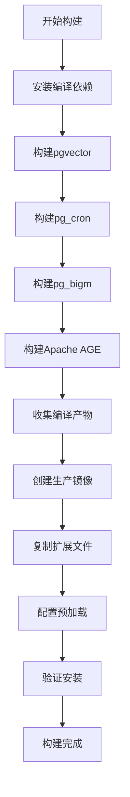

# PostgreSQL 17.5 扩展集成

## 1. 项目概述

### 1.1 背景
为支持EMOP平台的多样化数据处理需求，我们构建了集成多个关键扩展的PostgreSQL 17.5定制镜像，提供向量搜索、图数据库、全文检索和定时任务等功能。

### 1.2 技术选型
- **基础镜像**: `postgres:17.5`
- **扩展集成**: 4个核心扩展
- **架构**: linux/amd64

## 2. 扩展清单与功能

### 2.1 集成扩展详情

| 扩展名称 | 版本 | 主要功能 | 业务价值 |
|----------|------|----------|----------|
| **pgvector** | v0.8.0 | 向量存储与相似性搜索 | 语义搜索、AI应用支持 |
| **pg_cron** | v1.6.4 | 数据库内定时任务调度 | 自动化数据维护 |
| **pg_bigm** | latest | 2-gram全文搜索 | 中文模糊搜索优化 |
| **Apache AGE** | PG17分支 | 图数据库 | 复杂关系分析 |

### 2.2 扩展兼容性矩阵

| 扩展 | PostgreSQL 17.5 | 编译依赖 | 预加载要求 |
|------|------------------|----------|------------|
| pgvector | ✅ 官方支持 | 标准C编译器 | ❌ |
| pg_cron | ✅ 兼容 | 标准C编译器 | ✅ 必需 |
| pg_bigm | ✅ 兼容 | 标准C编译器 | ❌ |
| Apache AGE | ✅ PG17分支 | 标准C编译器 | ✅ 必需 |

## 3. 构建架构设计

### 3.1 多阶段构建架构

见镜像构建脚本`Dockerfile.postgresql-17.5-extensions`，可以使用`build-postgresql.sh`进行触发

**设计优势**：
- 最终镜像大小最小化
- 编译工具不进入生产镜像
- 构建过程可重现
- 安全性提升

### 3.2 编译依赖分析

```bash
# 基础编译工具
postgresql-server-dev-17    # PostgreSQL开发头文件
build-essential            # GCC编译器套件
git wget curl              # 源码获取工具

# 扩展特定依赖
cmake pkg-config           # 构建系统工具
libssl-dev                 # SSL支持
libxml2-dev libxslt1-dev   # XML处理
libreadline-dev            # 交互式输入
zlib1g-dev libbz2-dev      # 压缩库
liblz4-dev libzstd-dev     # 高效压缩
python3-dev                # Python开发支持
flex bison                 # 词法语法分析器
autoconf automake libtool  # 自动构建工具
```

### 3.3 构建流程设计



## 4. 扩展构建详情

### 4.1 pgvector构建

```bash
# 源码获取
git clone --depth=1 --branch v0.8.0 https://github.com/pgvector/pgvector.git

# 编译安装
cd pgvector
make PG_CONFIG=/usr/bin/pg_config
make PG_CONFIG=/usr/bin/pg_config install

# 产物文件
/usr/lib/postgresql/17/lib/vector.so
/usr/share/postgresql/17/extension/vector.control
/usr/share/postgresql/17/extension/vector--*.sql
```

**构建特点**：
- 使用标准PGXS构建系统
- 支持多种向量类型和距离函数
- 自动优化编译参数

### 4.2 pg_cron构建

```bash
# 源码获取
git clone --depth=1 --branch v1.6.4 https://github.com/citusdata/pg_cron.git

# 编译安装
cd pg_cron
make PG_CONFIG=/usr/bin/pg_config
make PG_CONFIG=/usr/bin/pg_config install

# 产物文件
/usr/lib/postgresql/17/lib/pg_cron.so
/usr/share/postgresql/17/extension/pg_cron.control
/usr/share/postgresql/17/extension/pg_cron--*.sql
```

**构建特点**：
- 需要预加载到shared_preload_libraries
- 支持标准cron语法
- 包含后台工作进程

### 4.3 pg_bigm构建

```bash
# 源码获取
git clone --depth=1 https://github.com/pgbigm/pg_bigm.git

# 编译安装
cd pg_bigm
make USE_PGXS=1
make USE_PGXS=1 install

# 产物文件
/usr/lib/postgresql/17/lib/pg_bigm.so
/usr/share/postgresql/17/extension/pg_bigm.control
/usr/share/postgresql/17/extension/pg_bigm--*.sql
```

**构建特点**：
- 优化中文2-gram分析
- 支持GIN索引
- 提供相似度函数

### 4.4 Apache AGE构建

```bash
# 源码获取
git clone --depth=1 -b PG17 https://github.com/apache/age.git

# 编译安装
cd age
make PG_CONFIG=/usr/bin/pg_config
make PG_CONFIG=/usr/bin/pg_config install

# 产物文件
/usr/lib/postgresql/17/lib/age.so
/usr/share/postgresql/17/extension/age.control
/usr/share/postgresql/17/extension/age--*.sql
```

**构建特点**：
- 实现Cypher查询语言
- 需要预加载支持
- 提供图数据类型

## 5. 配置管理

### 5.1 预加载配置

```bash
# postgresql.conf配置
shared_preload_libraries = 'age,pg_cron'
cron.database_name = 'postgres'
```

**配置说明**：
- **age**: 图数据库功能需要预加载
- **pg_cron**: 定时任务后台进程需要预加载
- pgvector和pg_bigm无需预加载

## 6. 构建与部署

### 6.1 构建命令

```bash
# 执行构建脚本
./docker/scripts/build-postgresql.sh

# 手动构建
docker build \
  -t registry.cn-shenzhen.aliyuncs.com/emop3/postgresql:17.5-extensions \
  -f docker/dockerfiles/Dockerfile.postgresql-17.5-extensions \
  ./docker/build/tmp/pg
```

### 6.2 构建时间估算

| 阶段 | 预估时间      | 主要操作 |
|------|-----------|----------|
| 依赖安装 | 1-2分钟     | apt-get安装编译工具 |
| pgvector编译 | 1-2分钟     | C代码编译 |
| pg_cron编译 | 1-2分钟     | C代码编译 |
| pg_bigm编译 | 1-2分钟     | C代码编译 |
| AGE编译 | 1-2分钟     | 大型C++项目编译 |
| 镜像构建 | 1-2分钟      | Docker层构建 |
| **总计** | **10-30分钟** | 取决于网络和硬件 |

:::warning ⚠️镜像构建速度
由于需要从源码编译，国内网络构建非常慢或者被墙，建议在aws或阿里云国外节点创建一台ECS后执行构建，完成后再推送至阿里云镜像仓库。
:::

### 6.3 启动验证

```bash
# 启动容器
docker run -d --name postgres-test \
  -e POSTGRES_DB=testdb \
  -e POSTGRES_USER=emop \
  -e POSTGRES_PASSWORD=EmopIs2Fun! \
  -e PGUSER=postgres \
  -e POSTGRES_INITDB_ARGS="-c shared_preload_libraries='age,pg_cron' -c cron.database_name='testdb'" \
  -p 5444:5432 \
  registry.cn-shenzhen.aliyuncs.com/emop3/postgresql:17.5-extensions

# 验证启动
docker logs postgres-test
```

## 7. 功能验证测试

### 7.1 基础验证

```sql
-- 连接数据库
\c testdb

-- 检查已安装扩展
SELECT
    name,
    default_version,
    installed_version,
    comment,
    CASE
        WHEN installed_version IS NOT NULL THEN 'ENABLED'
        ELSE 'AVAILABLE'
        END as status
FROM pg_available_extensions
where name IN ('vector', 'pg_cron', 'pg_bigm', 'age');

-- 检查预加载库
SHOW shared_preload_libraries;
```

**预期结果**：
```
name   |default_version|installed_version|comment                                                         |status   |
-------+---------------+-----------------+----------------------------------------------------------------+---------+
vector |0.8.0          |                 |vector data type and ivfflat and hnsw access methods            |AVAILABLE|
pg_cron|1.6            |                 |Job scheduler for PostgreSQL                                    |AVAILABLE|
pg_bigm|1.2            |                 |text similarity measurement and index searching based on bigrams|AVAILABLE|
age    |1.5.0          |                 |AGE database extension                                          |AVAILABLE|
```
**扩展插件启用**：

```sql
-- 数据库级别启用扩展
CREATE EXTENSION vector;      -- 向量搜索
CREATE EXTENSION pg_cron;     -- 定时任务
CREATE EXTENSION pg_bigm;     -- 全文搜索
CREATE EXTENSION age;         -- 图数据库
```
### 7.2 pgvector功能验证

```sql
-- 创建向量表
CREATE TABLE test_vectors (
    id SERIAL PRIMARY KEY,
    name TEXT,
    embedding vector(3)
);

-- 插入测试数据
INSERT INTO test_vectors (name, embedding) VALUES
('item1', '[1.0, 2.0, 3.0]'),
('item2', '[2.0, 3.0, 4.0]'),
('item3', '[1.5, 2.5, 3.5]');

-- 创建向量索引
CREATE INDEX ON test_vectors USING hnsw (embedding vector_l2_ops);

-- 相似性搜索
SELECT name, embedding <-> '[1.1, 2.1, 3.1]' AS distance
FROM test_vectors
ORDER BY embedding <-> '[1.1, 2.1, 3.1]'
LIMIT 2;
```

**预期结果**：
```
name |distance          |
-----+------------------+
item1|0.1732049820352609|
item3| 0.692820422824541|
```

### 7.3 pg_cron功能验证

```sql
-- 创建测试表
CREATE TABLE cron_test (
    id SERIAL PRIMARY KEY,
    created_at TIMESTAMP DEFAULT NOW(),
    message TEXT
);

-- 调度定时任务
SELECT cron.schedule(
    'test-job',
    '*/2 * * * *',
    $$INSERT INTO cron_test (message) VALUES ('Hello from cron!');$$
);

-- 查看任务状态
SELECT jobid, schedule, command, active FROM cron.job;

-- 等待2分钟后检查结果
SELECT * FROM cron_test ORDER BY created_at DESC LIMIT 5;

-- 查看执行历史
SELECT * FROM cron.job_run_details ORDER BY start_time DESC LIMIT 3;
```

### 7.4 pg_bigm功能验证

```sql
-- 创建测试表
CREATE TABLE test_search (
    id SERIAL PRIMARY KEY,
    title TEXT,
    content TEXT
);

-- 插入中文测试数据
INSERT INTO test_search (title, content) VALUES
('智能手表产品', '这是一款智能手表，具有健康监测功能'),
('智能手机评测', '最新的智能手机性能评测报告'),
('手表维修指南', '各种手表的维修和保养方法'),
('智慧城市建设', '关于智慧城市的发展规划');

-- 创建pg_bigm索引
CREATE INDEX test_search_title_idx ON test_search USING gin (title gin_bigm_ops);
CREATE INDEX test_search_content_idx ON test_search USING gin (content gin_bigm_ops);

-- 1. 使用 =% 操作符进行相似性搜索（这是pg_bigm的主要功能）
-- 设置相似度阈值
SET pg_bigm.similarity_limit = 0.4;

-- 相似性搜索
SELECT title, content 
FROM test_search 
WHERE title =% '智能手表';

-- 2. 使用 bigm_similarity() 函数计算相似度得分
SELECT 
    title, 
    bigm_similarity(title, '智能手表') AS similarity_score
FROM test_search
WHERE title =% '智能手表'
ORDER BY bigm_similarity(title, '智能手表') DESC;

-- 3. 使用 show_bigm() 函数查看2-gram分解
SELECT show_bigm('智能手表产品');

-- 4. 使用 likequery() 函数进行LIKE搜索
SELECT title, content
FROM test_search 
WHERE title LIKE likequery('智能手表');

-- 5. 更复杂的相似性搜索示例
-- 调整相似度阈值
SET pg_bigm.similarity_limit = 0.05;

-- 查找所有与"手表"相关的记录
SELECT 
    title,
    bigm_similarity(title, '手表') AS title_sim,
    bigm_similarity(content, '手表') AS content_sim
FROM test_search 
WHERE title =% '手表' OR content =% '手表'
ORDER BY GREATEST(
    bigm_similarity(title, '手表'), 
    bigm_similarity(content, '手表')
) DESC;
```

**预期结果示例**：

1. **相似性搜索结果**：
```
title |content          |
------+-----------------+
智能手表产品|这是一款智能手表，具有健康监测功能|
```

2. **相似度得分**：
```
title |similarity_score|
------+----------------+
智能手表产品|       0.5714286|
智能手机评测|      0.42857143|
```

3. **2-gram分解**：
```
show_bigm                 |
--------------------------+
{产品,"品 ",手表,智能,能手,表产," 智"}|
```

4. **关键函数说明**：
    - `=%` 操作符：pg_bigm的核心相似性搜索操作符
    - `bigm_similarity(text1, text2)`：计算两个字符串的相似度（0-1之间）
    - `show_bigm(text)`：显示字符串的所有2-gram元素
    - `likequery(text)`：将搜索关键词转换为LIKE模式
    - `pg_bigm.similarity_limit`：设置相似性搜索的最小阈值

5. **性能优化配置**：
```sql
-- 检查当前配置
SHOW pg_bigm.similarity_limit;
SHOW pg_bigm.enable_recheck;

-- 优化设置
SET pg_bigm.similarity_limit = 0.1;  -- 根据需要调整阈值
SET pg_bigm.enable_recheck = on;     -- 确保搜索结果准确性
```

### 7.5 Apache AGE功能验证

```sql
-- 设置图扩展搜索路径
SET search_path = ag_catalog, "$user", public;

-- 创建图
SELECT create_graph('test_graph');

-- 创建节点
SELECT * FROM cypher('test_graph', $$
    CREATE (p:Product {name: '笔记本电脑', code: 'LAPTOP001'})
    RETURN p
$$) as (product agtype);

SELECT * FROM cypher('test_graph', $$
    CREATE (c:Component {name: 'CPU', code: 'CPU001'})
    RETURN c
$$) as (component agtype);

-- 创建关系
SELECT * FROM cypher('test_graph', $$
    MATCH (p:Product {code: 'LAPTOP001'}), (c:Component {code: 'CPU001'})
    CREATE (p)-[r:CONTAINS {quantity: 1}]->(c)
    RETURN r
$$) as (relation agtype);

-- 查询图数据
SELECT * FROM cypher('test_graph', $$
    MATCH (p:Product)-[r:CONTAINS]->(c:Component)
    RETURN p.name, r.quantity, c.name
$$) as (product_name agtype, quantity agtype, component_name agtype);
```

## 8. 性能测试

### 8.1 测试环境

- **硬件**: 4核CPU, 8GB内存
- **网络**: 千兆以太网
- **存储**: SSD
- **并发**: 10个客户端连接

### 8.2 pgvector性能测试

```sql
-- 准备测试数据
CREATE TABLE perf_vectors (
    id SERIAL PRIMARY KEY,
    data vector(128)
);

-- 插入10万条随机向量数据
INSERT INTO perf_vectors (data)
SELECT FORMAT('[%s]',
      array_to_string(
              array(SELECT (random() * 2 - 1)::text FROM generate_series(1, 128)),
              ','
          ))::vector
FROM generate_series(1, 100000);

-- 创建HNSW索引
\timing on
CREATE INDEX perf_vectors_hnsw_idx 
ON perf_vectors USING hnsw (data vector_cosine_ops)
WITH (m = 16, ef_construction = 64);
```

**索引构建性能**：
```
约17秒
```

```sql
-- 向量相似性查询测试
\timing on
WITH test_query AS (
    SELECT FORMAT('[%s]', 
        array_to_string(
            array(SELECT (random() * 2 - 1)::text FROM generate_series(1, 128)), 
            ','
        ))::vector as query_vec
)
SELECT
    id,
    data <=> (SELECT query_vec FROM test_query) AS distance
FROM perf_vectors
ORDER BY data <=> (SELECT query_vec FROM test_query)
    LIMIT 10;
```

**查询性能结果**：
```
Time: 3 ms
```

### 8.3 pg_bigm性能测试

```sql
-- 准备测试数据
CREATE TABLE perf_search (
    id SERIAL PRIMARY KEY,
    title TEXT,
    content TEXT
);

-- 插入10万条测试数据
INSERT INTO perf_search (title, content)
SELECT 
    'Title ' || i || ' 智能产品测试数据',
    '这是第' || i || '条测试内容，包含各种中文关键词进行搜索测试'
FROM generate_series(1, 100000) i;

-- 创建pg_bigm索引
\timing on
CREATE INDEX perf_search_title_idx 
ON perf_search USING gin (title gin_bigm_ops);
```

**索引构建性能**：
```
约1秒
```

```sql
-- 模糊搜索性能测试
\timing on
SELECT title, bigm_similarity(title, '智能产品') AS sim
FROM perf_search
WHERE title =% '智能产品'
ORDER BY bigm_similarity(title, '智能产品') DESC
LIMIT 100;
```

**搜索性能结果**：
```
Time: 650 ms(由于order by较慢)
```

### 8.4 pg_cron性能测试

```sql
-- 创建性能监控表
CREATE TABLE cron_performance (
    id SERIAL PRIMARY KEY,
    job_name TEXT,
    start_time TIMESTAMP,
    end_time TIMESTAMP,
    duration_ms INTEGER
);

-- 创建性能测试任务
SELECT cron.schedule(
    'perf-test',
    '*/1 * * * *',
    $$
    INSERT INTO cron_performance (job_name, start_time, end_time, duration_ms)
    SELECT 
        'perf-test',
        start_time,
        end_time,
        EXTRACT(EPOCH FROM (end_time - start_time)) * 1000
    FROM cron.job_run_details 
    WHERE command LIKE '%perf-test%'
    ORDER BY start_time DESC LIMIT 1;
    $$
);

-- 监控任务执行性能
SELECT 
    job_name,
    AVG(duration_ms) as avg_duration_ms,
    MIN(duration_ms) as min_duration_ms,
    MAX(duration_ms) as max_duration_ms,
    COUNT(*) as execution_count
FROM cron_performance
GROUP BY job_name;
```

### 8.5 Apache AGE性能测试

```sql
-- 创建大规模图数据
SELECT * FROM cypher('test_graph', $$
    UNWIND range(1, 1000) AS i
    CREATE (n:Node {id: i, name: 'Node' + i})
$$) as (result agtype);

-- 创建随机关系
SELECT * FROM cypher('test_graph', $$
    MATCH (a:Node), (b:Node)
    WHERE a.id < b.id AND rand() < 0.01
    CREATE (a)-[:CONNECTS]->(b)
$$) as (result agtype);

-- 路径查询性能测试
\timing on
SELECT * FROM cypher('test_graph', $$
    MATCH path = (a:Node {id: 1})-[:CONNECTS*1..3]->(b:Node)
    RETURN length(path), count(*)
$$) as (path_length agtype, count agtype);
```

**图查询性能结果**：
```
Time: 40 ms
```

### 8.6 性能测试结果汇总

| 测试项目 | 数据量 | 索引构建时间 | 查询响应时间                  | 吞吐量 |
|----------|--------|--------------|-------------------------|--------|
| pgvector向量搜索 | 10万128维向量 | 17秒 | 3ms                     | 333 QPS |
| pg_bigm中文搜索 | 10万文档 | 1秒 | 650ms (没有order by大概2ms) | 1.5 QPS |
| pg_cron任务调度 | 持续运行 | - | 15ms                    | 依赖任务复杂度 |
| AGE图查询 | 1000节点+关系 | - | 40ms                    | 25 QPS |

**性能优化建议**：
- pgvector: 调整ef_construction参数平衡构建时间和查询精度
- pg_bigm: 针对频繁查询词建立专门索引
- AGE: 为图查询路径添加索引优化

## 9. 集群部署架构

### 9.1 主从架构设计

```yaml
# 主库配置 (Master)
master_node:
  hostname: emop-db-master
  role: primary
  extensions_enabled:
    - vector      # 向量搜索 (读写)
    - pg_cron     # 定时任务 (仅主库)
    - pg_bigm     # 全文搜索 (读写)
    - age         # 图数据库 (读写)
  
# 从库配置 (Slaves)  
slave_nodes:
  - hostname: emop-db-slave1
    role: replica
    extensions_enabled:
      - vector    # 向量搜索 (只读)
      - pg_bigm   # 全文搜索 (只读)
      - age       # 图数据库 (只读)
    # pg_cron不在从库启用
      
  - hostname: emop-db-slave2
    role: replica
    extensions_enabled:
      - vector    # 向量搜索 (只读)
      - pg_bigm   # 全文搜索 (只读)
      - age       # 图数据库 (只读)
```

### 9.2 扩展服务分布策略

#### 主库 (Master)
```sql
-- 主库postgresql.conf配置
shared_preload_libraries = 'age,pg_cron'
cron.database_name = 'emop'

-- 启用所有扩展
CREATE EXTENSION vector;
CREATE EXTENSION pg_cron;     -- 仅主库
CREATE EXTENSION pg_bigm;
CREATE EXTENSION age;
```

**职责**：
- 所有写操作
- 定时任务执行
- 图数据更新
- 向量数据写入

#### 从库 (Slaves)
```sql
-- 从库postgresql.conf配置
shared_preload_libraries = 'age'
# pg_cron不预加载

-- 启用只读扩展
CREATE EXTENSION vector;
CREATE EXTENSION pg_bigm;
CREATE EXTENSION age;
-- 不启用pg_cron
```

**职责**：
- 只读查询分发
- 向量相似性搜索
- 全文搜索查询
- 图数据查询

### 9.3 读写分离规则

| 操作类型 | 目标节点 | 原因 |
|----------|----------|------|
| 向量写入 | Master | 数据一致性 |
| 向量搜索 | Slave优先 | 读性能分散 |
| 定时任务 | Master专用 | 避免重复执行 |
| 图数据写入 | Master | 事务一致性 |
| 图数据查询 | Slave优先 | 查询性能优化 |
| 全文搜索 | Slave优先 | CPU密集型操作 |
