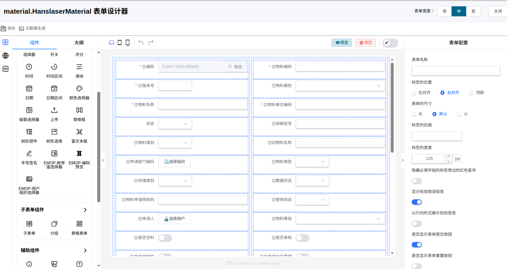

# 快速开始

## 欢迎使用 EMOP 3.0

EMOP（Enterprise Manufacturing Operations Platform）3.0 是新一代高性能、AI原生的企业制造运营平台，为制造业企业提供完整的PLM解决方案。本指南将帮助您快速了解和上手EMOP平台。

## 平台概览

### 核心特性
- **高性能**：提供亚秒级响应
- **AI原生**：集成大语言模型，支持多智能体
- **灵活建模**：面向对象建模方式，支持DSL表达式形式建模，无需关注数据库存储
- **强大集成**：原生支持主流CAD系统集成

## 核心概念快速入门

### 1. 数据模型（ModelObject）
EMOP中的所有业务对象都基于ModelObject，通过面向对象的继承、抽象等概念实现灵活建模。

### 2. 版本管理（ItemRevision）
支持完整的版本控制：
- **逻辑对象**：业务概念层面的对象
- **版本对象**：具体的版本实例
- **版本规则**：控制版本解析逻辑

### 3. 关系管理
支持三种关系类型：
- **结构关系**：如BOM父子关系
- **关联关系**：如文档引用关系
- **内嵌关系**：如规格参数

### 4. AI智能体
内置多个专业智能体，通过自然语言交互自主完成复杂任务：

- CAD辅助设计智能体：AI辅助设计、设计规范检查、参数优化建议
- 文档知识库智能体：智能文档分类、知识关联发现
- 实施智能体：业务需求理解、自动生成数据模型、界面配置、初步代码等内容

## 样例：零件管理

### 1. 定义数据模型

#### 方法A：Java注解方式
```java
@PersistentEntity(schema = Schema.SAMPLE, name = "Part")
public class Part extends ItemRevision {
    @QuerySqlField
    private String partNumber;
    
    @QuerySqlField
    private String partName;
    
    @QuerySqlField
    private String materialType;
    
    @QuerySqlField
    private Double weight;
}
```

#### 方法B：DSL方式
```sql
create type sample.Part extends ItemRevision {
    attribute partNumber: String {
        persistent: true
        required: true
        businessKey: true
    }
    attribute partName: String {
        persistent: true
        required: true
    }
    attribute materialType: String {
        persistent: true
    }
    attribute weight: Double {
        persistent: true
    }
    schema: sample
    tableName: PART
}
```

### 2. 创建零件对象
Java代码方式
```java
// 使用Java API
Part part = new Part();
part.setPartNumber("P001");
part.setPartName("发动机缸体");
part.setMaterialType("铸铁");
part.setWeight(15.5);

// 保存到数据库
S.service(ObjectService.class).create(part);
```
DSL方式
```javascript
create object Part {
    objectType: 'BomLine',
    parentPart: 'ENG-001',
    childPart: 'P001',
    quantity: 1,
    position: '1'
};
```

### 3. 查询零件
Java代码方式
```java
// 查询所有零件
List<Part> parts = Q.result(Part.class).query();

// 按条件查询
List<Part> heavyParts = Q.result(Part.class)
    .where("weight > ?", 10.0)
    .query();

// 按零件号查询
Part part = Q.result(Part.class)
    .where("partNumber = ?", "P001")
    .queryFirst();
```
DSL方式
```javascript
show object Part(weight > 10)

show object Part(partNumber = ‘P001’)
```

### 4. 前端界面
系统会自动为Part对象生成表单界面，同时可以通过拖拽方式自定义表单：

[](./images/form.png)


## 常见问题

### Q: 怎样切入平台？
A: 可以通过以下路径熟悉平台
1. **基础概念** → [业务建模基本概念](/business/modeling/guide)
2. **数据操作** → [数据操作指南](/business/data/overview)
3. **界面开发** → [前端渲染定义](/business/frontend/render)
4. **高级特性** → [Trait使用手册](/business/modeling/trait)
5. **实战项目** → [工装夹具库管理教程](/tutorial/fixture/overview)

### Q: 如何自定义业务对象？
A: 可以通过继承现有模型类或使用DSL定义新的对象类型。详见[如何定义业务模型](/business/modeling/modeling)。

### Q: 系统支持哪些CAD格式？
A: 支持主流CAD系统，包括Creo、SolidWorks、Catia、NX等。详见[CAD集成开发](/business/xcad/overview)。

### Q: 如何集成现有系统？
A: 提供完整的REST API和数据集成能力。详见[数据集成](/business/core/datahub)。

### Q: 性能如何优化？
A: 平台提供多级缓存。详见[多级缓存设计](/platform/cache) 及 [批量API](/business/specification/pipeline)。
