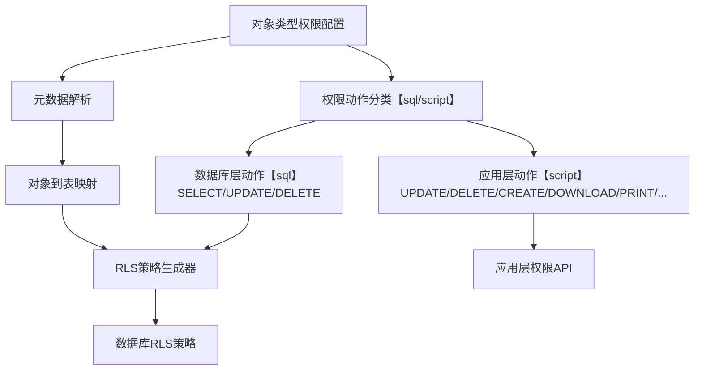
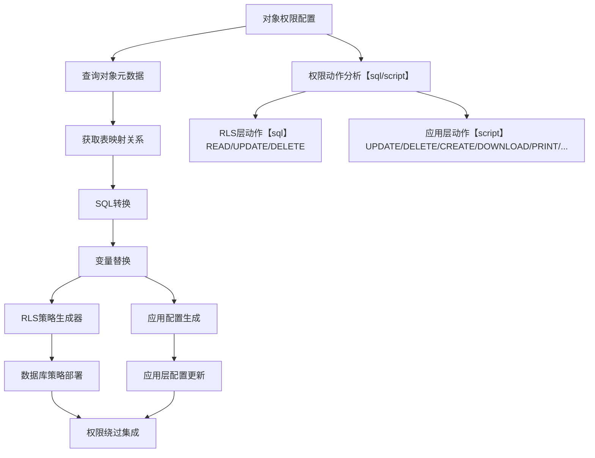
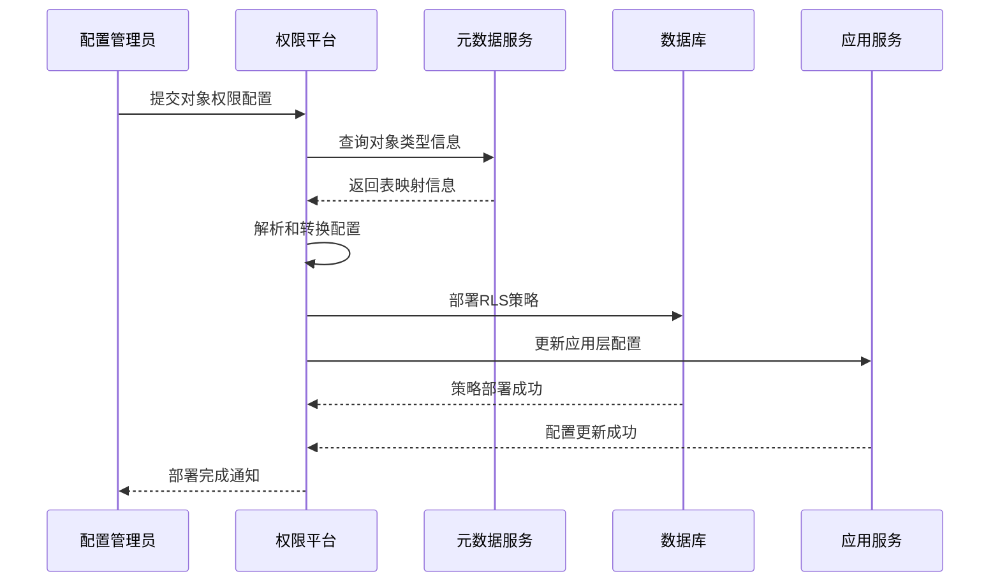
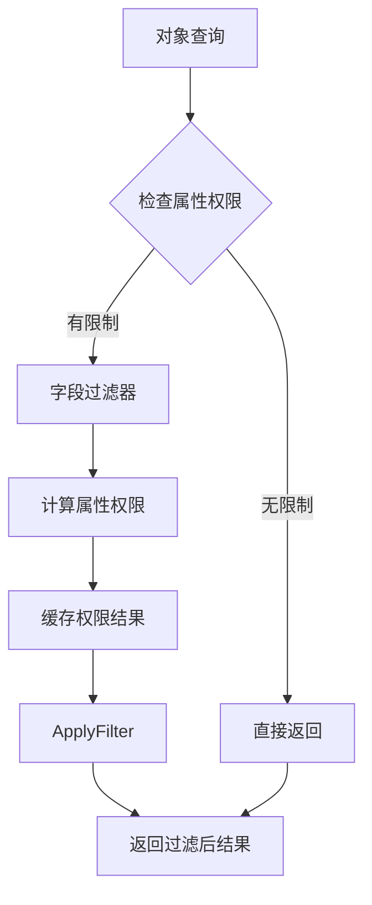
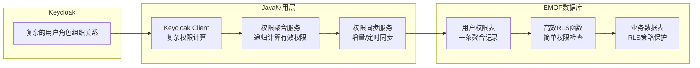

# ABAC权限控制设计文档

## 1. 概述

### 1.1 设计目标

基于EMOP平台现有的多层缓存架构，设计一套元数据驱动的ABAC（Attribute-Based Access Control）权限控制系统，核心目标：

- **元数据驱动**：权限配置完全基于元数据定义，支持动态调整
- **继承机制**：支持基于对象类型继承关系的权限继承
- **高性能**：结合现有缓存架构，确保权限检查不成为性能瓶颈
- **PostgreSQL RLS集成**：充分利用数据库层面的行级安全特性
- **属性级别控制**：支持对象属性级别的细粒度读写权限控制
- **Keycloak集成**：与企业级身份认证系统无缝集成
- **业务场景支持**：支持复杂的业务权限场景

::: warning ⚠️PG数据库绑定
为了性能考虑使用了PG数据库native的功能`RLS(Row-Level Security)`来实现，意味着数据库绑定，其他数据库例如Oracle、SQL
Server都提供类似的RLS功能，甚至更为强大，因此迁移成本不会太高，但是MySQL暂时不支持RLS特性
:::

## 2 RLS配置

### 2.1 设计理念

**核心设计思想**：

- **面向对象配置**：配置人员直接配置对象类型权限，无需关心底层表结构
- **统一权限视图**：所有权限动作统一配置，平台自动分发到RLS层或应用层
- **透明的技术边界**：配置人员不需要了解RLS和应用层的技术区别
- **对象到表的自动映射**：平台根据元数据自动完成对象类型到数据表的映射转换
- **默认允许策略**：未配置的权限动作默认允许，避免因缺少策略导致的操作失败，当表启用RLS后，平台会自动检测哪些CRUD操作缺少明确的权限配置，并为这些操作生成默认允许策略，确保系统正常运行

::: warning ⚠️注意事项
- 一个对象类型只能对应一张表，如果需要不同权限策略，请在元数据设计时使用不同的对象类型
- 平台会根据权限动作特性自动决定在RLS层还是应用层实现
- 暂时不提供界面配置，如果需要后续可添加界面配置后编译为具体的SQL片段即可
:::

### 2.2 面向对象的权限配置架构



### 2.3 统一的YAML配置模型

**面向业务对象的权限配置**

面向业务对象的权限配置, 配置人员只需关心业务逻辑
```yaml
version: "1.0"
description: "EMOP平台内置对象默认权限配置"

# 权限配置
permissionConfig:
  objects:
    # 所有受版本管控对象
    AbstractModelObject:
      description: "已发布和冻结版本对象不可以删除和更改"
      permissions:
        UPDATE:
          conditions:
            - script: "!(object._state in ['Released', 'Frozen'])"
              description: "不可以修改已发布和冻结版本对象"
        DELETE:
          conditions:
            - script: "!(object._state in ['Released', 'Frozen'])"
              description: "不可以删除已发布和冻结版本对象"
    # 草稿对象 - 简单权限场景
    DraftModelObject:
      description: "草稿对象权限控制，删改查都只能是自己"
      permissions:
        READ:
          conditions:
            - sql: "_creator = ${currentUserId}"
              description: "只能查看自己的草稿"
        UPDATE:
          conditions:
            - script: "object._creator = currentUserId"
              description: "只能修改自己的草稿"
        DELETE:
          conditions:
            - script: "object._creator = currentUserId"
              description: "只能删除自己的草稿"

# 预定义函数和模板
helpers:
  # 常用权限检查groovy函数，在应用层执行
  script_functions:
    # 用户角色检查函数
    user_has_role:
      description: "检查用户是否拥有指定角色"
      usage: "user_has_role('角色keycloak UID')"
      example: "user_has_role('bd23de3f-086a-42ff-ba39-fb9139d94af9')"
      returns: "boolean - 是否拥有该角色"

    user_is_admin:
      description: "检查当前用户是否为管理员"
      usage: "user_is_admin()"
      example: "user_is_admin()"
      returns: "boolean - 是否为管理员"

    user_is_manager:
      description: "检查当前用户是否为经理"
      usage: "user_is_manager()"
      example: "user_is_manager()"
      returns: "boolean - 是否为经理"

    user_in_department:
      description: "检查当前用户是否在指定部门"
      usage: "user_in_department('部门UID')"
      example: "user_in_department('f7669429-3da1-47f9-b143-abdb5b95d77e')"
      returns: "boolean - 是否在该部门"

    # 对象权限检查函数
    check_creator_permission:
      description: "检查是否为对象创建者"
      usage: "check_creator_permission(creatorId)"
      example: "check_creator_permission(object._creator)"
      returns: "boolean - 是否为创建者"
      notes: "支持Long、Integer、String等类型的创建者ID"

    check_object_permission:
      description: "检查用户是否对指定对象有特定权限"
      usage: "check_object_permission(objectId, 'action')"
      example: "check_object_permission(123L, 'READ')"
      returns: "boolean - 是否有该权限"

    # 业务逻辑辅助函数
    check_object_state:
      description: "检查对象状态是否允许操作"
      usage: "check_object_state(state, allowedStates)"
      example: "check_object_state(object._state, ['DRAFT', 'Working'])"
      returns: "boolean - 状态是否允许"


  # 常用SQL函数，默认放置于 auth schema下面，在RLS策略中执行
  sql_functions:
    # 获取当前用户信息
    "auth.get_current_user_id()":
      description: "获取当前用户ID"
      usage: "_creator = auth.get_current_user_id()"
      returns: "BIGINT - 当前用户ID"

    "auth.get_current_user_uid()":
      description: "获取当前用户UID"
      usage: "creator_uid = auth.get_current_user_uid()"
      returns: "TEXT - 当前用户UID"

    "auth.get_current_user_department_uid()":
      description: "获取当前用户主部门UID"
      usage: "department_uid = auth.get_current_user_department_uid()"
      returns: "TEXT - 当前用户主部门UID"

    # 用户权限检查函数
    "auth.user_has_role(role_uid)":
      description: "检查用户是否拥有指定角色"
      usage: "auth.user_has_role('bd23de3f-086a-42ff-ba39-fb9139d94af9')"
      returns: "BOOLEAN - 是否拥有该角色"

    "auth.user_is_admin()":
      description: "检查用户是否为管理员"
      usage: "auth.user_is_admin()"
      returns: "BOOLEAN - 是否为管理员"

    "auth.user_is_manager()":
      description: "检查用户是否为经理"
      usage: "auth.user_is_manager()"
      returns: "BOOLEAN - 是否为经理"

    "auth.user_in_department(department_uid)":
      description: "检查用户是否在指定部门"
      usage: "auth.user_in_department('f7669429-3da1-47f9-b143-abdb5b95d77e')"
      returns: "BOOLEAN - 是否在该部门"

    # 对象权限检查函数
    "auth.check_creator_permission(creator_id)":
      description: "检查是否为对象创建者"
      usage: "auth.check_creator_permission(_creator)"
      returns: "BOOLEAN - 是否为创建者"

    "auth.check_department_permission_by_creator(creator_id)":
      description: "检查是否与创建者在同一部门"
      usage: "auth.check_department_permission_by_creator(_creator)"
      returns: "BOOLEAN - 是否同部门"

    # 会话管理函数
    "auth.set_session_user_context(user_id, user_uid, bypass)":
      description: "设置会话用户上下文"
      usage: "SELECT auth.set_session_user_context(123, 'user-uid', false)"
      returns: "VOID"

    "auth.clear_session_user_context()":
      description: "清除会话用户上下文"
      usage: "SELECT auth.clear_session_user_context()"
      returns: "VOID"
```
:::info 提示
- 内置函数拓展：
  - `script_functions` 定义位于 `permissionEmbeddedFunctions.groovy`, 可自行拓展
  - `sql_functions` 定义位于 `auth_functions.sql`, 可自行拓展
- 权限定义拓展：
  - 非平台级别定义不要修改 `default-permission-config.yml`, 可以新增一个 yml 定义文件，并放入放入classpath
  - 往`application.yml` 中指定新的 yml 定义文件至`emop.permission.config-files`节点
:::
### 2.4 平台自动化处理机制

**对象到表的自动映射**：

1. **元数据查询**：根据对象类型从TypeDefinition中获取对应的表名
2. **权限动作分类**：平台自动识别哪些动作在RLS层处理，哪些在应用层处理
3. **SQL转换**：将面向对象的SQL转换为面向表的SQL
4. **策略完整性检查**：检测哪些CRUD操作缺少策略配置
5. **默认策略生成**：为缺失的操作自动生成默认允许策略
6. **策略部署**：自动将配置分发到对应的技术层

**权限动作的自动分类规则**：

- **RLS层处理**：SELECT、UPDATE、DELETE（影响数据库查询性能的基础操作）
- **应用层处理**：UPDATE、DELETE、CREATE、DOWNLOAD、PRINT、SHARE等（业务逻辑相关的操作）
- **指定方式** `script`类型为应用层执行的`groovy`脚本, `sql`类型为 `RLS` 里面执行的条件

:::info 解释
- `script`提供了较好的应用层执行的复杂度及扩展性，界面上的按钮操作判定都比较方便
- `sql`应用在`RLS`里面，只能针对增删改查的权限进行控制，性能较好，可以进行最终的落库前的检查，但是会影响所有的行数据

因此选择合适的引擎非常重要
:::
::: warning ⚠️引擎选择限制
- READ权限：为了性能考虑，完全依赖RLS在数据库层过滤，Java应用层暂时不做额外检查，因此即使针对READ配置了`script`逻辑，也不会进行检查
- CREATE/UPDATE/DELETE权限：如果配置了`script`逻辑就Java应用层进行检查和验证，如果配置了 `sql`逻辑就在数据库层面进行检查
- 其他自定义权限：只有`script`逻辑生效，`sql`无法生效
  :::
::: warning ⚠️性能考虑
  Script引擎的权限条件可以访问完整的对象属性和上下文信息，但这在某些场景下带来了性能考量：

**需要对象实例的Script条件**：
- 包含`object.xxx`访问的条件（如`object._creator == currentUserId`）
- 根据ID进行权限检查时，需要从缓存或数据库中获取完整对象数据
- 建议优先使用已有ModelObject实例的API，避免不必要的数据库查询

**性能优化的Script条件**：
- 仅依赖用户上下文的条件（如`user_is_admin()`, `user_has_role('role-uid')`）
- 平台会进行性能优化：检测表达式，把这类归纳为TYPE_ONLY脚本，然后条件执行时无需加载对象，
- 建议将TYPE_ONLY条件放在权限规则的前面，利用OR逻辑快速通过

**API选择建议**：
```java
Document doc = processedDoc;
// ✅ 推荐：使用ModelObject API，高性能
if (permissionService.checkPermission(doc, PermissionAction.UPDATE)) {
    // 业务处理
}

// ⚠️ 注意性能：ID API在需要对象属性时会触发查询
if (permissionService.checkPermission(docId, PermissionAction.UPDATE)) {
    Document doc = documentService.findById(docId); // 重复查询
    // 业务处理
}

// ✅ TYPE_ONLY权限无性能影响（管理员等角色权限）
if (permissionService.checkPermission(docId, PermissionAction.UPDATE)) {
    // 如果是TYPE_ONLY权限（如user_is_admin()），性能优异
}
```
:::
## 3 平台自动化权限策略实现

### 3.1 配置到实现的自动转换架构

**平台自动化处理流程**：



### 3.2 数据库层权限绕过机制(bypass)

**RLS策略中的绕过逻辑集成**：

平台在生成RLS策略时，会自动将绕过逻辑集成到每个策略中，确保绕过在数据库层面直接生效。

**绕过集成的策略模板**：

```sql
-- 自动生成的带绕过逻辑的RLS策略模板
CREATE POLICY {object_type}_{action}_policy 
ON {schema}.{table_name} FOR {operation} TO application_role
USING (
    -- 当前 bypass
    current_setting('app.bypass_permission', true)::boolean = true
    OR
    -- 正常权限检查条件
    ({normal_permission_conditions})
);
```
### 3.3 自动化策略生成机制

**对象到表的映射解析**：

1. **元数据查询**：通过对象类型在TypeDefinition中查找对应的表信息
2. **权限继承处理**：如果对象有继承关系，自动合并父类权限配置
3. **表名标准化**：将对象类型映射转换为标准的schema.table格式

**权限动作的智能分类**：

| 权限动作 | 处理层      | 原因                    | 生成策略                  |
|---------|----------|-----------------------|-----------------------|
| READ | RLS层     | 影响查询性能，需要数据库原生支持      | FOR SELECT策略          |
| UPDATE | 应用层/RLS层 | 界面操作/影响修改操作，需要数据库原生支持 | Groovy脚本/FOR UPDATE策略 |
| DELETE | 应用层/RLS层     | 界面操作/影响删除操作，需要数据库原生支持      | Groovy脚本/FOR DELETE策略 |
| CREATE | 应用层      | 业务逻辑复杂，不针对具体行         | Groovy脚本/FOR INSERT策略 |
| DOWNLOAD | 应用层      | 业务操作，需要额外的审计日志        | Groovy脚本              |
| PRINT | 应用层      | 业务操作，可能需要水印等处理        | Groovy脚本              |
| SHARE | 应用层      | 复杂的业务逻辑，涉及第三方系统       | Groovy脚本              |

**SQL转换和优化**：

- **变量展开**：`${currentUserId}` → `current_setting('app.user_id')::BIGINT`

::: warning ⚠️RLS配置注意事项
当表启用RLS后，应用层事务中插入的数据一定要能查出，否则会报错`new row violates row-level security policy for table "xxx"`, 插入/修改/查询没有冲突的情况下，正常用户操作是不会出现问题。
针对某些特殊场景，例如导入数据等没有上下文或使用了SYSTEM上下文的造成冲突，`INSERT`的Policy符合但是`SELECT`的Policy不符合，可以使用`bypass`来进行操作，样例代码：
```java
UserContext.runAsSystem(() -> {
    UserContext.ensureCurrent().byPass(() -> {
        // 创建不同状态的CAD文档
        createBasicCadDocuments();
    });
});
```
:::

### 3.4 配置部署和生效机制

**自动化部署流程**：



**部署验证机制**：

1. **语法验证**：检查SQL片段的语法正确性
2. **权限测试**：使用测试用户验证权限策略是否正确生效
3. **性能检查**：验证生成的RLS策略是否会导致性能问题

### 3.5 运行时权限检查集成

**数据库层权限检查**：

- **自动生效**：RLS策略在数据库层自动生效，无需应用层调用
- **绕过支持**：绕过逻辑在RLS策略中直接集成，数据库层面即可判断
- **高性能**：利用数据库原生RLS机制，查询性能最优

**应用层权限检查**：

- **统一API**：平台提供统一的权限检查API，支持所有权限动作
- **配置驱动**：权限检查逻辑完全基于配置生成，无需硬编码
- **缓存优化**：权限检查结果自动缓存，减少重复计算

## 4. 属性级别权限控制

### 4.1 设计目标与应用场景

**典型业务场景**：

- **财务敏感字段**：成本、价格等字段只有财务人员可见
- **技术机密字段**：技术参数、工艺参数只有研发人员可见
- **审计字段**：创建人、修改人等字段对普通用户只读
- **状态字段**：某些状态字段只有特定角色可以修改

### 4.2 属性权限实现架构



### 4.3 查询层属性过滤

**服务层权限控制**：

```java
// 属性权限服务接口
public interface AttributePermissionService {

    // 过滤对象的敏感属性
    <T extends ModelObject> T filterObjectAttributes(T object, PermissionAction permissionAction);

    // 批量过滤对象属性
    <T extends ModelObject> List<T> filterObjectsAttributes(List<T> objects, PermissionAction permissionAction);

    // 检查单个属性访问权限
    boolean checkAttributePermission(String objectType, String attributeName, PermissionAction permissionAction);
}
```

## 5. Keycloak集成与用户权限扁平化设计

### 5.1 Keycloak复杂性分析与设计思路

**Keycloak集成面临的挑战**：

- **表结构复杂**：Keycloak采用EAV模型，用户、角色、组织关系分散在多张表中
- **跨Schema查询性能问题**：Keycloak和EMOP数据分离导致的性能瓶颈
- **权限计算复杂**：需要递归计算用户的组织角色、复合角色等
- **RLS性能要求**：数据库层面需要高效的权限检查

**核心设计思路**：

1. **Java端负责复杂逻辑**：在应用层处理Keycloak的用户、角色、组织关系计算
2. **数据库端只做简单过滤**：专门创建一张扁平化的权限表，给RLS使用
3. **一条记录原则**：每个用户一条聚合后的权限记录，最大化RLS性能
4. **数据同步机制**：Java端负责将计算结果同步到权限表

### 5.2 用户权限扁平化架构

**整体数据流架构**：



### 5.3 扁平化权限表设计

**核心设计原则**：

- **一个用户一条记录**：最大化RLS查询性能
- **预计算结果存储**：避免实时计算复杂权限关系
- **扁平化存储**：将层级关系扁平化为数组和JSONB
- **常用权限标识**：为常见权限检查提供布尔字段

**权限表结构设计**：

```sql
-- 专门为RLS优化的用户权限表, 元数据对应 UserPermissions 类型
CREATE TABLE emop.user_permissions
(
    id                     BIGINT PRIMARY KEY,
    keycloak_user_uid      TEXT NOT NULL,
    username               TEXT,

    -- 扁平化权限数据（存储Keycloak的String类型UID）
    all_role_uids          TEXT[] NOT NULL DEFAULT '{}',
    all_department_uids    TEXT[] NOT NULL DEFAULT '{}',
    primary_department_uid TEXT,
    department_role_uids   JSONB     DEFAULT '{}',

    -- 常用权限标识（基于角色名称的业务判断）
    is_admin               BOOLEAN   DEFAULT FALSE,
    is_manager             BOOLEAN   DEFAULT FALSE,

    -- 系统字段
    _properties JSONB,

    -- 同步控制
    updated_at             TIMESTAMP DEFAULT NOW(),
    sync_version           BIGINT    DEFAULT 1
);
```

### 5.4 权限聚合与同步策略

**权限聚合逻辑**：

1. **直接角色获取**：用户直接分配的角色
2. **组织角色继承**：从用户所属组织继承的角色
3. **复合角色展开**：递归展开复合角色的子角色
4. **权限去重合并**：合并所有来源的权限，去除重复
5. **常用权限计算**：基于角色计算is_admin、can_download等标识

::: warning ⚠️同步机制
Rest触发，现阶段手工或代码中RPC调用，后续在用户组织界面保存时调用，因此在keycloak中修改数据后一定要记得手工触发rest

- 全量同步: http://localhost:880/foundation/api/auth/permissions/sync/all
- 单个用户同步: http://localhost:880/foundation/api/auth/permissions/sync/user/{keycloakUserUid}
- 查询用户角色组织信息: http://localhost:880/foundation/api/auth/permissions/user/{keycloakUserUid}

:::

### 5.5 RLS性能优化设计

**高性能权限检查函数**：

```sql
-- 单次查询获取完整用户权限
CREATE
OR REPLACE FUNCTION get_user_permissions()
RETURNS emop.user_permissions;

-- 简单高效的权限检查
CREATE
OR REPLACE FUNCTION user_has_role(role_name TEXT)
RETURNS BOOLEAN;

CREATE
OR REPLACE FUNCTION user_in_department(dept_name TEXT)  
RETURNS BOOLEAN;
```

**RLS策略优化特点**：

- **主键查询**：基于keycloak_user_id的主键查询
- **GIN索引支持**：数组字段使用GIN索引加速
- **函数缓存**：权限检查函数支持结果缓存
- **避免子查询**：通过扁平化数据避免复杂子查询

## 6. 性能优化策略

### 6.1 批量权限检查

**批量权限API设计**：

```java
public interface PermissionCheckService {

    // 批量检查对象权限
    Map<Long, Boolean> checkBatchPermissions(List<Long> objectIds, String action);

    // 批量过滤有权限的对象
    List<Long> filterPermittedObjects(List<Long> objectIds, String action);

    // 批量检查属性权限
    Map<String, Boolean> checkBatchAttributePermissions(String objectType, List<String> attributes,
                                                        String accessType);
}
```

### 6.2 索引优化策略

RLS中条件过滤一定要命中index, 可筛选性较强的字段放在最前面，所有相关字段都在index中最佳，这样就不用查找回原表进行数据获取。
