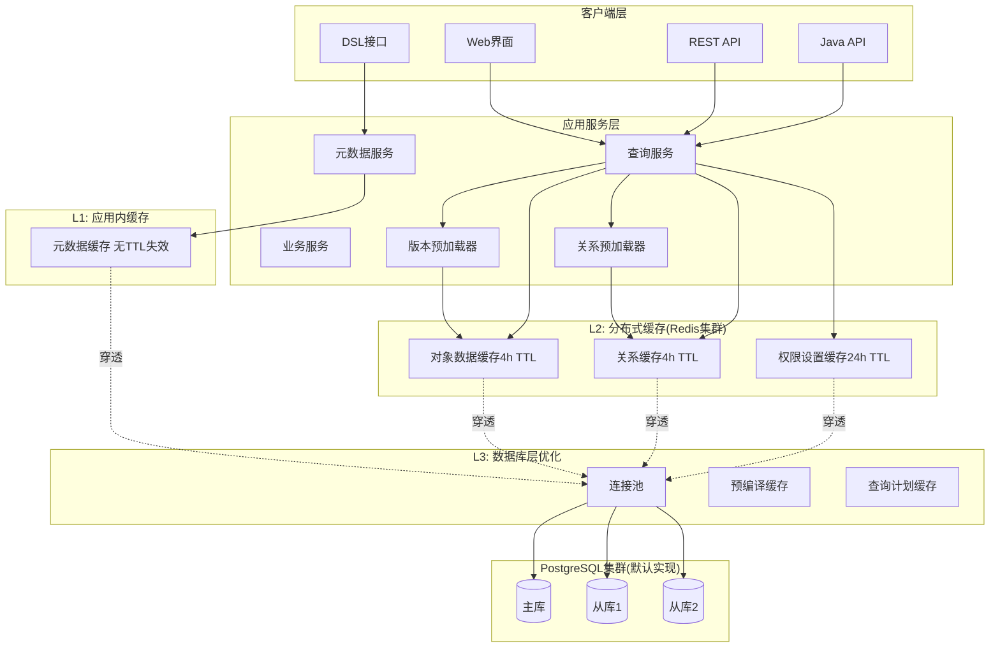
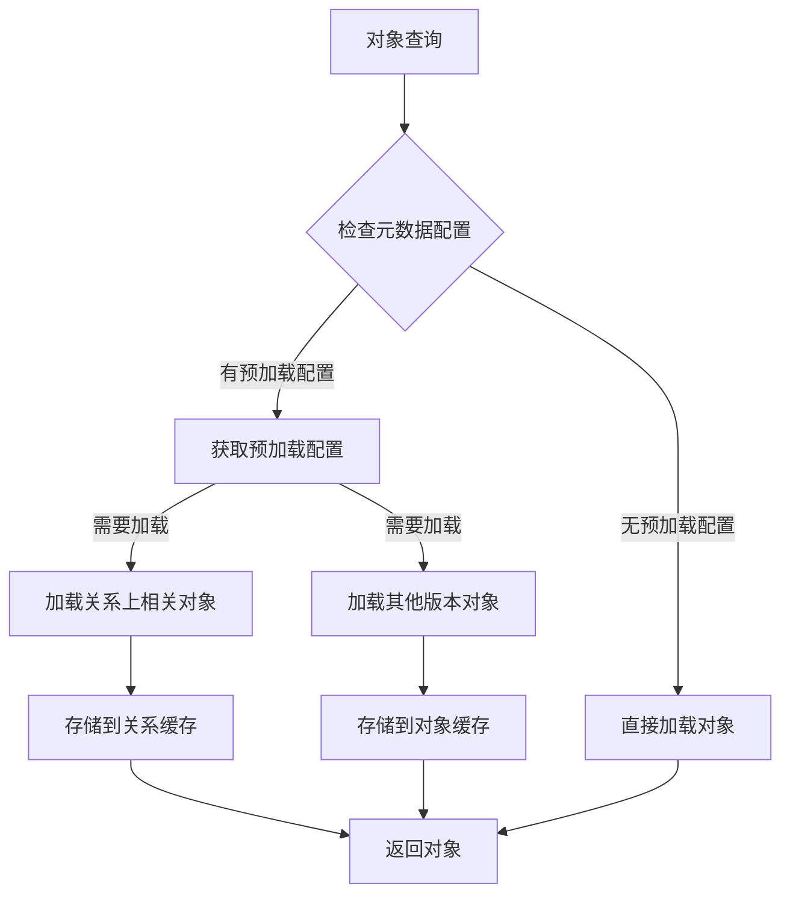
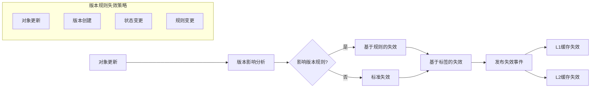

# EMOP平台多层缓存架构设计文档

## 1. 概述

### 1.1 背景与目标

EMOP平台作为企业级元数据驱动的数据管理平台，面临以下挑战：
- **高频元数据访问**：类型定义、属性定义等元数据被频繁查询
- **复杂对象图查询**：业务对象间存在复杂的关联关系
- **跨服务数据共享**：微服务架构下的数据一致性需求
- **对象关系遍历**：查询通常从一个对象出发，沿关系链查询相关对象

设计目标：
- 将数据库查询压力降低70%以上
- 热点数据访问响应时间控制在10ms以内
- 支持水平扩展的分布式缓存架构
- 保证最终一致性下的高可用性
- 针对对象关系查询模式优化缓存效率

### 1.2 总体架构



## 2. 缓存分层策略

### 2.1 L1缓存：应用内存缓存

**设计原则**：
- 基于Caffeine实现的JVM内存缓存
- 零网络开销，亚毫秒级响应
- 进程隔离，避免缓存污染
- 容量有限，仅缓存最热点数据

**缓存分类与策略**：

| 缓存类型 | 容量上限    | TTL策略   | 失效策略 | 适用数据 |
|---------|---------|---------|---------|---------|
| 元数据缓存 | 1,000项  | 不失效     | 手动失效 | TypeDefinition、AttributeDefinition |
| 枚举值缓存 | 10,000项 | 不失效 | 手动失效 | ValueDomainData |
| 热点关系缓存 | 5,000项 | 30分钟 | LRU + 手动失效 | 高频访问的对象关系 |

::: info ℹ️L1缓存实现
采用Caffeine Cache，可以按需自定义失效策略，例如：
```java
private final Cache<String, UserPermissions> userPermissionsCache = Caffeine.newBuilder()
        .maximumSize(1000)
        .expireAfterWrite(5, TimeUnit.MINUTES)
        .recordStats()
        .build();
```
:::

### 2.2 L2缓存：分布式缓存层

**设计原则**：
- Redis集群提供高可用分布式缓存
- 跨应用节点数据共享
- 支持复杂数据结构和事务
- 持久化保证数据可靠性
- 针对元数据驱动平台的对象关系查询模式优化

### 2.3 L3缓存：数据库层优化

**PostgreSQL内置优化**：
- **shared_buffers**：设置为物理内存的25%
- **effective_cache_size**：设置为物理内存的75%
- **work_mem**：针对复杂查询调优
- **maintenance_work_mem**：索引维护优化

**连接池优化**：
- **最大连接数**：CPU核心数 × 2
- **连接预热**：应用启动时建立最小连接
- **PreparedStatement缓存**：每连接缓存100个

## 3. 元数据驱动的缓存策略

### 3.1 对象关系预加载机制

**设计理念**：
基于元数据定义，智能预测和预加载相关对象，减少N+1查询问题。

**预加载策略**：



**对象级别配置**：整个对象类型的默认预加载行为, 根据元数据继承关系而实现继承

### 3.2 基于元数据的缓存控制

**缓存注解设计概念**：

- `@Cacheable(enabled, direction, preloadRelations, preloadRelationsExclude, preloadRevisions, ttl, depth)`
```
preloadRevisions 可能的值为
- latest 代表预加载最新版
- latestReleased 代表预加载最新发布版
- all 代表预加载所有版本(只有明确场景才使用，可能会对预加载产生性能影响)
```
**配置示例概念**：
```java
@CacheEnabled(enabled = true, direction = OUTGOING, preloadRelations = {"*"}, preloadRelationsExclude = {}, preloadRevisions = {latest, latestReleased}, ttl = "4h", depth= "1")
public class Document extends AbstractModelObject {

    @AssociateRelation
    private List<Tag> tags;

    @StructuralRelation
    private Folder parent;

    @AssociateRelation
    private List<Comment> comments;
}
```

## 4. 缓存键设计规范

### 4.1 命名空间设计

```
emop:{domain}:{type}:{identifier}
```

**域分类**：
- `obj`：业务对象数据
- `query`：查询结果
- `rel`：关系数据
- `coderev`：版本数据和业务编码（统一域）
- `bizukey`：业务复合键索引
- `lock`：分布式锁
- `session`：会话数据

### 4.2 键模式规范

| 数据类型 | 键模式                                             | 示例                                   | 说明                                                                         | 存储内容                      |
|------|-------------------------------------------------|--------------------------------------|----------------------------------------------------------------------------|---------------------------|
| 对象数据 | `emop:obj:{id}`                                 | `emop:obj:123456789`                 | 存储完整的ModelObject                                                           | 序列化的完整二进制对象(`Fury`序列化和反序列化) |
| 业务编码 | `emop:coderev:{type}:{code}`                    | `emop:coderev:Material:M0606`        | 业务编码到对象的映射（版本域统一管理）,没有版本的coderev                                           | 对象ID字符串                   |
| 版本数据 | `emop:coderev:{type}:{code}/{revId}`            | `emop:coderev:Material:M0606/A`      | 特定版本到对象的映射                                                                 | 对象ID字符串                   |
| 版本类型 | `emop:coderev:{type}:{code}/{type}`             | `emop:coderev:Material:M0606/latest` | 版本类型（latest/latestReleased）到对象的映射                                          | 对象ID字符串                   |
| 业务复合键 | `emop:bizukey:{type}:{keyValue}`                | `emop:bizukey:Part:proj1:P001`       | 业务复合键到对象的映射                                                                | 对象ID字符串                   |
| 关系数据 | `emop:rel:{primaryId}:{relType}:{revisionRule}` | `emop:rel:123:children:LATEST`       | 存储关联对象ID集合，支持版本规则动态解析，由于StructrualRelation不支持revisionRule，因此使用固定值`PRECISE` | 解析后的对象ID数组JSON            |
| 标签映射 | `tag:{type}:{code}`, `tag:{id}`                 | `tag:Material:MAT-001` , `tag:123456789`             | 业务编码标签到缓存键的映射，附加在现有的key-value之上，方便高效失效key-value                    | 缓存键字符串集合（Redis Set）       |

:::warning ⚠️注意事项
上面表格中的关系都是指出向关系，针对入向关系暂时不做缓存，因为使用场景较少缓存使用效率不高，针对入项关系的分析，更多依靠图数据进行。
:::

### 4.4 高层级存储伪代码

**对象存储伪代码**：
```java
// 存储对象时的缓存操作
public void cacheObject(ModelObject obj) {
    Pipeline pipeline = redis.pipelined();
    
    // 1. 存储主对象数据
    String objectKey = "emop:obj:" + obj.getId();
    pipeline.setex(objectKey, TTL_4_HOURS, serialize(obj));
    
    // 2. 存储业务编码映射
    if (obj instanceof Revisionable rev) {
        String codeKey = "emop:coderev:" + obj.getType() + ":" + rev.getCode();
        if (rev.getRevId() != null) {
            codeKey += "/" + rev.getRevId();
        }
        pipeline.setex(codeKey, TTL_4_HOURS, obj.getId().toString());
        
        // 3. 存储版本类型映射
        String latestKey = "emop:coderev:" + obj.getType() + ":" + rev.getCode() + "/latest";
        pipeline.setex(latestKey, TTL_4_HOURS, obj.getId().toString());
        
        if (isReleased(obj)) {
            String releasedKey = "emop:coderev:" + obj.getType() + ":" + rev.getCode() + "/latestReleased";
            pipeline.setex(releasedKey, TTL_4_HOURS, obj.getId().toString());
        }
    }
    
    // 4. 存储业务复合键映射
    if (obj instanceof BusinessUniqueKeyAware businessKey) {
        for (BusinessUniqueKey key : businessKey.businessUniqueKeys()) {
            String bizKey = "emop:bizukey:" + obj.getType() + ":" + buildKeyValue(obj, key);
            pipeline.setex(bizKey, TTL_4_HOURS, obj.getId().toString());
        }
    }
    
    pipeline.sync();
}
```

**关系存储伪代码**：
```java
// 存储关系时的缓存操作和标签设置
public void cacheRelationWithTags(Long primaryId, String relType, 
                                  RevisionRule rule, List<ModelObject> resolvedObjects) {
    Pipeline pipeline = redis.pipelined();
    
    // 1. 存储关系数据
    String relationKey = String.format("emop:rel:%s:%s:%s", primaryId, relType, rule.getName());
    List<Long> objectIds = resolvedObjects.stream().map(ModelObject::getId).collect(toList());
    pipeline.setex(relationKey, getTTLForRule(rule), serialize(objectIds));
    
    // 2. 设置标签映射
    for (ModelObject obj : resolvedObjects) {
        String tagKey = "tag:" + obj.getId();
        pipeline.sadd(tagKey, relationKey); // 使用标签操作
        String code = extractCode(obj, rule);
        if (code != null) {
            tagKey = "tag:" + code;
            pipeline.sadd(tagKey, relationKey); // 使用标签操作
        }
    }
    
    pipeline.sync();
}
```

### 4.3 统一业务编码和版本数据

**设计理念**：
- 将业务编码视为版本对象的特殊情况（只有code，没有revId）
- 统一在 `coderev` 域中管理所有与code相关的缓存
- 减少键空间的复杂性，简化缓存管理逻辑

**键格式说明**：
```
# 业务编码
emop:coderev:Material:M0606

# 具体版本
emop:coderev:Material:M0606/A
emop:coderev:Material:M0606/B

# 特殊版本类型
emop:coderev:Material:M0606/latest
emop:coderev:Material:M0606/latestReleased
```

### 4.5 统一对象存储优化设计

**设计目标**：
通过统一存储策略减少内存使用和网络往返次数，将原本分散存储的对象索引统一为指向主存储的引用。

**核心设计理念**：
- **主存储唯一性**：每个ModelObject只在`emop:obj:{id}`存储一份完整数据
- **索引统一化**：所有其他查询方式（业务编码、版本、复合键）都存储对象ID作为索引
- **查询路径优化**：使用Lua脚本实现单次往返的索引解析和数据获取

**存储架构对比**：

| 查询方式 | 全量存储方式                                      | 引用存储方式                                      | 内存节省 |
|---------|---------------------------------------------|---------------------------------------------|---------|
| 对象ID查询 | `emop:obj:{id}` → 完整对象                      | `emop:obj:{id}` → 完整对象                      | 无变化 |
| 业务编码查询 | `emop:coderev:{type}:{code}` → 完整对象         | `emop:coderev:{type}:{code}` → 对象ID         | 85%+ |
| 版本查询 | `emop:coderev:{type}:{code}/{revId}` → 完整对象 | `emop:coderev:{type}:{code}/{revId}` → 对象ID | 85%+ |
| 复合键查询 | `emop:bizukey:{type}:{key}` → 完整对象          | `emop:bizukey:{type}:{key}` → 对象ID          | 85%+ |

**统一查询Lua脚本增强**：
```lua
-- unified_object_lookup.lua
-- 通过任意索引键查询对象，支持批量查询
-- KEYS: 索引键数组 (如: emop:coderev:Material:M0606, emop:bizukey:Part:proj1:P001)

local function batch_object_lookup()
    local results = {}
    local object_keys_to_fetch = {}
    local index_to_object_map = {}
    
    -- 第一轮：批量获取所有索引对应的对象ID
    for i = 1, #KEYS do
        local index_key = KEYS[i]
        local object_id = redis.call('GET', index_key)
        
        if object_id then
            local object_key = 'emop:obj:' .. object_id
            table.insert(object_keys_to_fetch, object_key)
            index_to_object_map[object_key] = i
        else
            results[i] = nil
        end
    end
    
    -- 第二轮：批量获取所有对象数据
    if #object_keys_to_fetch > 0 then
        local object_values = redis.call('MGET', unpack(object_keys_to_fetch))
        
        for j = 1, #object_keys_to_fetch do
            local object_key = object_keys_to_fetch[j]
            local index_position = index_to_object_map[object_key]
            results[index_position] = object_values[j]
        end
    end
    
    return results
end

return batch_object_lookup()
```

### 4.6 版本规则集成的关系缓存设计

**设计目标**：
将EMOP的版本规则机制深度集成到缓存层，实现版本感知的关系缓存，提供统一的版本规则查询体验。

**核心设计原理**：
- **版本规则作为缓存维度**：将版本规则作为缓存键的一个维度，不同版本规则产生不同的缓存条目
- **延迟解析策略**：缓存时存储基础关系信息，查询时根据版本规则动态解析具体版本
- **智能缓存共享**：相同版本规则的查询可以共享缓存，避免重复计算

**关系缓存分层架构**：
```
查询层：findChildren(primary, relType, LATEST)
    ↓
缓存层：emop:rel:123:children:LATEST
    ↓
解析层：基础关系 + 版本规则解析
    ↓
存储层：Relation表 + RevisionRule解析
```

**版本规则下的关系缓存策略**：

| 版本规则类型          | 缓存策略 | TTL设置 | 失效触发            |
|-----------------|------|-------|-----------------|
| PRECISE         | 中期缓存 | 4小时   | 对象删除时根据id失效     |
| LATEST          | 中期缓存 | 4小时   | 目标对象变化时根据code失效 |
| RELEASED | 中期缓存 | 4小时   | 目标对象变化时根据code失效 |
| LATEST_WORKING | 中期缓存 | 4小时   | 目标对象变化时根据code失效 |
| TIME_POINT      | 长期缓存 | 24小时  | 历史数据不变          |
| SCRIPT          | 无缓存  | -     | -               |

**缓存键命名规范**：
```
# 基础格式
emop:rel:{primaryId}:{relationType}:{revisionRule}

# 示例
emop:rel:12345:children:LATEST          # 获取最新版本的子对象
emop:rel:12345:children:LATEST_RELEASED # 获取最新发布版本的子对象
emop:rel:12345:children:PRECISE         # 获取精确版本的子对象
emop:rel:12345:dependencies:TIME_POINT_20240101 # 获取时间点版本的依赖对象
```

**版本规则解析流程**：
1. **查询阶段**：根据版本规则构建缓存键
2. **缓存命中**：直接返回已解析的版本对象
3. **缓存未命中**：从数据库加载基础关系→应用版本规则→缓存解析结果
4. **结果标签**：为解析后的对象设置code标签，支持精确失效

### 4.7 针对关系的智能标签失效机制

**设计理念**：
通过为缓存条目添加业务语义标签，实现基于业务逻辑的精确缓存失效，解决版本对象更新时的缓存一致性问题。

**标签分类体系**：
- **id标签**：`tag:{id}` - 基于对象的全局id
- **业务编码标签**：`tag:{type}:{code}` - 基于对象的业务编码

**标签设置策略**：
```
缓存关系时的标签设置：
1. 解析关系中的所有目标对象
2. 提取每个对象的业务编码（考虑版本规则）
3. 为缓存键添加相应的"id标签"和"业务编码标签"标签
4. 支持一个缓存键对应多个标签

示例：
缓存键：emop:rel:123:children:LATEST
目标对象：Engine-001/A [id=123456789], Pump-002/B [id=123456788]
设置标签：
- tag:Material:Engine-001 -> {emop:rel:123:children:LATEST}
- tag:123456789 -> {emop:rel:123:children:LATEST}
- tag:Material:Pump-002 -> {emop:rel:123:children:LATEST}
- tag:123456788 -> {emop:rel:123:children:LATEST}
```

### 4.8 统一关系查询架构

**设计目标**：
统一结构关系和关联关系的查询接口，提供一致的缓存策略和版本规则支持。

**统一接口设计**：
- **查询接口统一**：不论是结构关系还是关联关系，都通过统一的接口查询
- **缓存策略统一**：采用相同的缓存键格式和失效机制
- **版本规则统一**：所有关系查询都支持版本规则参数

**关系类型映射**：
```
统一查询视图：
├── 结构关系 (StructuralRelation)
│   ├── parent: emop:rel:{id}:parent:PRECISE
│   └── children: emop:rel:{id}:children:PRECISE
├── 关联关系 (AssociateRelation)  
│   ├── dependencies: emop:rel:{id}:dependencies:{rule}
│   └── references: emop:rel:{id}:references:{rule}
└── 特殊关系
    ├── all_relations: emop:rel:{id}:__all__:{rule}
    └── incoming_relations: emop:rel:{id}:__incoming__:{rule}
```

- **过期策略**：使用Redis TTL自动过期 + 应用层主动清理

## 5. 缓存更新策略

### 5.1 数据一致性模型

**最终一致性**：适用于大部分业务场景
- 写操作：先更新数据库，后异步失效缓存

### 5.2 版本感知的智能缓存失效策略



**版本规则失效触发机制**：
```
对象更新事件 → 版本影响分析 → 确定影响的版本规则 → 构建失效缓存键模式 → 执行批量失效

示例流程：
1. Engine-001对象新增B版本
2. 分析影响：LATEST、LATEST_WORKING规则受影响
3. 构建失效模式：emop:rel:*:*:LATEST (包含tag:Engine-001)
4. 批量失效所有匹配的缓存键
```

**失效粒度控制**：
- **对象级失效**：单个对象更新时的精确失效，同时基于标签机制失效对应关系
- **关系级失效**：基于标签机制失效对应关系，关系失效不会导致对象失效

**关联关系失效机制**：

#### A. Revisionable对象更新失效策略

**场景描述**：当一个包含业务编码的版本对象（如Engine-001/A）发生更新时，需要失效所有指向该对象的关系缓存。

**基于标签失效的Lua脚本**：
```lua
-- invalidate_relation_by_tag.lua
-- 失效所有包含指定type:code或id标签的关系缓存
-- ARGV[1]: "类型:业务编码"或"id" (如: Material:Engine-001 , 123456789)

local tag = ARGV[1]
local tag_key = 'tag:' .. tag

-- 获取所有包含该标签的关系缓存键
local relation_keys = redis.call('SMEMBERS', tag_key)

if #relation_keys == 0 then
    return {0, {}}
end

local deleted_keys = {}
local deleted_count = 0

-- 批量删除关系缓存
for i = 1, #relation_keys do
    local key = relation_keys[i]
    local deleted = redis.call('DEL', key)
    if deleted > 0 then
        deleted_count = deleted_count + deleted
        table.insert(deleted_keys, key)
    end
end

-- 删除标签集合
redis.call('DEL', tag_key)

return {deleted_count, deleted_keys}
```
输入参数为 `{type}:{code}`

#### B. 普通ModelObject更新失效策略

**场景描述**：当一个普通的业务对象（不包含版本信息）更新时的失效策略。

**对象自身关系失效的Lua脚本**：
使用`invalidate_relation_by_tag.lua`，输出参数为 `{id}` 

#### C. 关系变更失效策略

**场景描述**：当对象间的关系发生变更（添加、删除、修改关系）时的失效策略。

**关系类型批量失效的Lua脚本**：
```lua
-- invalidate_relation_by_rel_name.lua
-- 失效指定对象的特定关系类型的所有版本规则缓存
-- ARGV[1]: 主对象ID
-- ARGV[2]: 关系类型

local primary_id = ARGV[1]
local rel_type = ARGV[2]
local pattern = 'emop:rel:' .. primary_id .. ':' .. rel_type .. ':*'

-- 获取所有匹配的关系缓存键
local relation_keys = redis.call('KEYS', pattern)

if #relation_keys == 0 then
    return {0, {}}
end

local deleted_keys = {}

-- 批量删除关系缓存
for i = 1, #relation_keys do
    local key = relation_keys[i]
    redis.call('DEL', key)
    table.insert(deleted_keys, key)
end

return {#relation_keys, deleted_keys}
```

#### D. 批量失效优化策略

**批量标签失效的Lua脚本**：
```lua
-- batch_invalidate_relation_by_tags.lua
-- 批量失效多个tag标签的关系缓存
-- ARGV: tag数组 (如: Material:Engine-001, 123456789)

local all_relation_keys = {}
local all_tag_keys = {}
local relation_key_set = {} -- 用于去重

-- 第一轮：收集所有要删除的relation_key和tag_key
for i = 1, #ARGV do
    local tag = ARGV[i]
    local tag_key = 'tag:' .. tag
    
    -- 获取该标签的所有关系缓存键
    local relation_keys = redis.call('SMEMBERS', tag_key)
    
    if #relation_keys > 0 then
        -- 收集relation_keys（去重）
        for j = 1, #relation_keys do
            local relation_key = relation_keys[j]
            if not relation_key_set[relation_key] then
                relation_key_set[relation_key] = true
                table.insert(all_relation_keys, relation_key)
            end
        end
        
        -- 收集tag_key
        table.insert(all_tag_keys, tag_key)
    end
end

local deleted_count = 0
local deleted_keys = {}

-- 第二轮：批量删除relation_keys
if #all_relation_keys > 0 then
    -- 批量删除所有relation_keys
    local deleted = redis.call('DEL', unpack(all_relation_keys))
    deleted_count = deleted_count + deleted
    
    -- 记录实际删除的keys（假设都删除成功）
    for i = 1, #all_relation_keys do
        table.insert(deleted_keys, all_relation_keys[i])
    end
end

-- 第三轮：批量删除tag_keys
if #all_tag_keys > 0 then
    redis.call('DEL', unpack(all_tag_keys))
end

return {deleted_count, deleted_keys}
```
