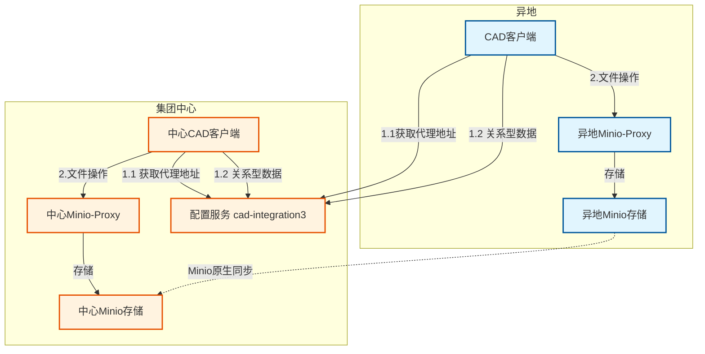

# EMOP异地文件服务设计文档

## 1. 设计概览

### 1.1 核心价值与设计理念

异地文件服务专门解决EMOP分布式环境中的**异地文件访问延迟问题**。核心设计理念是通过"**文件存储分离-元数据集中-动态路由**"模式，为异地工程师提供就近的文件存储服务，同时保持所有元数据和业务逻辑的集中管理。

**关键设计原则**：

- **存储就近化**：文件存储部署在异地，降低访问延迟
- **元数据集中化**：所有文件元数据、权限、关系数据保持在中心节点
- **服务透明化**：CAD客户端动态获取最优的代理服务地址
- **能力复用化**：最大化利用Minio原生的同步、监控等能力

### 1.2 典型应用场景

**现有问题**：
- 异地工程师访问集团中心文件服务延迟较高（50-200ms）
- 大文件上传下载占用专线带宽
- 网络抖动影响文件操作体验

**解决方案**：
- 异地部署独立的Minio文件存储及EMOP3 Minio-Proxy服务
- CAD客户端启动时动态获取就近的Minio-Proxy地址
- 利用Minio原生能力实现存储同步
- 所有业务逻辑和元数据管理保持不变

### 1.3 整体架构设计



## 2. 核心架构设计

### 2.1 架构分层

```
配置服务层 (动态路由配置)
├── 关系型数据 (中心cad-integration3)  
├── 代理服务层 (异地Minio-Proxy + 中心Minio-Proxy)  
├── 存储服务层 (异地Minio + 中心Minio + 原生同步)
└── 基础设施层 (网络、存储)
```

### 2.2 职责分离

**配置服务职责**：
- 维护客户端到代理服务的路由配置
- 根据客户端IP/用户信息返回最优代理地址
- 提供代理服务健康状态查询

**异地Minio-Proxy职责**：
- 提供与中心代理完全相同的文件服务接口
- 将文件存储操作路由到本地Minio
- 保持与现有业务逻辑完全兼容

**Minio存储职责**：
- 提供文件的实际存储服务
- 利用Minio原生能力实现跨站点同步
- 提供原生的监控和管理能力

## 3. 动态路由设计

### 3.1 配置服务接口

**路由配置API**：

```java
public interface ProxyConfigService {
    
    /**
     * 获取客户端应该使用的代理服务地址
     * @param clientInfo 客户端信息（IP、用户ID等）
     * @return 代理服务的URL
     */
    String getProxyUrl(ClientInfo clientInfo);
    
    /**
     * 获取所有可用的代理服务列表
     * @return 代理服务列表及其健康状态
     */
    List<ProxyServiceInfo> getAvailableProxies();
}
```

**客户端信息**：

```java
public class ClientInfo {
    private String clientIP;
    private String userId; 
    private String department;
    private String location;  // 可选，用于地理位置判断
}
```

### 3.2 路由策略

**简单路由规则**：

```yaml
# 路由配置示例
routing:
  rules:
    - condition: "clientIP.startsWith('192.168.100')"  # 异地网段
      proxyUrl: "http://zhangjiakou-proxy.internal:8080"
    - condition: "department == 'ZJK_ENGINEERING'"      # 异地部门
      proxyUrl: "http://zhangjiakou-proxy.internal:8080"  
    - condition: "default"                               # 默认规则
      proxyUrl: "http://center-proxy.internal:8080"
```

**故障切换逻辑**：

```java
public class ProxyFailoverHandler {
    
    public String getProxyWithFailover(ClientInfo clientInfo) {
        String primaryProxy = getPrimaryProxy(clientInfo);
        
        if (isProxyHealthy(primaryProxy)) {
            return primaryProxy;
        }
        
        // 降级到中心代理
        return getCenterProxy();
    }
}
```

## 4. 文件同步设计

### 4.1 Minio原生同步能力

**利用Minio Site Replication功能**：

```bash
# 配置站点复制
mc admin replicate add center-minio http://center-minio:9000 \
                       remote-minio http://zhangjiakou-minio:9000

# 启用双向同步  
mc admin replicate info center-minio
```

**同步特性**：
- 自动双向同步新增、修改、删除的文件
- 保持文件版本一致性
- 提供同步状态监控
- 支持增量同步，只传输变更内容

### 4.2 同步策略配置

**同步配置**：

```yaml
# minio同步配置
replications:                    # 针对不同的桶的同步方案
  - replication:
      bucket: "zhangjiakou"      # 张家口
      enabled: true
      mode: "bidirectional"      # 双向同步
      bandwidth_limit: "100MB"   # 带宽限制
      sync_delete: true          # 同步删除操作
      health_check_interval: "30s"
  - replication:
      bucket: "standard"      # 标准件
      enabled: true
      mode: "bidirectional"      # 双向同步
      bandwidth_limit: "100MB"   # 带宽限制
      health_check_interval: "30s"
```

## 6. 运维和监控

### 6.1 利用Minio原生监控

**监控能力**：
- Minio Console提供Web界面监控
- 支持Prometheus metrics导出
- 提供API接口查询存储状态
- 自带日志和审计功能

**关键监控指标**：

```yaml
# Prometheus监控指标
metrics:
  - minio_cluster_capacity_total_bytes
  - minio_cluster_capacity_usable_free_bytes  
  - minio_s3_requests_total
  - minio_s3_errors_total
  - minio_replication_stats
```
