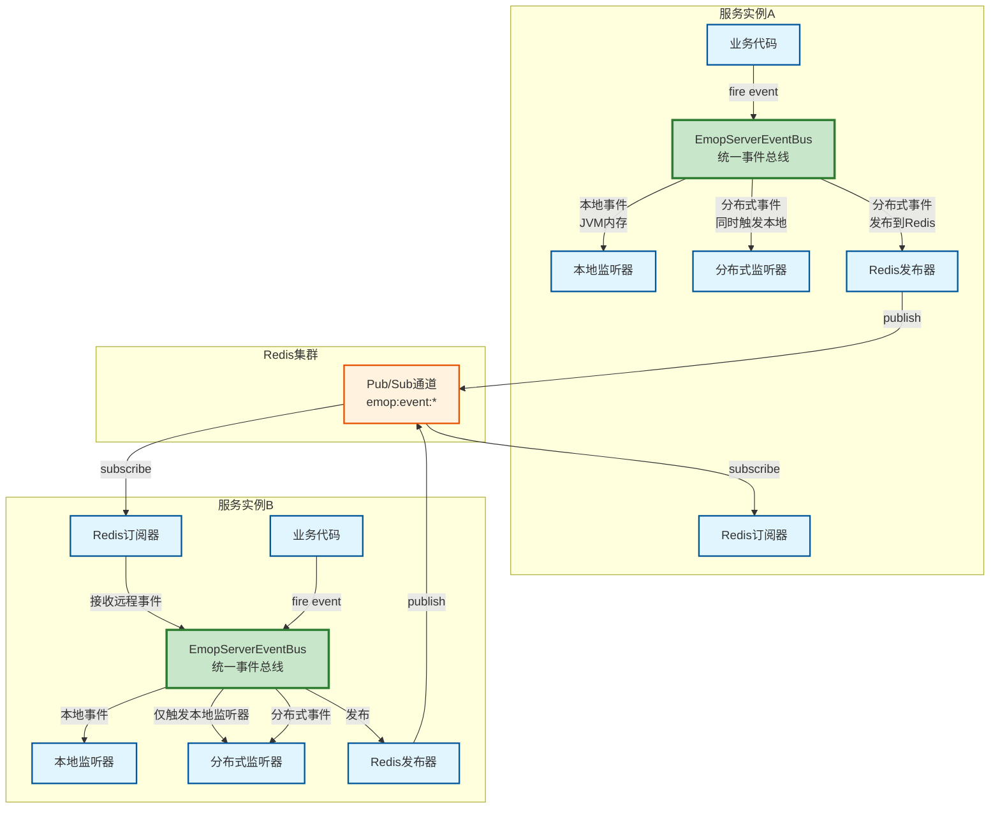

# EMOP Server事件系统设计文档

## 1. 概述

### 1.1 背景与目标

EMOP Server的事件系统是平台内部组件间通信和协作的核心机制。事件系统采用发布-订阅模式，支持服务生命周期管理、业务流程协调、数据变更通知等场景。

平台同时支持：
- **本地事件**：单个JVM实例内的高性能事件传播
- **分布式事件**：跨服务实例的事件通知和协调

**核心应用场景**：

本地事件场景：
- 服务启动和关闭的生命周期管理
- 单实例内的组件初始化顺序控制
- 实例级别的资源管理和监控

分布式事件场景：
- **缓存一致性**：对象更新时通知所有实例失效本地缓存
- **业务协同**：跨实例的业务流程协调和状态同步
- **系统监控**：集中收集各实例的系统事件用于监控告警
- **实时通知**：向所有在线用户推送业务变更通知

**设计目标**：
- 统一的事件API，支持本地和分布式两种传播模式
- 保持现有事件API的兼容性，最小化业务代码改动
- 本地事件零网络开销，分布式事件可靠传递
- 支持事件的异步处理和顺序保证
- 具备良好的性能和可扩展性

### 1.2 总体架构

EMOP Server事件系统采用分层设计，在统一的事件总线（EmopServerEventBus）之上支持本地和分布式两种传播模式。



**架构说明**：
- **统一事件总线**：EmopServerEventBus提供统一的事件发布接口，根据事件类型自动选择传播模式
- **本地事件路径**：事件在JVM内存中直接传播，零网络开销，适用于生命周期管理等场景
- **分布式事件路径**：事件通过Redis Pub/Sub跨实例传播，同时在本地实例也会触发监听器
- **去重和防循环**：订阅器自动过滤本实例发出的事件和重复事件

## 2. 事件模型设计

### 2.1 事件分类体系

EMOP Server事件系统根据传播范围分为两大类：

**本地事件（LocalSystemEvent）**：
- **传播范围**：仅在当前JVM实例内传播
- **性能特点**：零网络开销，亚毫秒级响应
- **序列化**：不需要序列化，直接内存传递
- **适用场景**：
  - 服务生命周期事件：ServerStarting、EmopServerReady
  - 实例级资源初始化：DatasourceReady、MetadataReady
  - 单实例内的组件协调
- **典型示例**：
  ```java
  // 服务启动事件
  EmopServerEventBus.fire(new LocalSystemEvent("ServerStarting"));
  
  // 元数据就绪事件
  EmopServerEventBus.fire(new LocalSystemEvent("MetadataReady"));
  ```

**分布式事件（DistributedEvent）**：
- **传播范围**：跨所有服务实例传播
- **性能特点**：需要网络传输，毫秒级延迟
- **序列化**：支持`Fury`二进制序列化和反序列化
- **适用场景**：
  - 业务数据变更：对象创建、更新、删除
  - 缓存失效通知：通知所有实例失效本地缓存
  - 元数据变更：类型定义、属性定义的变更
  - 关系变更：对象间关系的建立和删除
- **典型示例**：
  ```java
  // 对象更新事件（自动跨实例传播）
  EmopServerEventBus.fire(new ObjectUpdateEvent(objectId, objectType, objectCode));
  
  // 关系变更事件
  EmopServerEventBus.fire(new RelationEvent(primaryId, relationType, operation));
  ```

**事件接口设计**：
```java
/**
 * EMOP Server事件基础接口
 */
public interface EmopServerEvent {
    String getName();
    Object getContext();
    
    /**
     * 是否为分布式事件，默认为false（本地事件）
     * 子类可以覆盖此方法返回true以启用分布式传播
     */
    default boolean isDistributed() {
        return false;
    }
}
```

**事件分类决策树**：
```
事件需要跨实例传播？
├── 否 → 使用LocalSystemEvent（本地事件）
│   └── 示例：ServerStarting、DatasourceReady
└── 是 → 实现DistributedEvent接口（分布式事件）
    └── 示例：ObjectUpdateEvent、RelationEvent
```

### 2.2 现有事件类型

**系统生命周期事件（本地事件）**：
```java
// 定义在EmopServerEvent接口中
String EVENT_SERVER_STARTING = "ServerStarting";
String EVENT_DATASOURCE_READY = "DatasourceReady";
String EVENT_PLATFORM_SERVICE_READY = "PlatformServiceReady";
String EVENT_METADATA_READY = "MetadataReady";
String EVENT_EMOP_SERVER_READY = "EmopServerReady";
```

**元数据变更事件**：
```java
String EVENT_METADATA_CREATED = "MetadataCreated";
String EVENT_METADATA_UPDATED = "MetadataUpdated";
String EVENT_METADATA_DELETED = "MetadataDeleted";
String EVENT_TYPEDEFINITION_METADATA_READY = "KnownClassMetadataReady";
```

**业务事件（本地事件）**：
```java
String EVENT_RELATION = "RelationRelated";
String EVENT_OBJECT_STATE_CHANGE = "ObjectStateChange";
String EVENT_CHECKOUT = "Checkout";
String EVENT_CHECKIN = "Checkin";
String EVENT_SAVE = "Save";
String EVENT_REVISE = "ReviseRelated";
String EVENT_PERMISSION = "PermissionRelated";
```

**现有事件实现**：
- `LocalSystemEvent`：本地系统事件的通用实现
- `BusinessEvent<T>`：业务事件的基类，包含操作用户、目标对象、操作类型等信息
- `ObjectStateChangeEvent`：对象状态变更事件
- `RelationEvent`：关系变更事件

### 2.3 分布式事件接口设计

**分布式事件标记接口**：
```java
package io.emop.model.event;

/**
 * 分布式事件标记接口
 * 实现此接口的事件将通过Redis Pub/Sub跨实例传播
 */
public interface DistributedEvent extends EmopServerEvent {
    
    @Override
    default boolean isDistributed() {
        return true;
    }
    
    /**
     * 获取事件的唯一标识，用于去重
     * 默认使用UUID生成，子类可以覆盖
     */
    default String getEventId() {
        return UUID.randomUUID().toString();
    }
    
    /**
     * 获取事件发起的实例ID，用于避免循环传播
     */
    String getSourceInstanceId();
    
    /**
     * 设置事件发起的实例ID
     */
    void setSourceInstanceId(String instanceId);
    
    /**
     * 获取事件发生的时间戳
     */
    default long getTimestamp() {
        return System.currentTimeMillis();
    }
}
```

**业务事件发布为分布式事件**：
```java
@Data
public class ObjectUpdateEvent implements DistributedEvent {
    
    private final String name = "ObjectUpdate";
    private String eventId;
    private String sourceInstanceId;
    private long timestamp;
    
    private Long objectId;
    private String objectType;
    private String objectCode;
    
    public ObjectUpdateEvent(Long objectId, String objectType, String objectCode) {
        this.eventId = UUID.randomUUID().toString();
        this.timestamp = System.currentTimeMillis();
        this.objectId = objectId;
        this.objectType = objectType;
        this.objectCode = objectCode;
    }
    
    @Override
    public Object getContext() {
        return objectId;
    }
}
```

### 2.4 事件总线设计

**EmopServerEventBus职责**：
- 提供统一的事件发布接口
- 管理事件监听器的注册和通知
- 根据事件类型自动选择传播模式
- 协调本地和分布式事件的处理流程

**现有实现特点**：
- 基于内存的监听器管理
- 支持特定事件和全局事件（*）的监听
- 监听器按注册顺序执行
- 使用强一致性模型执行监听器

### 2.5 事件总线增强设计

**EmopServerEventBus增强**：
```java
public class EmopServerEventBus {
    
    private static DistributedEventPublisher distributedPublisher;
    
    /**
     * 初始化分布式事件发布器
     * 在服务启动时调用
     */
    public static void initDistributedPublisher(DistributedEventPublisher publisher) {
        distributedPublisher = publisher;
    }
    
    /**
     * 发布事件
     */
    public static void fire(EmopServerEvent event) {
        // 1. 本地事件处理
        fireLocal(event);
        
        // 2. 如果是分布式事件，发布到Redis
        if (event.isDistributed() && distributedPublisher != null) {
            distributedPublisher.publish((DistributedEvent) event);
        }
    }
    
    /**
     * 本地事件触发（内部方法）
     */
    private static void fireLocal(EmopServerEvent event) {
        // 通知特定事件的监听器
        notifyListeners(event.getName(), event);
        // 通知全局监听器
        notifyListeners(GLOBAL_EVENT, event);
    }
    
    /**
     * 接收远程事件（由订阅器调用）
     */
    public static void fireRemote(DistributedEvent event) {
        // 只触发本地监听器，不再发布到Redis（避免循环）
        fireLocal(event);
    }
}
```

## 3. 分布式事件实现

### 3.0 实现原则

**分层实现**：
- **platform-api**：定义事件接口和标记接口，不依赖Redis
- **platform-core**：实现Redis Pub/Sub的发布订阅逻辑
- **业务模块**：定义具体的事件类型，选择实现本地或分布式接口

**依赖隔离**：
- platform-api项目不引入Redis依赖
- 分布式事件的序列化、发布、订阅逻辑全部在platform-core实现
- 通过接口和SPI机制实现解耦

## 3.1 Redis Pub/Sub实现

### 3.2 通道设计

**通道命名规范**：
```
emop:event:{eventName}
```

**通道分类**：
- `emop:event:*`：全局事件通道，所有实例订阅
- `emop:event:ObjectUpdate`：对象更新事件通道
- `emop:event:RelationRelated`：关系变更事件通道
- `emop:event:MetadataUpdated`：元数据更新事件通道

**通道订阅策略**：
- 每个实例订阅所有需要的事件通道
- 使用模式订阅`emop:event:*`简化配置
- 支持动态订阅和取消订阅

### 3.3 事件序列化

**序列化方案选择**：
- 使用`fury`序列化`SerializationUtil`，便于调试和跨语言支持
- 包含事件类型信息，支持多态反序列化
- 压缩大事件内容，减少网络传输

**序列化格式**：
```json
{
  "eventType": "io.emop.model.event.ObjectUpdateEvent",
  "eventId": "uuid-xxx",
  "sourceInstanceId": "instance-001",
  "timestamp": 1234567890,
  "name": "ObjectUpdate",
  "data": {
    "objectId": 123456,
    "objectType": "Material",
    "objectCode": "M0001"
  }
}
```

### 3.4 发布器实现

**DistributedEventPublisher接口**：
```java
public interface DistributedEventPublisher {
    
    /**
     * 发布分布式事件
     */
    void publish(DistributedEvent event);
    
    /**
     * 批量发布事件
     */
    void publishBatch(List<DistributedEvent> events);
}
```


### 3.5 订阅器实现

**DistributedEventSubscriber接口**：
```java
public interface DistributedEventSubscriber {
    
    /**
     * 订阅事件通道
     */
    void subscribe(String eventName);
    
    /**
     * 订阅所有事件
     */
    void subscribeAll();
    
    /**
     * 取消订阅
     */
    void unsubscribe(String eventName);
    
    /**
     * 启动订阅器
     */
    void start();
    
    /**
     * 停止订阅器
     */
    void stop();
}
```


## 4. 事件可靠性保证

### 4.1 事件去重机制

**去重策略**：
- 每个事件携带唯一的eventId
- 订阅器维护最近处理过的事件ID集合
- 收到重复事件时直接丢弃

**去重窗口**：
- 保留最近10分钟的事件ID
- 定期清理过期的事件ID
- 使用LRU策略限制内存使用

### 4.2 事件顺序保证

**顺序性分析**：
- Redis Pub/Sub保证单个通道内的消息顺序
- 不同通道之间的消息无顺序保证
- 同一对象的多个事件应发布到同一通道

**顺序保证策略**：
- 对于需要严格顺序的事件，使用对象ID作为通道后缀
- 示例：`emop:event:ObjectUpdate:{objectId}`
- 订阅器需要订阅对应的通道模式

### 4.3 事件丢失处理

**Redis Pub/Sub特性**：
- 不保证消息持久化
- 订阅者离线时消息会丢失

**补偿机制**：
- 对于关键事件（如缓存失效），使用TTL自动过期兜底
- 定期全量同步关键数据
- 提供手动触发缓存刷新的接口

## 5. 监听器设计

### 5.1 监听器接口

**EmopServerLifecycleListener接口**：
```java
public interface EmopServerLifecycleListener {
    
    /**
     * 事件处理方法
     */
    void onEvent(EmopServerEvent event);
    
    /**
     * 监听的事件名称
     * 星号(*) 代表监听所有事件
     */
    List<String> watchEventNames();
    
    /**
     * 是否满足触发条件
     */
    default boolean meetCondition() {
        return true;
    }
}
```

**现有监听器示例**：
- `MetadataUpdateListener`：监听元数据变更，更新本地缓存
- `ServiceRegister`：监听服务启动事件，注册服务
- `ServerContext`：监听系统事件，更新服务器上下文
- `AuditService`：监听业务事件，记录审计日志

### 5.2 监听器分类

**本地监听器**：
- 只处理本地事件
- 不需要修改现有代码
- 不需要考虑幂等性
- 示例：ServiceRegister、ServerContext

**分布式监听器**：
- 处理分布式事件
- 必须实现幂等性（可能被多次调用）
- 需要考虑并发安全
- 示例：CacheInvalidationListener

**混合监听器**：
- 同时处理本地和分布式事件
- 根据事件类型区分处理逻辑
- 示例：MetadataUpdateListener（本地更新+分布式缓存失效）

### 5.3 监听器注册

**保持现有API兼容**：
```java
// 现有代码无需修改
EmopServerEventBus.register(new MetadataUpdateListener());

// 新增分布式监听器
EmopServerEventBus.register(new CacheInvalidationListener());
```

**监听器示例**：
```java
public class CacheInvalidationListener implements EmopServerLifecycleListener {
    
    @Override
    public void onEvent(EmopServerEvent event) {
        if (event instanceof ObjectUpdateEvent) {
            ObjectUpdateEvent updateEvent = (ObjectUpdateEvent) event;
            
            // 失效本地缓存
            invalidateCache(updateEvent.getObjectId());
            
            log.info("Cache invalidated for object: {}", updateEvent.getObjectId());
        }
    }
    
    @Override
    public List<String> watchEventNames() {
        return Arrays.asList("ObjectUpdate", "RelationRelated");
    }
    
    private void invalidateCache(Long objectId) {
        // 失效L1缓存
        CacheService cache = S.service(CacheService.class);
        cache.evict(CacheKey.object(objectId));
    }
}
```

## 6. 配置项

**application.yml配置**：
```yaml
emop:
  event:
    distributed:
      enabled: true                    # 是否启用分布式事件, 默认启用
      instance-id: ${HOSTNAME}         # 实例ID，默认使用主机名
      deduplication:
        window-size: 10000             # 去重窗口大小
        cleanup-interval: 300          # 清理间隔（秒）
      channels:
        - ObjectUpdate                 # 订阅的事件通道
        - RelationRelated
        - MetadataUpdated
```