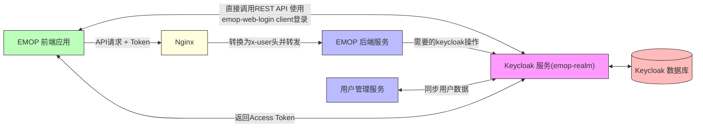

# EMOP 平台 Keycloak 集成开发文档

## 概述

EMOP 平台使用 Keycloak 作为身份认证和用户管理服务。本文档主要介绍如何配置 Keycloak 与 EMOP 平台集成，包括设置自定义用户属性、配置
Access Token、添加客户端应用以及将 EMOP 用户 ID 同步到 Keycloak 中。

主要集成内容包括：

- Keycloak 的 Docker 部署及配置
- emop-realm 域的基本设置
- 自定义用户属性配置
- Access Token 的自定义与配置
- EMOP 用户管理界面与 Keycloak 集成
- 导出和重建 Keycloak 配置

# EMOP 平台 Keycloak 集成架构

## 系统架构

以下架构图展示了 EMOP 平台与 Keycloak 的集成架构及基本交互流程：



### 基本认证流程

1. **直接 API 认证**:
    - EMOP 前端应用直接调用 Keycloak 的 REST API 进行认证
    - 使用 `emop-web-login` 客户端配置进行授权

2. **Token 处理**:
    - Keycloak 验证用户凭据后返回 `access_token`
    - EMOP 前端获取 Token 并存储
    - 前端使用 Token 调用 EMOP 后端 API

3. **API 授权**:
    - EMOP 后端服务验证请求中的 Token
    - 通过 Token 中的用户信息确定用户权限
    - Nginx 验证access_token的有效性，并转为`x-user` http head转发请求到后端服务

### 用户数据同步

- EMOP 用户管理服务负责将用户和组织数据同步到 Keycloak
- 用户属性中的 "userId" 字段关联 EMOP 系统用户 ID
- 通过同步机制确保 EMOP 与 Keycloak 的用户数据一致性

### 扩展性

- Keycloak 支持后续集成 SSO、SAML、Kerberos 等高级认证机制
- 这些集成可以在 Keycloak 中配置，无需修改 EMOP 平台代码

## Docker 部署配置

EMOP 平台使用 Docker Compose 部署 Keycloak
服务。部署方式见[auth服务部署](../deployment/docker#_4-4-部署auth-keycloak-服务)

## Keycloak 基本配置

### EMOP Realm 设置

EMOP 平台使用名为 `emop-realm` 的 Realm 来管理所有用户和应用。

### 默认预置用户

系统预置了以下账户，默认密码都为`123456`：

| 用户名        | 邮箱                         | 角色    | 描述       |
|------------|----------------------------|-------|----------|
| admin      | admin@emopdata.com         | 管理员   | 系统管理员账户  |
| superadmin | superadmin@emopdata.com    | 超级管理员 | 超级管理员账户  |
| user       | user@emopdata.com          | 普通用户  | 测试普通用户账户 |
| demo       | lanying.zhang@emopdata.com | 演示用户  | 演示账户     |

## 用户属性管理

### 设置用户自定义属性

Keycloak 允许定义自定义用户属性以满足 EMOP 平台的特殊需求。

#### 默认属性

系统已配置的默认属性包括：

| 属性名          | 显示名称          | 描述             |
|--------------|---------------|----------------|
| username     | $\{username}  | 用户名            |
| email        | $\{email}     | 电子邮箱           |
| firstName    | $\{firstName} | 名字             |
| lastName     | $\{lastName}  | 姓氏             |
| userId       | 用户ID          | EMOP 系统中的用户 ID |
| phone        | 电话            | 用户电话号码         |
| defaultGroup | 默认组织          | 用户默认组织         |
| avatar       | 头像            | 用户头像 URL       |

#### 添加新的用户属性

1. 登录 Keycloak 管理控制台, 通过 `http://localhost:9180` 可访问 keycloak 的管理界面，默认账号为 `admin/EmopIs2Fun!`
2. 进入 EMOP Realm
3. 导航到 "Realm settings" > "User profile" > "Attributes"
4. 点击 "Create attribute" 按钮
5. 填写属性信息：
    - Name：属性名称（例如：department）
    - Display name：显示名称（例如：部门）
6. 点击 "Save" 保存属性

## Access Token 配置与自定义

### 将用户属性添加到 Access Token

要将 EMOP 用户属性添加到 Access Token 中：

1. 登录 Keycloak 管理控制台
2. 进入 EMOP Realm
3. 导航到 "Clients" > 在"Clients list" tab页点击"emop-web-login" > 在"Clients scopes" tab页点击"
   emop-web-login-dedicated"
3. 点击 "Mappers" 选项卡
4. 点击 "Add mapper" > "By configuration"
5. 选择 "User Attribute"
6. 配置映射：
    - Name：自定义例如userId
    - User Attribute：选择需要添加的属性名
    - Token Claim Name：token中的key的值，例如userId
    - Claim JSON Type：String
    - Add to access token：ON
    - Add to userinfo：ON
7. 点击 "Save"

## 用户管理与集成(未实现)

### EMOP 用户 ID 与 Keycloak 集成

为了在 EMOP 平台与 Keycloak 之间同步用户：

1. 在 EMOP 系统中创建用户时，生成唯一的 userId
2. 通过 Keycloak Admin REST API 在 Keycloak 中创建相应用户
3. 将 EMOP userId 作为自定义属性添加到 Keycloak 用户中
4. 在身份验证过程中，从 Access Token 获取 userId 值

## 自定义配置导出与重构

### 导出 Realm 配置

要导出当前 Realm 配置以便重用或备份：

1. 使用 Keycloak 命令行工具导出配置：

```bash
# 进入 Keycloak 容器
docker exec -it auth-keycloak bash

# 导出 Realm 配置
kc.sh export --dir /tmp/export --realm emop-realm --users realm_file

# 退出docker
exit
```

2. 从容器中复制导出的文件：

```bash
docker cp auth-keycloak:/tmp/export/emop-realm-realm.json ./emop-realm-realm.json
```

### 使用导出配置构建自定义镜像

将导出的`emop-realm-realm.json`覆盖现有的`docker/configs/auth/emop-realm-realm.json`文件，然后运行`docker/build/build-keycloak.sh`进行镜像的更新。

