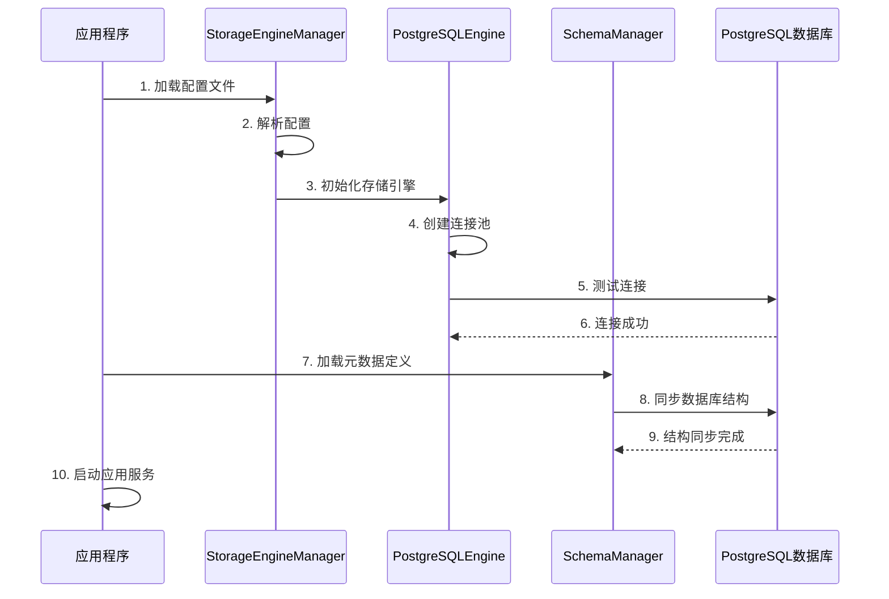

# EMOP结构化数据存储引擎架构设计文档

## 概述

描述EMOP平台存储引擎的设计，通过引入存储抽象层实现元数据与数据库技术解耦。 分层架构如下:
```
┌───────────────────────────────────────────────────────────────────────────┐
│                     应用层 (Application Layer)                             │
├───────────────────────────────────────────────────────────────────────────┤
│ ┌─────────────────┐ ┌─────────────────┐ ┌─────────────────┐ ┌───────────┐ │
│ │ ModelObject API │ │  Query API (Q)  │ │  Service API    │ │  DSL API  │ │
│ │  对象操作接口    │ │   查询API        │ │    服务API      │ │  领域语言  │ │
│ └─────────────────┘ └─────────────────┘ └─────────────────┘ └───────────┘ │
├───────────────────────────────────────────────────────────────────────────┤
│                     领域层 (Domain Layer)                                  │
├───────────────────────────────────────────────────────────────────────────┤
│ ┌─────────────────┐ ┌─────────────────┐ ┌─────────────────┐ ┌───────────┐ │
│ │  ModelObject    │ │  TypeDefinition │ │ MetadataService │ │  业务服务  │ │
│ │  模型对象体系    │ │  类型定义        │ │  元数据服务      │ │ Services  │ │
│ └─────────────────┘ └─────────────────┘ └─────────────────┘ └───────────┘ │
├───────────────────────────────────────────────────────────────────────────┤
│                  存储抽象层 (Storage Abstraction)                          │
├───────────────────────────────────────────────────────────────────────────┤
│ ┌─────────────────┐ ┌─────────────────┐ ┌─────────────────┐ ┌───────────┐ │
│ │  StorageEngine  │ │  QueryEngine    │ │  SchemaManager  │ │ TxManager │ │
│ │  存储引擎        │ │   查询引擎       │ │  架构管理器     │ │ 事务管理器 │ │
│ └─────────────────┘ └─────────────────┘ └─────────────────┘ └───────────┘ │
├───────────────────────────────────────────────────────────────────────────┤
│                数据访问层 (Data Access Layer, 默认Postgresql实现)           │
├───────────────────────────────────────────────────────────────────────────┤
│ ┌─────────────────┐ ┌─────────────────┐ ┌─────────────────┐ ┌───────────┐ │
│ │PostgreSQLEngine │ │   ConnectionPool│ │   SQLGenerator  │ │ResultMapper│ │
│ │PostgreSQL引擎   │ │  连接池          │ │   SQL生成器     │ │ 结果映射器  │ │
│ └─────────────────┘ └─────────────────┘ └─────────────────┘ └───────────┘ │
├───────────────────────────────────────────────────────────────────────────┤
│                    基础设施层 (Infrastructure)                             │
├───────────────────────────────────────────────────────────────────────────┤
│ ┌─────────────────────────────────────────────────────────────────────┐   │
│ │            PostgreSQL Cluster (Master + Slaves)                     │   │
│ │            PostgreSQL集群 (主库 + 从库)                              │   │
│ └─────────────────────────────────────────────────────────────────────┘   │
└───────────────────────────────────────────────────────────────────────────┘
```
## 各层详细设计

### 1. 应用层 (Application Layer)

**职责**：对外提供统一的API接口，保持现有业务代码兼容性

**核心组件**：

* **Query API (Q)**：查询构建器，提供链式API构建复杂查询
* **ModelObject API**：对象CRUD操作接口
* **DSL API**：领域特定语言接口
* **Service API**：业务服务调用接口

**设计原则**：EMOP平台向业务层暴露的核心API,稳定且向下兼容,确保业务稳定性

### 2. 领域层 (Domain Layer)

**职责**：管理业务概念和元数据定义，实现平台核心逻辑

**核心组件**：

#### ModelObject体系

* **AbstractModelObject**：所有业务对象的基类
* **SimpleModelObject**：轻量级业务对象实现
* **ItemRevision**：版本化对象基类

#### 元数据管理

* **TypeDefinition**：对象类型定义，包含属性、关系、约束等信息
* **AttributeDefinition**：属性定义，支持基本属性、关系属性、计算属性
* **RelationDefinition**：关系定义，支持结构关系、关联关系等
* **SchemaDefinition**：Schema定义，管理数据库实例分类

#### 核心服务

* **MetadataService**：元数据管理服务
* **ObjectService**：统一查询服务
* **ValidationService**：数据验证服务

### 3. 存储抽象层 (Storage Abstraction)

**职责**：定义存储操作的统一接口，实现存储技术无关性

**核心接口**：

#### StorageEngine

统一的数据存储操作接口，定义了：

* 对象的增删改查操作
* 批量操作支持
* 事务控制接口
* 连接管理

#### QueryEngine

查询执行引擎接口，负责：

* Query对象到具体存储查询语言的转换
* 查询执行和结果映射
* 查询优化策略
* 分页和排序支持

#### SchemaManager

Schema管理接口，提供：

* 数据库表结构的动态创建和修改
* 索引管理
* 约束管理
* 元数据到物理结构的映射

#### TransactionManager

事务管理接口，支持：

* 本地事务控制
* 分布式事务协调
* 事务隔离级别管理
* 回滚和提交操作

### 4. 数据访问层 (Data Access Layer)

**职责**：实现具体存储技术的访问逻辑, 默认实现为Postgresql

**PostgreSQL实现组件**：

#### PostgreSQLEngine

PostgreSQL存储引擎的具体实现：

* 实现StorageEngine接口
* 管理PostgreSQL连接
* 处理SQL执行和异常
* 支持读写分离路由

#### ConnectionPool

数据库连接池管理：

* 主库连接池管理
* 从库连接池管理
* 连接健康检查
* 负载均衡策略

#### SQLGenerator

SQL语句生成器：

* 根据Query对象生成PostgreSQL SQL
* 支持复杂查询条件转换
* 处理分页和排序
* 优化SQL性能

#### ResultMapper

结果映射器：

* 将SQL查询结果映射为ModelObject
* 处理关系对象的延迟加载
* 支持复杂对象图的构建
* 类型转换和验证

### 5. 基础设施层 (Infrastructure)

**职责**：提供底层的存储基础设施

**PostgreSQL集群架构**：

* **主库 (Primary)**：处理所有写操作和事务
* **从库 (Read Replicas)**：处理只读查询，提供读扩展能力
* **连接代理**：智能路由读写请求
* **监控和故障转移**：确保高可用性

## PostgreSQL存储引擎设计

### 主从分离架构

```mermaid
flowchart TD
    client[客户端应用] --> storage[StorageEngine]
    
    subgraph "PostgreSQL存储引擎"
        storage --> router[路由管理器]
        router --> writeOps[写操作]
        router --> readOps[读操作]
        router --> txOps[事务操作]
        
        writeOps --> primary
        readOps --> loadBalancer[负载均衡器]
        txOps --> primary
        
        loadBalancer --> replica1
        loadBalancer --> replica2
        loadBalancer -.-> primary
        
        subgraph "连接池管理"
            primary[主库连接池]
            replica1[从库连接池1]d
    
    primary --> masterDB[(主库 PostgreSQL)]
    replica1 &DB[(从库 PostgreSQL集群)]
    masterDB -->|复制| slaveDB
    
    classDef client fill:#f9f,stroke:#333,stroke-width:1px
    classDef router fill:#bbf,stroke:#333,stroke-width:1px
    classDef poolb,stroke:#333,stroke-width:1px
    classDef db fill:#fbb,stroke:#333,stroke-width:1px
    
    class client client
    class router,writeOps,readOps,txOps,loadBalancer router
    class primary,replica1,replica2,reaveDB db
```

#### 读写分离策略

* **写操作路由**：所有写入、更新、删除操作自动路由到主库
* **读操作路由**：查询操作优先路由到从库，主库作为备选
* **事务处理**：事务内的所有操作路由到主库确保一致性
* **智能路由**：根据SQL语句类型自动判断路由目标

#### 连接管理：管理到主库的连接，支持写操作和事务

* **从库连接池**：管理到多个从库的连接，支持负载均衡
* **连接监控**：实时监控连接健康状态，自动处理故障切换
* **配置热更新**：支持动态调整连接池参数

### 数据一致性保证

#### 事务支持

* **本地事务**：支持单个数据库的ACID事务
* **读一致性**：事务内的读操作保证在主库执行
* **隔离级别**：支持PostgreSQL的多种事务隔离级别
* **超时处理**：自动处理长事务和连接超时

#### 复制延迟处理

* **延迟检测**：监控主制延迟
* **强一致性读**：对实时性要求高的查询自动路由到主库
* **最终一致性**：查询可接受从库的最终一致性(EMOP默认采用), 正常情况从库延时 `<500 ms`, 对于需要强一致性场景, 使用 API `S.withStrongConsistency(Supplier<T> operation)`

### 数据库用户角色分工
EMOP对数据库用户进行了权限分离，保障数据的安全性。
1. **emop** - 超级用户
    - 执行所有DDL操作（CREATE、ALTER、DROP等）
    - 管理RLS策略
    - 动态授权表权限
    - 仅在Schema管理和RLS管理时使用

2. **app_user** - 应用用户
    - 执行DML操作（SELECT、INSERT、UPDATE、DELETE）
    - 受RLS策略约束
    - 无法执行DDL操作
    - 日常应用运行时使用

3. **application_role** - 应用角色
    - 用于RLS策略中的角色匹配
    - app_user是此角色的成员

4. **replicator** - 主从数据同步用户
    - 执行主从数据同步

### 数据库用户权限授权流程

#### 数据库初始化阶段
数据库初始化脚本只创建：
- 用户和角色
- 基本的数据库连接权限

#### 平台初始化阶段
平台代码在创建表时自动：
- 授权元数据创建的表的DML权限给app_user
- 授权元数据创建的表权限给application_role（用于RLS）
- 授权相关序列的使用权限
- 确保Schema权限正确

## 扩展新存储引擎

### 扩展机制
新的存储引擎需要实现存储抽象层的内容
1. **StorageEngine**：实现具体的存储操作逻辑
2. **QueryEngine**：查询执行
3. **SchemaManager**：实现Schema和表结构管理
4. **TransactionManager**：实现事务控制逻辑

## 配置及初始化
### 配置样例
下面是一个示例配置文件：
```yaml
emop:
  storage:
    postgresql:
      master:
        host: emop-db-master-${EMOP_DOMAIN}
        port: 5432
        database: emop
        schema: public
        username: emop
        password: EmopIs2Fun!
      replicas:
        -  host: emop-db-slave1-${EMOP_DOMAIN}
           port: 5431
           database: emop
           schema: public
           username: emop
           password: EmopIs2Fun!
        -  host: emop-db-slave2-${EMOP_DOMAIN}
           port: 5430
           database: emop
           schema: public
           username: emop
           password: EmopIs2Fun!
      pool:
        maximum-pool-size: 20
        minimum-idle: 5
        connection-timeout: 30000
        idle-timeout: 600000
        max-lifetime: 1800000
```

### 系统初始化流程

初始化过程可视化如下：



1. **加载配置**：读取存储引擎配置
2. **注册引擎**：注册可用的存储引擎实现
3. **初始化连接**：建立数据库连接池
4. **Schema同步**：同步元数据到物理表结构
5. **服务启动**：启动存储相关服务
