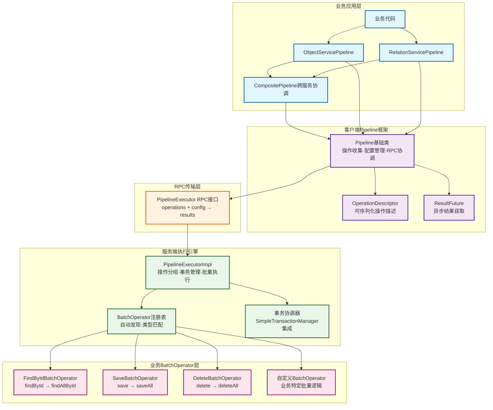

# EMOP Pipeline框架设计文档

## 1. 设计概览

## 1.1 核心价值与设计理念

Pipeline框架专门解决EMOP分布式RPC环境中的**网络延迟累积问题**。核心设计理念是通过"**收集-批量执行-结果分发**"
模式，将多个细粒度RPC调用合并为少数几个批量调用，实现性能的指数级提升。

**关键设计原则**：

- **平台专注框架能力**：操作收集、分组、事务管理、结果分发
- **业务专注批量实现**：提供高效的批量操作逻辑，复用现有批量API
- **约束简化设计**：严格的输入输出一致性约束，避免复杂的结果映射
- **深度事务集成**：与现有SimpleTransactionManager无缝集成，支持多线程场景

## 1.2 Pipeline框架整体架构



## 1.3 问题分析与解决思路

**性能瓶颈分析**：

- 每次RPC调用网络延迟：0.5~2毫秒
- 传统方式处理1000个BOM行项需要3000次RPC调用
- 仅网络延迟就消耗6秒，还不包括业务处理时间

**Pipeline解决方案**：

- 将3000次RPC调用减少到2次（批量查询 + 批量保存）
- 性能提升可达几十倍
- 数据量越大，性能优势越明显

## 1.4 架构分层设计

```
应用层 (CompositePipeline跨服务协调)
├── Pipeline基础层 (操作收集、配置管理、RPC调用)
├── RPC传输层 (PipelineExecutor远程接口)
├── 执行引擎层 (服务器端批量执行逻辑)
└── BatchOperator层 (业务批量操作实现)
```

## 2. 核心架构设计

### 2.1 职责分离原则

**平台框架职责**：

- 操作收集与延迟执行
- 操作分组与合并
- 事务边界管理
- 结果分发与异常处理
- RPC调用协调

**业务服务职责**：

- BatchOperator批量操作实现
- 输入输出数量严格一致性保证
- 业务逻辑的批量优化
- 现有批量API的复用

### 2.2 操作收集与延迟执行机制

**OperationDescriptor设计思想**：
每个Pipeline方法调用立即创建一个操作描述符，但实际执行延迟到`execute()`调用。操作描述符包含：

- **操作标识**：用于平台分组（如`io.emop.service.api.data.ObjectService.findById()`）
- **操作模式**：自感知读写属性（READ_ONLY/WRITE/READ_WRITE）
- **参数封装**：可序列化的操作参数
- **索引位置**：用于结果分发的精确定位

**OperationMode自感知机制**：

```
READ_ONLY: findById、exists、query等纯查询操作
WRITE: save、delete、update等写操作  
READ_WRITE: upsert等可能涉及读后写的复合操作
```

平台根据操作模式自动推断事务策略，无需手动配置。

### 2.3 BatchOperator - 业务批量操作器

**核心设计约束**：

```java
public interface BatchOperator<T extends OperationDescriptor, R> {
    // 关键约束：inputs.size() 必须等于 outputs.size()
    List<R> executeBatch(List<T> operations);

    String operationId();  // 操作分组标识

    Class<T> getOperationDescriptorType();
}
```

**关键约束说明**：

- **严格的一致性**：返回结果数量与输入操作数量完全相等
- **顺序对应性**：结果顺序与输入操作顺序严格对应
- **失败处理策略**：操作失败时在对应抛出异常并中断执行，异常通过RPC传递回客户端调用者

这种约束设计极大简化了平台的结果分发逻辑，避免了复杂的映射计算。

## 3. 执行引擎设计

### 3.1 操作分组与智能合并

**平台分组策略**：

1. 按`operationId`对所有操作进行分组
2. 每组操作调用对应的BatchOperator进行批量处理

**示例转换**：

```
原始操作：findById(1), findById(2), save(obj1), save(obj2)
分组结果：
- "ObjectService.findById()": [findById(1), findById(2)]
- "ObjectService.save()": [save(obj1), save(obj2)]

业务服务对应的批量操作执行：
- findAllById([1, 2]) → 1次RPC调用
- saveAll([obj1, obj2]) → 1次RPC调用
总计：2次RPC调用 vs 原来的4次

如果使用 CompositePipeline 可降低至一次RPC，同时利用服务端的并行执行能力获得更佳的性能
```

### 3.2 事务策略自动推断

**智能事务决策**：

```java
TransactionStrategy determineStrategy(List<OperationDescriptor> operations,PipelineConfig config){
    boolean hasWriteOps=operations.stream().anyMatch(op->op.getOperationMode()!=READ_ONLY);
    
    if(config.isDisableTransaction()) return NONE;
    if(config.isReadonly()&&hasWriteOps) throw IllegalStateException;
    if(!hasWriteOps)return read_ONLY;  // 自动优化为只读事务
    return read_WRITE;
}
```

**事务集成设计**：

- 与现有`Transaction Manager`深度集成
- 支持嵌套事务场景
- 利用事务上下文传递机制
- 支持多线程环境下的事务传递

### 3.3 执行模式设计

**并发执行模式（默认）**：

- 相同类型操作合并执行
- 不同类型操作可并发执行（在安全条件下）
- 服务器端自动优化执行顺序

**顺序执行模式**：

- 严格按操作添加顺序执行
- 适用于有依赖关系的操作场景
- 禁用服务器端批量优化

**配置模式说明**：

- `readonly()`：只读模式，自动优化为只读事务
- `sequential()`：顺序执行，保证操作依赖关系
- `disableTransaction()`：禁用事务，每个操作独立提交

## 4. CompositePipeline跨服务协调

### 4.1 设计理念突破

合并所有子Pipeline的operations为**单次RPC调用**, 保障事务边界的同时进一步降低RPC调用，并由服务器端的并行处理器进一步提升性能。

```java
public class CompositePipeline extends Pipeline {
    @Override
    public PipelineExecutionResult execute() {
        // 关键设计：合并所有子Pipeline的operations
        mergeAllOperations();

        // 调用父类execute()，确保单次RPC调用和事务完整性
        return super.execute();
    }
}
```

### 4.2 操作合并策略

**顺序执行模式**：

- 严格按Pipeline顺序合并operations
- 保证服务间依赖关系
- 适用于有严格时序要求的场景

**并发执行模式**：

- 按操作类型重新排列operations
- 优化批量执行效果
- 最大化性能提升

### 4.3 事务边界统一管理

**关键价值**：

- 确保所有子Pipeline操作在同一事务中执行
- 统一的成功或失败语义
- 避免分布式事务的复杂性

## 5. 多线程与事务传递

### 5.1 事务上下文传递设计

**核心机制**：
利用现有SimpleTransactionManager的事务上下文捕获和传递能力：

```java
// 捕获当前事务上下文
SimpleTransactionManager.TransactionContext txContext=
        SimpleTransactionManager.captureContext();

// 在异步执行中传递事务上下文
        CompletableFuture<Result> future=SimpleTransactionManager.runWithContext(()->{
        return executeBatchOperation(operations);
        },executorService);
```

### 5.2 多线程执行条件

**安全使用条件**：

- 操作组数量 > 1
- 总操作数量 > 50
- 不在事务中（避免事务传递复杂性）

满足条件时，不同类型的操作组可以并发执行，进一步提升性能。

## 6. 开发指南与最佳实践

### 6.1 新增Service Pipeline支持

**开发步骤**：

1. **创建Pipeline实现类**：继承Pipeline基类，提供特定服务的Pipeline方法
2. **实现BatchOperator**：为每种操作类型实现批量处理逻辑
3. **自动发现注册**：平台通过反射自动发现并注册BatchOperator
4. **提供工厂方法**：在现有Service接口中提供静态pipeline()方法

### 6.2 BatchOperator实现规范

**设计约束**：

- 输入输出数量严格一致
- 顺序严格对应
- 无状态设计，支持并发
- 复用现有批量API

## 7. 总结

Pipeline框架通过以下关键设计实现了高性能的批量操作能力：

1. **清晰的职责分离**：平台专注框架能力，业务专注批量实现
2. **严格的约束设计**：输入输出一致性约束简化复杂映射逻辑
3. **智能化决策机制**：自动事务策略、配置推断、操作合并
4. **深度系统集成**：与现有事务、缓存无缝集成

**核心价值**：将RPC调用从O(n)降低到O(1)
，在大数据量场景下实现十倍甚至百倍性能提升，同时保持代码可读性和接口简洁性。