# BOM设计

## 1. 核心概念

### 1.1 BOM数据模型

物料清单(Bill of Materials, BOM)是描述产品结构的基础数据模型。EMOP中的BOM系统基于几个核心对象构建：

1. **BOM视图 (BOM View)**
   - BOM的容器对象
   - 定义BOM的类型和属性
   - 管理整体配置规则

2. **BOM行 (BOM Line)**
   - BOM的节点对象
   - 维护父子层级关系
   - 记录用量和属性信息

3. **目标对象 (Target Object)**
   - 被BOM行引用的业务对象
   - 可以是零件、文档等
   - 具有独立的版本管理

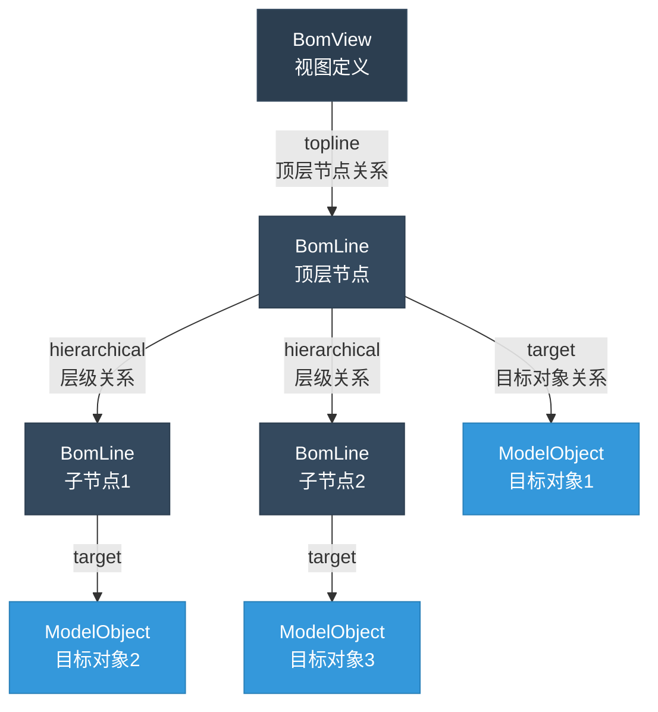
### 1.2 版本管理基础

#### 1.2.1 版本状态流转

产品数据在生命周期中会经历不同的状态，见[对象状态管理](../business/modeling/state-management#系统默认状态说明)

#### 1.2.2 版本有效性

版本有效性管理确保系统在任何时间点都能找到正确的数据版本：

1. **时间有效性**
   - 生效时间: 版本开始可用的时间点
   - 失效时间: 版本停止使用的时间点
   - 过渡期: 新旧版本共存的时间段

2. **状态有效性**
   - 依赖版本状态确定是否可用
   - 不同环境可采用不同的有效性规则
   - 支持版本平滑过渡

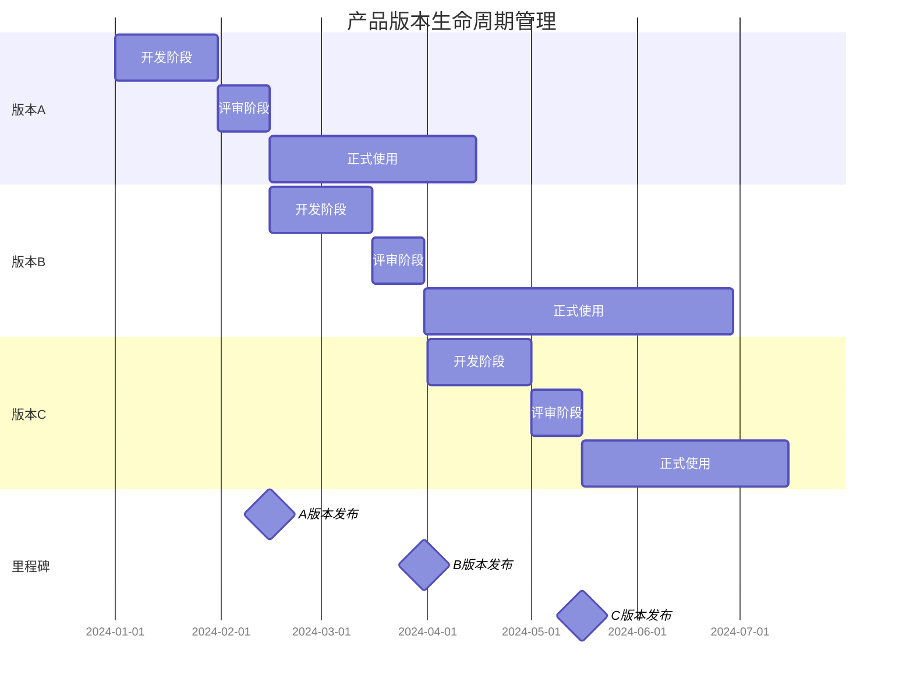
### 1.3 BOM精确性管理

#### 1.3.1 精确与非精确BOM

BOM的精确性描述了其引用目标对象的方式，这直接影响了BOM的使用场景和行为：

1. **非精确BOM**
   - 动态引用目标对象，不指定具体版本
   - 版本可以根据版本规则动态解析

2. **精确BOM**
   - 精确引用特定版本的目标对象
   - 版本关系固定不变

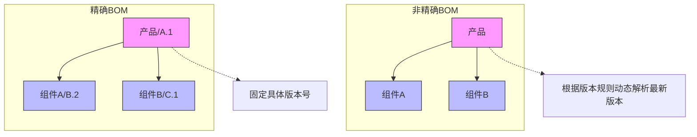
#### 1.3.2 版本规则

版本规则定义了如何解析目标对象的具体版本，是BOM系统的核心配置之一：

1. **基本规则类型**
   - 最新版本规则：始终使用最新的工作版本
   - 发布版本规则：使用最新的已发布版本
   - 固定版本规则：使用指定的版本号
   - 时间点规则：使用特定时间点的有效版本

2. **规则应用场景**
   - 开发环境：通常使用最新版本规则，方便快速迭代
   - 生产环境：使用发布版本规则，确保稳定性
   - 历史追溯：使用固定版本规则，保证可追溯性
   - 时间回溯：使用时间点规则，查看历史配置

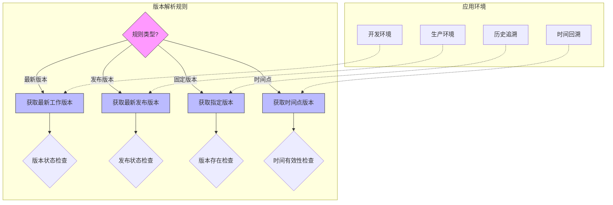

### 1.4 替代料与互换性管理

BOM系统支持灵活的替代料和互换性管理，确保生产过程中的物料灵活性：

1. **替代料管理**
   - 定义：可在特定条件下替换主要物料的备选物料
   - 替代关系类型：完全替代、有条件替代、部分替代
   - 优先级控制：定义多个替代料之间的使用优先顺序

2. **互换性定义**
   - 双向互换：两个物料完全等效，可双向替换
   - 单向互换：替代料可替换主料，但主料不一定能替换替代料
   - 属性互换：基于特定属性集合的互换性判断

3. **替代规则**
   - 时间有效性：替代关系的生效和失效时间控制
   - 批次限制：特定批次的替代规则
   - 场景应用：设计、采购、生产等不同场景的替代策略

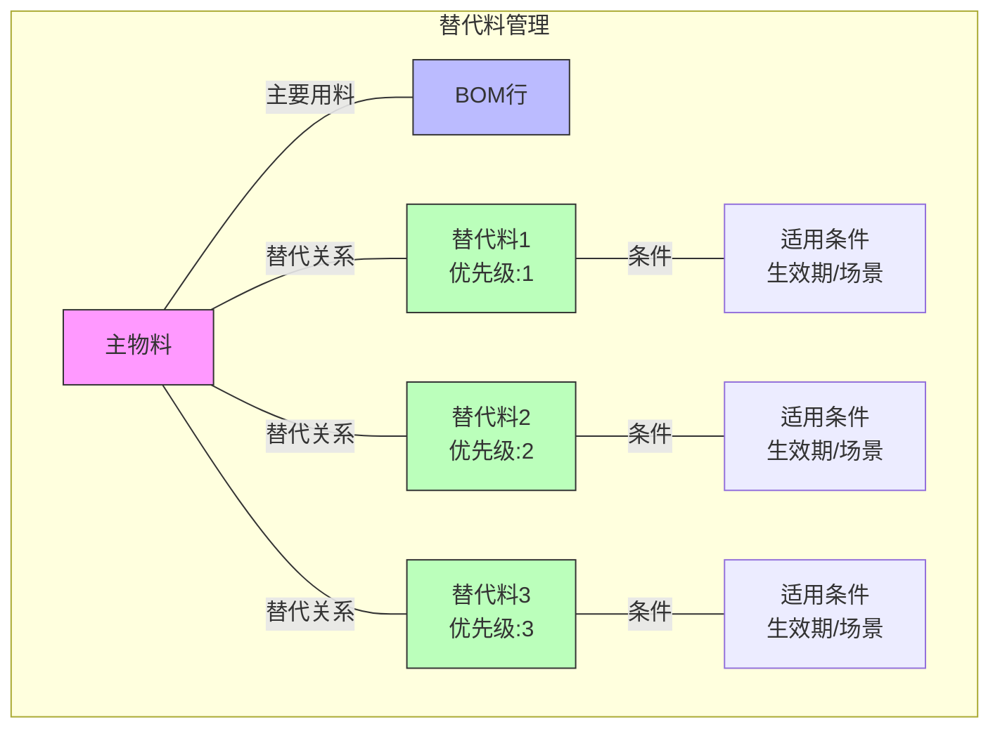

4. **应用场景**
   - 物料短缺时的替代方案管理
   - 成本优化和供应链弹性增强
   - 设计变更过渡期的兼容管理

## 2. 内置BOM类型分析
### 2.1 研发设计阶段
#### 2.1.1 CAD BOM

CAD BOM是产品设计阶段的基础数据，直接反映了产品的三维设计结构：

1. **特点**
   - 完全对应CAD模型结构
   - 保持与CAD系统同步
   - 支持自动导入导出
   - 包含设计参数和约束

2. **应用场景**
   - 3D设计数据管理
   - 2D工程图管理
   - 设计变更管理
   - 干涉检查与仿真

3. **对象类型**
   - **BomView (type=CAD_BOM)**: CAD BOM的容器对象
   - **BomLine**: CAD BOM的节点对象
   - **CADComponent**: 装配体对象，零件对象都用CADComponent表达

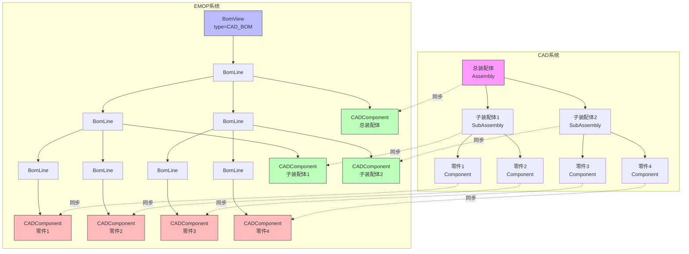

#### 2.1.2 CAD BOM到EBOM的转换

CAD BOM到工程BOM(EBOM)的转换是产品设计过程中的关键步骤，实现设计数据到产品定义的转换：

1. **转换流程**
   - 读取CAD BOM结构
   - 建立Part与CADComponent的映射
   - 处理结构变换规则
   - 创建EBOM结构

2. **转换规则**
   - 结构简化：合并不必要的中间节点
   - 数据丰富：添加非CAD属性信息
   - 属性映射：将CAD参数转换为工程参数
   - 标准件识别：自动识别并分类标准件

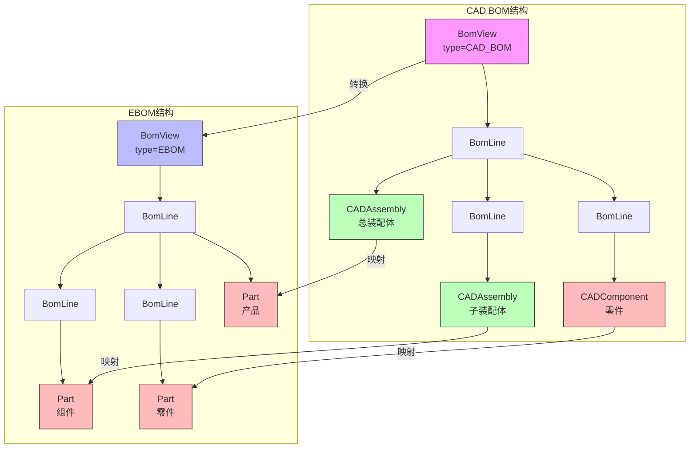

在转换过程中，CADAssembly通常映射为Part对象(category="assembly")，而CADComponent映射为Part对象(category="component")。转换后的EBOM保持与CAD BOM的关联关系，便于设计变更同步。

#### 2.1.3 工程BOM (EBOM)

EBOM是产品设计的标准化描述，是产品定义的核心数据：

1. **基本特征**
   - 完整的产品结构定义
   - 规范的技术要求描述
   - 版本控制和变更管理
   - 配置规则支持

2. **关键属性**
   - 产品规格参数
   - 材料技术要求
   - 质量控制标准
   - 设计验证要求

3. **主要功能**
   - 产品结构管理
   - 技术文档管理
   - 设计评审支持
   - 变更影响分析

4. **对象类型**
   - **BomView (type=EBOM)**: EBOM的容器对象
   - **BomLine**: EBOM的节点对象
   - **Part**: 产品、组件和零件对象
   - **Document**: 技术文档对象
   - **Specification**: 规格说明对象

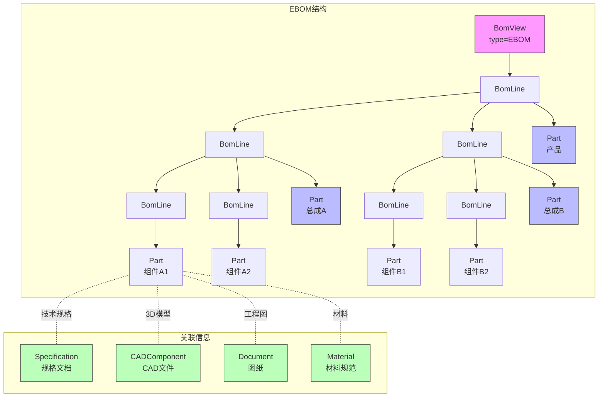

EBOM中的Part可以关联多种信息，包括规格文档、CAD模型、图纸和材料规范等，形成完整的产品定义。

#### 2.1.4 查找号与定位管理

查找号和定位管理是工程BOM中的关键功能，它将物料清单与实际装配位置关联起来：

1. **查找号系统**
   - 定义：唯一标识装配体中零件位置的编号体系
   - 编号方案：序列式、分区式、层次式等多种方案
   - 自动生成：支持基于规则的查找号自动生成

2. **位置属性**
   - 坐标定位：基于3D空间坐标的精确定位
   - 相对定位：相对于参考点或面的位置描述
   - 装配路径：组装或拆卸的路径和方向定义

3. **视图关联**
   - 与工程图关联：查找号与2D工程图的标注关联
   - 与3D模型关联：查找号与3D模型中位置的映射
   - 爆炸图支持：支持装配爆炸图与查找号的对应

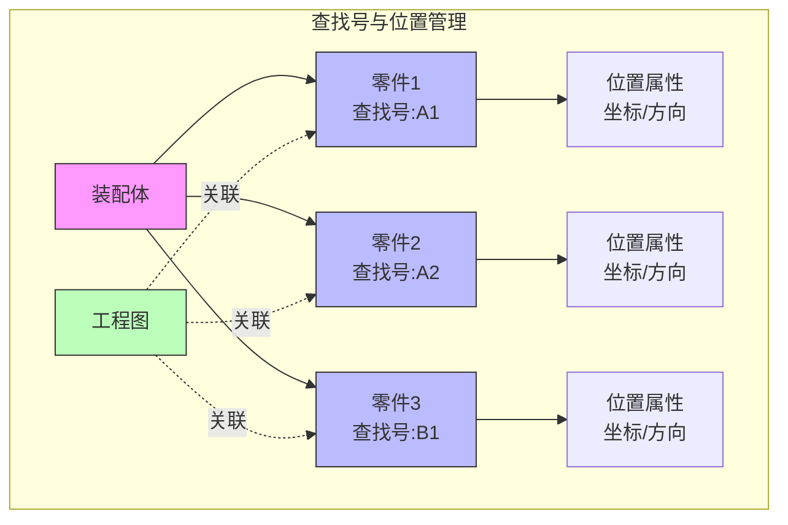

4. **实施方法**
   - BOM行查找号属性：在BomLine上添加查找号和位置属性
   - 查找号规则引擎：支持企业特定的查找号分配规则
   - 冲突检测：防止查找号重复或错误的机制

### 2.2 生产制造阶段

#### 2.2.1 工艺BOM (PBOM)

工艺BOM(Process BOM, PBOM)是连接设计和制造的桥梁，主要用于工艺规划和准备阶段：

1. **基本特征**
   - 基于EBOM结构进行工艺分析
   - 添加工艺路线和工序信息
   - 定义制造工艺要求
   - 组织生产准备数据

2. **关键属性**
   - 工艺路线编号
   - 工序编码和顺序
   - 工艺参数和要求
   - 工装夹具定义

3. **主要功能**
   - 工艺路线规划
   - 工艺文件管理
   - 工序资源配置
   - 生产能力分析

4. **对象类型**
   - **BomView (type=PBOM)**: PBOM的容器对象
   - **BomLine**: PBOM的节点对象
   - **Route**: 工艺路线对象
   - **ProcessStep**: 工序步骤对象
   - **Part**: 引用自EBOM的零部件对象
   - **ProcessDocument**: 工艺文档对象

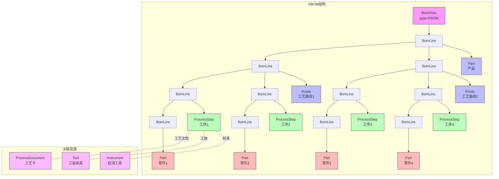

PBOM通常以工艺路线为主线，将产品结构组织为工序步骤，每个工序步骤关联所需的零部件和资源。PBOM是从EBOM转换而来，保持与设计数据的关联。

#### 2.2.2 制造BOM (MBOM)

MBOM面向生产制造过程，反映了产品的实际装配和制造结构：

1. **核心特点**
   - 基于工艺路线组织
   - 包含制造过程信息
   - 关联生产资源
   - 支持车间现场管理

2. **重要属性**
   - 工序步骤定义
   - 工装夹具需求
   - 人力资源要求
   - 质量检验标准

3. **主要应用**
   - 生产计划制定
   - 工艺过程管理
   - 资源需求计算
   - 生产成本核算

4. **对象类型**
   - **BomView (type=MBOM)**: MBOM的容器对象
   - **BomLine**: MBOM的节点对象
   - **Operation**: 制造工序对象
   - **Part**: 引用自EBOM的零部件对象
   - **Resource**: 制造资源对象

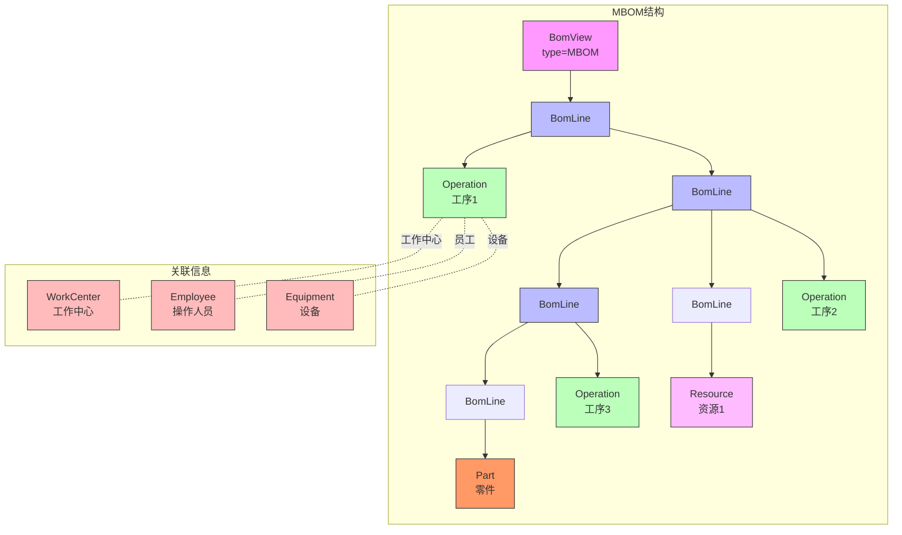

MBOM与PBOM紧密相关，通常是从PBOM转换生成。与PBOM相比，MBOM更加注重生产执行和资源配置，直接服务于生产现场。MBOM中的Operation可以关联工作中心、设备和操作人员等资源。

5. **PBOM到MBOM的转换**

PBOM到MBOM的转换是将工艺规划转化为生产执行的关键步骤：
   - 将ProcessStep转换为Operation
   - 关联具体生产资源
   - 保持零部件引用关系
   - 调整生产线平衡

特点：
- 目标对象包括Operation和Part
- Operation节点可以引用资源
- Part节点通常引用自EBOM
- 支持从PBOM转换生成
- 更加注重生产执行和资源配置

## 3. BOM集成场景

### 3.1 多BOM协同

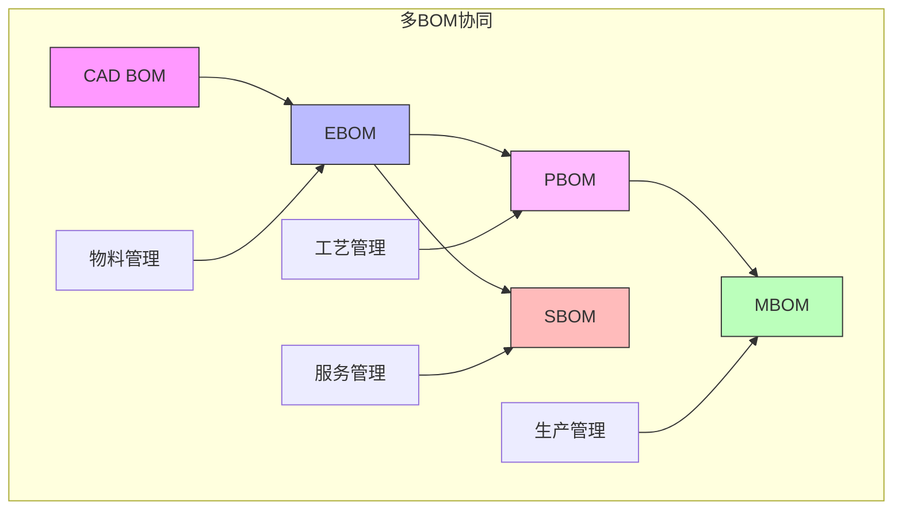

多BOM协同是产品全生命周期管理的关键，不同类型的BOM支持不同业务阶段：

- CAD BOM提供设计数据
- EBOM支持产品定义和物料管理
- PBOM支持工艺规划和工艺管理
- MBOM支持生产执行和生产管理
- SBOM支持服务维护和服务管理

这些BOM之间存在清晰的转换关系和数据流动，共同构成产品数据的完整链条。

### 3.2 BOM转换流程

BOM转换是产品从设计到制造的关键流程，每个阶段的BOM都有特定的关注点和用途：

1. **CAD BOM → EBOM**: 从设计视图转换为产品结构视图
   - 转换CAD组件为标准Part对象
   - 清理非物理节点和设计辅助对象
   - 添加物料编码和属性信息
   - 关联技术文档和规格要求

2. **EBOM → PBOM**: 从产品结构视图转换为工艺规划视图
   - 基于产品结构创建工艺路线
   - 分解装配过程为工序步骤
   - 添加工艺要求和参数
   - 关联工艺文档和资源需求

3. **PBOM → MBOM**: 从工艺规划视图转换为生产执行视图
   - 将工序转换为生产操作
   - 关联具体生产资源
   - 优化生产顺序和批次
   - 添加质量控制节点

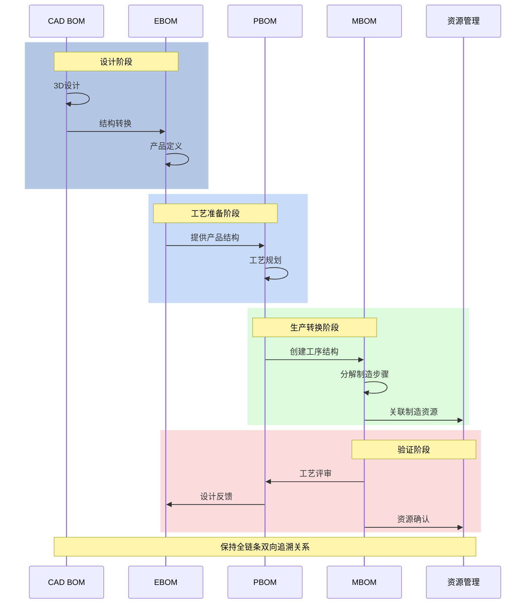

整个转换过程保持全链条的双向追溯关系，确保设计变更能够有效传递到制造环节，同时制造反馈也能回流到设计阶段。

### 3.3 BOM冻结与快照

为了支持产品生命周期管理中的各种里程碑和历史回溯需求，BOM系统提供了完善的冻结与快照机制：

1. **BOM快照**
   - 定义：在特定时间点创建的BOM完整副本
   - 不变性：快照创建后内容不可修改
   - 存储方式：高效存储差异化数据，避免重复

2. **里程碑管理**
   - 发布里程碑：产品正式发布时的BOM冻结
   - 审核里程碑：设计审核或评审时的临时冻结
   - 生产里程碑：批量生产前的制造BOM冻结

3. **基线管理**
   - 产品基线：代表产品特定状态的BOM集合
   - 比较功能：支持不同基线间的差异比较
   - 派生功能：支持从现有基线派生新版本

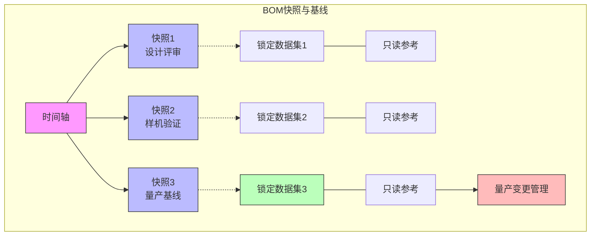

4. **实现机制**
   - 时间点定义：基于时间点的有效性标记
   - 修订锁定：特定修订版本的固化
   - 配置规则：保存BOM配置规则的状态

### 3.4 BOM自动转换及责信度检查

BOM在不同阶段的转换通常涉及复杂的业务逻辑，系统提供了自动转换和质量控制机制：

1. **自动转换规则引擎**
   - 基于模板：预定义的转换模板和规则
   - 智能匹配：基于模式匹配的自动转换
   - 业务规则：可配置的业务规则和转换逻辑

2. **责信度检查**
   - 完整性检查：确保所有必要数据都已转换
   - 一致性检查：确保转换后数据的业务一致性
   - 合规性检查：确保符合行业标准和规范

3. **问题处理流程**
   - 异常标记：自动标记存在问题的转换结果
   - 人工干预：支持特定场景的人工干预和修正
   - 审批流程：重要变更的多级审批机制

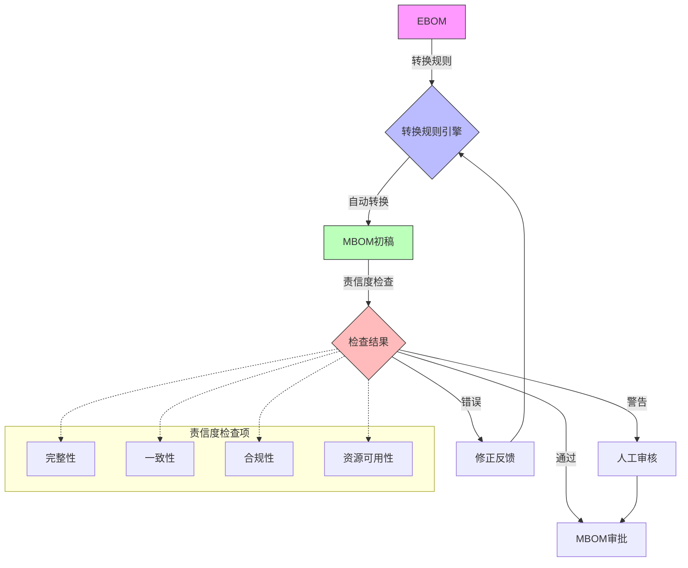

4. **关键实施点**
   - 转换映射配置：灵活配置源与目标的映射关系
   - 质量门控：设定质量阈值和必要条件
   - 转换历史记录：记录所有转换活动和决策
   
## 4. 实现新的BOM类型：SBOM案例

服务BOM（Service BOM，SBOM）用于管理产品的服务和维护结构。下面展示如何实现这个新的BOM类型。

### 4.1 领域模型定义
//TBD

### 4.2 创建SBOM结构

//TBD

### 4.3 SBOM的查询和使用

//TBD

### 4.4 与其他BOM的集成

//TBD

## 5. BOM系统扩展点

### 5.1 版本规则扩展

```java
// 1. 自定义版本规则
public class SbomRevisionRule extends RevisionRule {
    @Override
    public ModelObject resolveRevision(ModelObject original) {
        if (original instanceof ServiceTask) {
            // 应用特定的版本解析逻辑
            return resolveServiceTaskRevision((ServiceTask)original);
        }
        return super.resolveRevision(original);
    }
}

```

### 5.2 BOM转换规则扩展
//TBD

### 5.2 计算扩展
////TBD

## 6. 总结

EMOP的BOM系统提供了灵活的树形结构管理能力，通过BomView和BomLine的基础设施，可以构建各种类型的BOM应用。在开发新的BOM类型时，需要：

1. 清晰定义业务模型
2. 合理组织对象关系
3. 实现必要的转换规则
4. 注意性能和数据一致性

理解和运用好这些概念，可以帮助我们构建强大的产品数据管理系统。