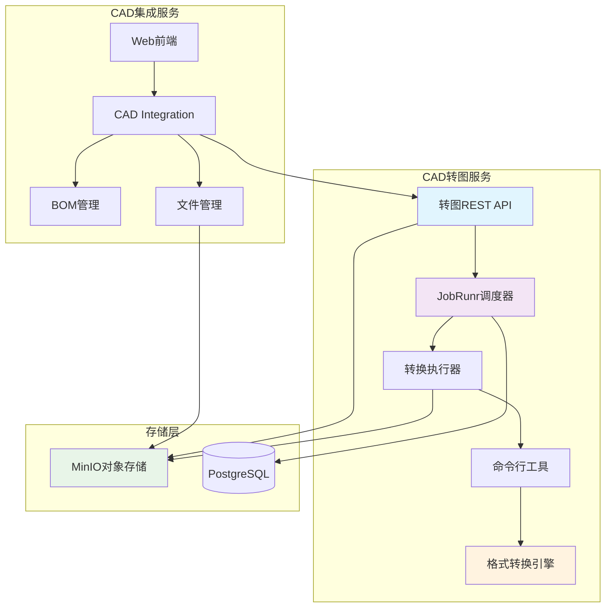
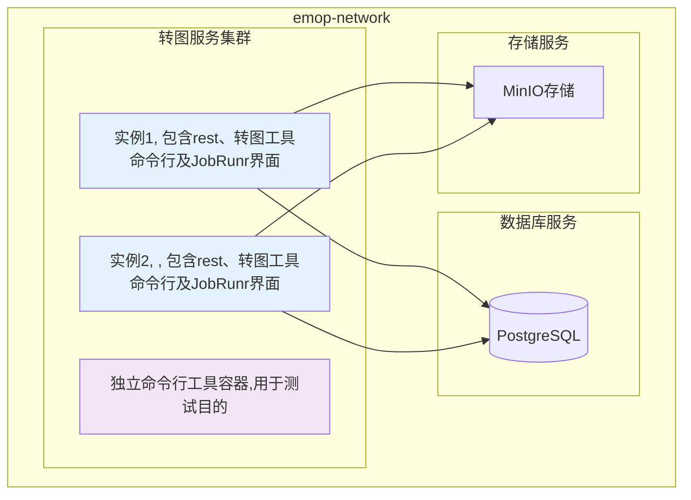
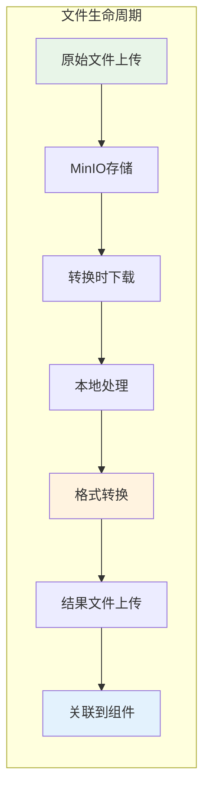
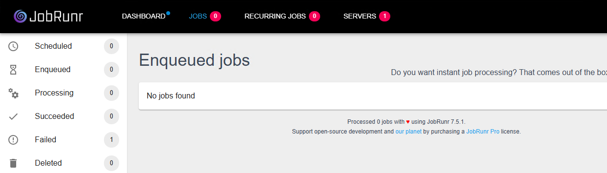

# CAD转图服务设计与实施

## 1. 业务背景与需求分析

### 1.1 业务背景

在现代制造业的产品生命周期管理(PLM)中，CAD数据是产品设计的核心。然而，随着企业规模的扩大和协作的深入，CAD数据管理面临着诸多挑战：

1. **格式多样化问题**：不同的CAD软件（如Creo、SolidWorks、CATIA、NX等）产生的文件格式各异，导致数据孤岛
2. **文件体积庞大**：原始CAD文件通常包含完整的设计数据，文件体积巨大，不适合在线传输和预览
3. **兼容性问题**：不同版本的CAD软件可能无法直接打开历史文件
4. **协作效率低**：非CAD用户（如管理人员、客户）无法直接查看和理解CAD数据

### 1.2 业务需求

基于以上背景，EMOP系统需要一个统一的CAD转图服务来解决以下核心需求：

#### 1.2.1 格式标准化
- 将各种CAD格式转换为统一的标准格式，实现跨平台数据交换
- 支持主流CAD软件的文件格式（.prt, .asm, .dwg, .step, .iges等）
- 提供轻量化的可视化格式，支持Web端预览

#### 1.2.2 数据提取与分析
- 从CAD装配体中自动提取BOM结构信息
- 识别零部件关系和层级结构
- 支持版本兼容性处理和引用修复

#### 1.2.3 系统集成
- 与EMOP的BOM系统无缝集成
- 支持批量转换和增量更新
- 提供可靠的任务调度和监控机制

#### 1.2.4 性能与可扩展性
- 支持大文件和复杂装配体的高效转换
- 提供水平扩展能力，满足企业级负载需求
- 异步处理模式，避免阻塞用户操作

## 2. 技术方案设计

### 2.1 整体架构设计

CAD转图服务采用微服务架构，与EMOP主系统松耦合集成：

### 2.2 核心组件设计

#### 2.2.1 REST API层
- **职责**：提供外部调用接口，接收转换请求
- **主要接口**：
    - `POST /api/cad/conversion/item/{componentId}/convert` - 提交转换任务
    - `GET /api/cad/conversion/status/{jobId}` - 查询任务状态
- **特点**：异步响应，立即返回任务ID，避免长时间等待

#### 2.2.2 任务调度层(JobRunr)
- **职责**：管理转换任务的生命周期，提供可靠的异步执行
- **核心特性**：
    - 任务持久化存储
    - 自动重试机制
    - 分布式任务调度
    - 可视化监控面板
- **任务上下文**：包含组件ID、文件路径、输出目录等信息

#### 2.2.3 转换执行器
- **职责**：执行具体的转换逻辑，协调各个处理步骤
- **处理流程**：
    1. 文件下载与准备
    2. 版本兼容性处理
    3. 调用转换引擎
    4. 结果文件上传
    5. 数据库更新

#### 2.2.4 命令行工具层
- **职责**：封装格式转换引擎，提供标准化的转换接口
- **核心工具**：
    - `CdxfbConverter`：CAD文件转换为CDXFB格式
    - `BomPrinter`：从CAD装配体提取BOM结构

### 2.4 关键技术

#### 2.4.1 异步处理架构
**决策**：采用JobRunr作为任务调度框架
**理由**：
- CAD文件转换是CPU密集型操作，处理时间不可预测
- 异步处理避免HTTP请求超时
- 支持任务监控和失败重试
- 便于水平扩展和负载均衡

#### 2.4.2 容器化部署
**决策**：使用Docker容器化部署
**理由**：
- 格式转换包含native库，环境依赖复杂
- 容器化确保环境一致性
- 支持快速扩容和缩容
- 简化部署和运维复杂度

#### 2.4.3 双层文件架构
**决策**：REST服务 + 命令行工具的分层架构
**理由**：
- 命令行工具便于调试和独立测试
- REST服务提供标准化的外部接口
- 分层设计提高可维护性
- 支持批处理和交互式处理两种模式

## 3. 实施方案

### 3.1 部署架构

#### 3.1.1 服务拓扑

Docker编排配置见[这里](../deployment/docker#_4-4-部署cad转图服务)

### 3.2 集成实施

#### 3.2.1 与BOM系统集成

CAD转图服务与EMOP BOM系统的集成体现在以下几个层面：

1. **数据源集成**
    - 从BOM系统获取CAD组件信息
    - 自动识别装配体结构和引用关系
    - 支持BOM变更触发的自动转换

2. **结果回写**
    - 转换完成后更新CAD组件的转换状态
    - 关联转换后的文件到原始组件
    - 维护转换历史记录

3. **版本同步**
    - 支持BOM版本管理机制
    - 处理设计变更的增量更新
    - 保持转换结果与源数据的版本一致性

#### 3.2.2 三维文件集成

### 3.3 监控与运维

#### 3.3.1 任务监控

通过JobRunr Dashboard提供全面的任务监控：

- **实时状态监控**：查看正在执行、等待中、已完成的任务
- **性能指标**：任务执行时间、成功率、失败率统计
- **错误诊断**：详细的错误日志和堆栈跟踪
- **手动干预**：支持任务重试、取消等操作

访问 http://localhost:861/
