# 分类管理设计

## 1. 核心概念

### 1.1 分类数据模型

分类系统是产品生命周期管理的基础设施，用于组织和管理各种业务对象。本节定义系统的基础概念和数据模型。

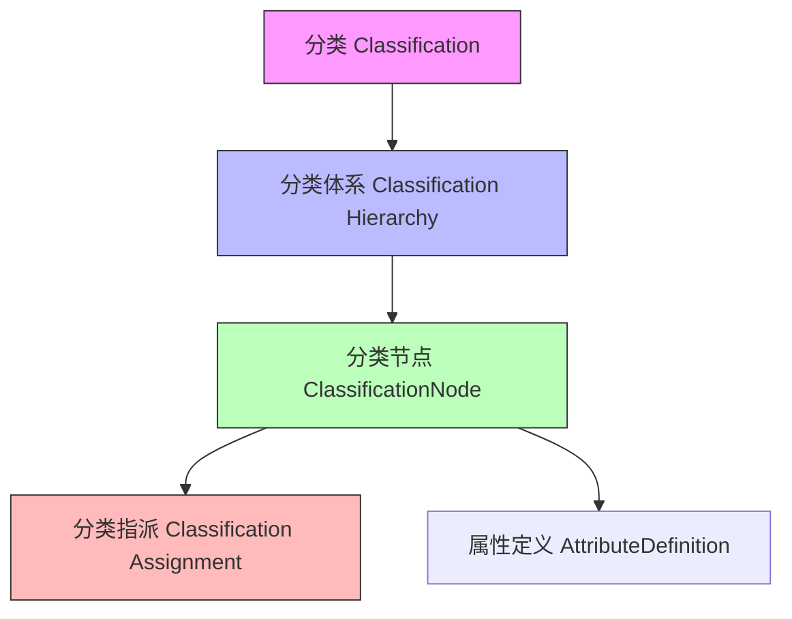

- **分类（Classification）**：对业务对象进行系统化组织的方法
- **分类节点（ClassificationNode）**：分类体系中的具体分类项，是分类体系的基本组成单元
- **分类体系（Classification Hierarchy）**：分类节点的组织结构，定义了节点间的层次和关联关系
- **分类指派（Classification Assignment）**：表示业务对象与分类节点之间的关联关系，使用`classification`关联关系表达，同时分类属性值存放与该关系的`_properties`中

### 1.2 对象属性与分类属性的区分

在设计分类系统时，需要清晰区分对象固有属性和分类属性，这对于数据模型的设计和使用至关重要。这与EMOP平台的属性系统概念相符。

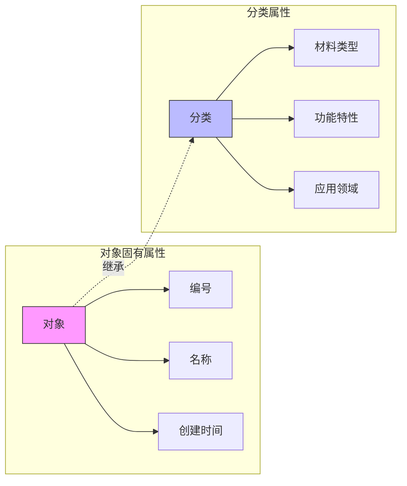

#### 对象固有属性（Object Attributes）
- **定义**：对象本身具有的属性，不依赖于分类体系，对应EMOP平台中的基本属性
- **特点**：随对象创建而存在，直接存储在对象上，属于对象的内在特征
- **示例**：零件编号、名称、创建时间、版本号等
- **实现**：使用EMOP的@QuerySqlField注解定义

#### 分类属性（Classification Attributes）
- **定义**：通过分类体系继承获得的属性，可使用EMOP的属性扩展机制
- **特点**：基于分类位置动态获得，可被子分类继承或覆盖，同分类下的对象共享相同属性定义
- **示例**：材料类型、功能特性、应用领域、技术参数等
- **实现**：可使用EMOP的`_properties`字段存储或通过DSL扩展

属性管理策略需考虑数据一致性、维护成本和使用场景，合理选择何时使用对象属性和何时使用分类属性。

### 1.3 多维分类模型

多维分类模型允许从不同视角对对象进行分类，每个维度代表一种独立的分类方式。这可以利用EMOP的关联关系（AssociateRelation）实现分类指派。

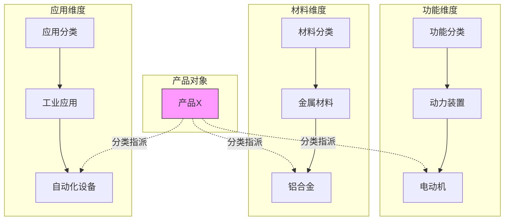

多维分类的优势在于能够从不同角度组织和查找对象。常见的维度包括：
- 功能维度：基于产品功能或用途的分类
- 材料维度：基于产品材料构成的分类
- 应用维度：基于产品应用场景的分类
- 自定义维度：根据特定业务需求定义的分类维度

### 1.4 分类继承机制

分类继承机制是分类系统的核心功能，它定义了属性如何从父分类传递到子分类。

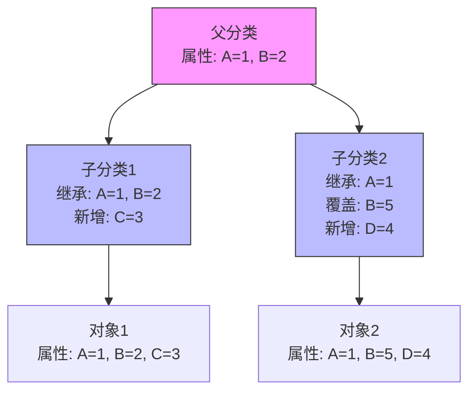

继承机制的关键规则包括：
- **向下继承原则**：子分类自动继承父分类的所有属性定义和默认值
- **属性优先级管理**：通常遵循"本地定义 > 最近父类 > 远程父类"的优先顺序

### 1.5 分类节点类型约束

分类节点类型约束定义了特定分类节点允许关联的对象类型，提供了更精细的分类控制机制。

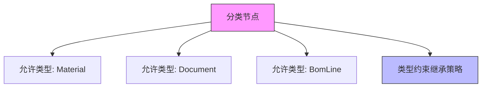

分类节点类型约束的关键特性：
- 每个分类节点可以定义一组允许关联的对象类型
- 支持对象类型的继承关系，当允许父类型时自动允许其子类型
- 提供多种继承策略，定义如何从父节点继承类型约束

#### 类型约束继承策略

分类节点支持四种类型约束继承策略，决定如何从父节点继承类型约束：

1. **INHERIT（继承策略）**：继承父节点的所有允许类型，并添加自己定义的类型
   - 最终允许类型是父节点和本节点类型的并集
   - 例如：父节点允许[A,B]，本节点允许[C]，最终允许[A,B,C]

2. **OVERRIDE（覆盖策略）**：完全覆盖父节点的类型约束，只使用自己定义的类型
   - 忽略父节点的所有类型约束
   - 例如：父节点允许[A,B]，本节点允许[C]，最终只允许[C]

3. **EXTEND（扩展策略）**：与INHERIT相同，扩展父节点的允许类型
   - 在语义上强调对父节点类型的扩展
   - 例如：父节点允许[A]，本节点允许[B]，最终允许[A,B]

4. **RESTRICT（限制策略）**：限制为父节点允许类型的子集
   - 最终允许类型是父节点和本节点类型的交集
   - 例如：父节点允许[A,B,C]，本节点允许[B,D]，最终只允许[B]

#### 对象类型继承支持

类型约束系统支持对象类型的继承关系，当配置允许某个父类型时，所有继承自该类型的子类型也自动被允许。例如：

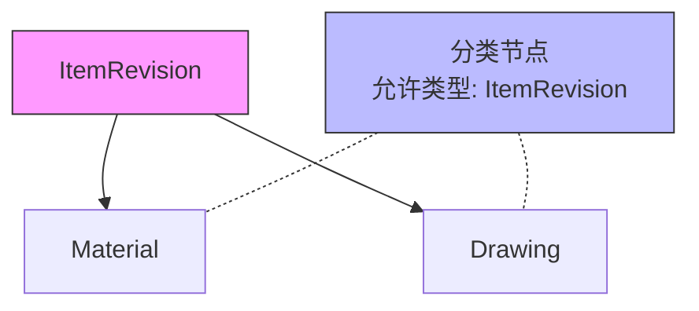

在上图中，分类节点配置为允许ItemRevision类型，则所有继承自ItemRevision的子类型（如Material、Drawing）也自动被允许关联到该分类节点。

## 2. 分类体系架构

### 2.1 基础分类结构

分类体系的基础结构通常采用树形结构，这提供了清晰的层次关系和导航路径。

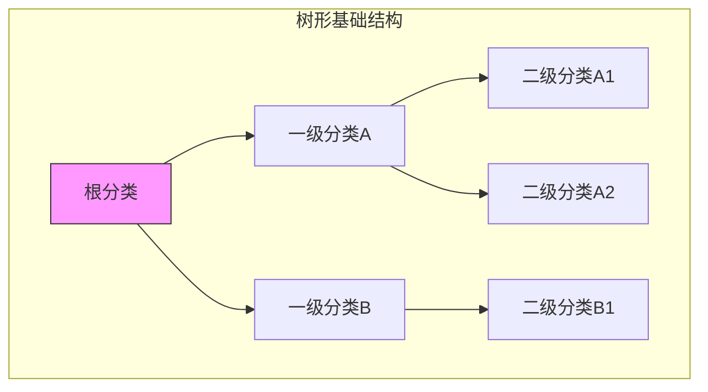

基础结构中的关键要素：
- **层次关系定义**：建立清晰的父子层次关系，有助于分类体系的组织和导航
- **父子节点管理**：通过EMOP的结构关系`HierarchicalTrait`实现层次关系
- **路径表示方法**：使用完整路径（如 /根/一级/二级）或编码体系表示节点位置

### 2.2 多维分类模型

多维分类模型允许从不同视角对对象进行分类，每个维度代表一种独立的分类方式。

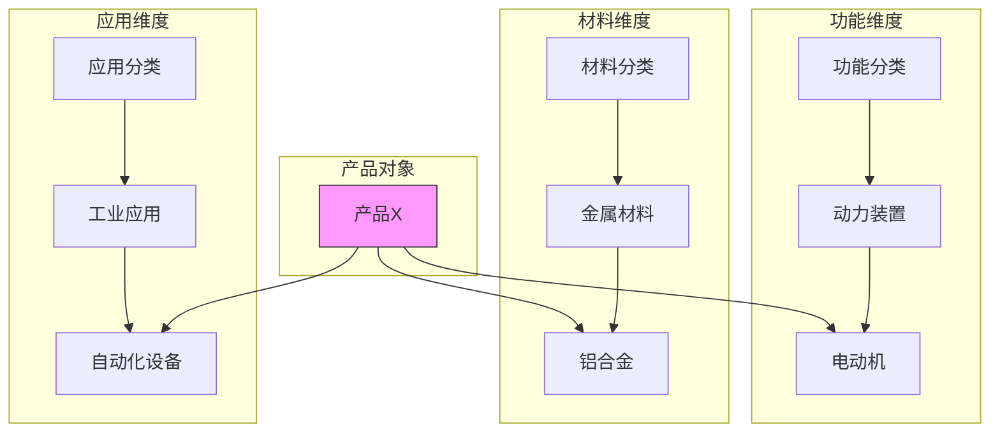

多维分类的优势在于能够从不同角度组织和查找对象。常见的维度包括：
- 功能维度：基于产品功能或用途的分类
- 材料维度：基于产品材料构成的分类
- 应用维度：基于产品应用场景的分类
- 自定义维度：根据特定业务需求定义的分类维度

### 2.3 图结构扩展

图结构扩展丰富了分类系统的表达能力，引入了多种类型的关系来连接不同的分类节点。可以利用EMOP的关联关系(AssociateRelation)实现分类节点间的横向辅助关系表达。

主要关系类型包括：
- **层次关系（HAS_PARENT）**：传统的父子层次关系，使用EMOP的结构关系
- **关联关系（RELATED_TO）**：表示存在业务关联的分类节点，使用EMOP的关联关系
- **等价关系（EQUIVALENT_TO）**：表示在不同标准或体系中等价的分类节点
- **应用关系（USED_IN）**：表示分类节点与应用领域的关系

## 3. 分类对象模型

### 3.1 核心对象设计

分类系统的核心对象模型定义了系统的基本组成单元及其关系。可以基于EMOP的ModelObject体系构建。

#### ClassificationNode（分类节点）

分类节点是分类体系的基本单元，代表一个具体的分类项。

#### AssociateRelation（分类指派复用平台的AssociateRelation）

分类指派描述了分类节点与对象之间的连接，对应的实际分类值存储于关系对象的`_properties`中。

### 3.2 属性系统

属性系统定义了分类节点上可以附加的属性类型和值。可以复用EMOP的属性系统。

属性定义（AttributeDefinition）包含：
- 属性类型系统：支持EMOP的基本类型、枚举类型和引用类型
- 验证规则：使用EMOP的验证机制确保属性值符合业务规则
- 默认值设置：为属性提供初始值


### 3.3 分类关联

分类关联（AssociateRelation）定义了业务对象与分类节点的关系。可以使用EMOP的AssociateRelation实现。

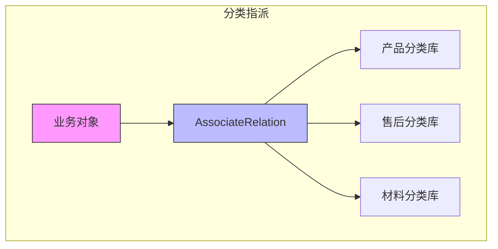

关键特性包括：
- **多分类支持**：一个对象可以同时关联多个分类节点，通过EMOP的AssociateRelation实现
- **上下文相关**：在特定上下文中应用的分类关联，可以在关系中添加上下文属性

### 3.4 分类节点类型约束实现

分类节点的类型约束功能通过以下配置属性实现：

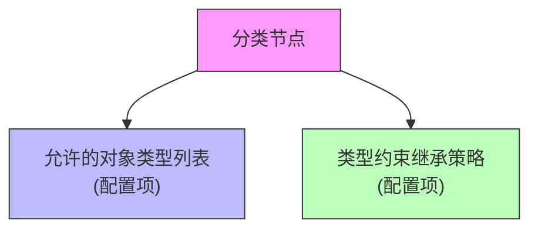

#### 配置项说明

1. **允许的对象类型列表**
   - 定义：指定该分类节点允许关联的业务对象类型清单
   - 示例值：Material（物料）、Document（文档）等
   - 实施建议：根据业务场景选择合适的类型范围，避免过于宽泛

2. **类型约束继承策略**
   - 定义：确定如何从父节点继承类型约束的策略
   - 可选值：
     - INHERIT（继承）：继承父节点的所有允许类型，并添加自己定义的类型
     - OVERRIDE（覆盖）：忽略父节点类型约束，仅使用自身定义的类型
     - EXTEND（扩展）：与INHERIT相同，语义上强调扩展父节点类型
     - RESTRICT（限制）：限制为父节点允许类型的子集
   - 默认值：INHERIT
   - 实施建议：一般情况推荐使用INHERIT策略，特殊场景根据需要选择其他策略

#### 功能特性

实施人员通过以下功能特性实现类型约束：

1. **类型验证**
   - 当用户尝试将业务对象分类到特定节点时，系统自动验证对象类型是否被允许
   - 若不允许，系统将阻止分类操作并提示适当的错误信息

2. **类型继承计算**
   - 系统自动根据继承策略计算分类节点的实际允许类型列表
   - 实际类型列表 = 本地定义类型 + 继承类型（根据继承策略）

3. **对象类型继承支持**
   - 若配置允许父类型（如ItemRevision），则所有子类型（如Material、Drawing）也自动被允许
   - 实施人员只需配置顶层类型，无需列举所有子类型

### 3.5 分类服务类型约束功能

分类服务提供丰富的类型约束管理功能，实施人员可通过DSL配置实现以下功能：

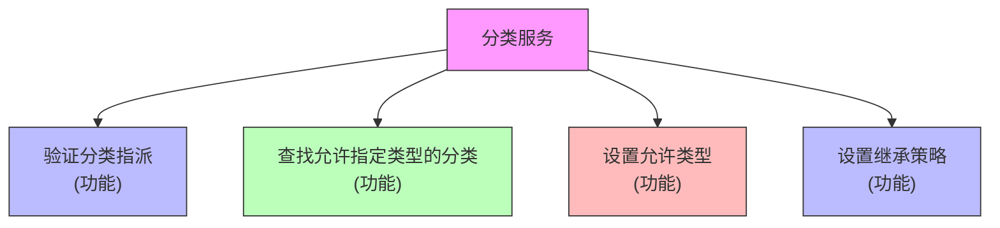

#### 功能详解

1. **验证分类指派**
   - 功能：验证特定对象类型是否允许与指定分类节点关联

2. **查找允许特定对象类型的分类**
   - 功能：查找允许特定对象类型的分类层次结构或节点

3. **设置分类节点允许的对象类型**
   - 功能：配置分类节点允许关联的对象类型列表

4. **设置分类节点的类型约束继承策略**
   - 功能：设置分类节点如何继承父节点的类型约束

## 4. 多维分类实现

### 4.1 分类维度管理

多维分类需要有效管理不同的分类维度，使它们既相互独立又能协同工作。可以利用EMOP的Schema进行隔离。

维度管理的关键方面：
- **独立维度树**：每个维度有自己独立的分类树结构，存储在独立的Schema中
- **维度间映射**：定义不同维度间的关联和映射规则，使用AssociateRelation实现
- **组合维度视图**：提供跨维度的综合视图，使用动态查询实现

### 4.2 对象的多重分类

多重分类允许对象同时属于多个分类，这在复杂业务场景中非常必要。可以使用EMOP的AssociateRelation实现。

实现多重分类的主要机制：
- **主分类定义**：指定一个作为对象主要特征的分类，通过关系属性标识
- **辅助分类**：添加多个辅助分类来描述对象的其他特征，通过独立的关联关系实现
- **标签式分类**：轻量级的分类方式，适用于横切关注点，可以实现为特殊的分类关联类型

## 5. 分类属性系统深化

### 5.1 属性继承机制

属性继承是分类系统的核心机制，需要明确的规则来处理继承关系。可以参考EMOP的继承机制实现。

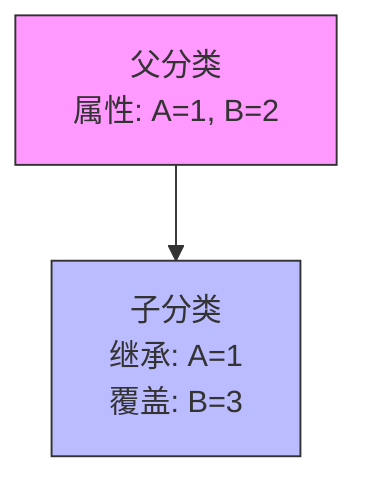

### 5.2 动态属性

动态属性根据上下文动态计算或确定，增加了属性系统的灵活性。可以利用EMOP的计算属性(Computed)实现。

动态属性的主要类型：
- **计算属性**：基于其他属性值计算得出的属性，使用EMOP的计算属性
- **关联属性**：从关联对象获取的属性，通过xpath实现

### 5.3 属性组管理

属性组是相关属性的逻辑集合，简化了属性管理和用户界面。可以使用EMOP的`trait`概念实现。

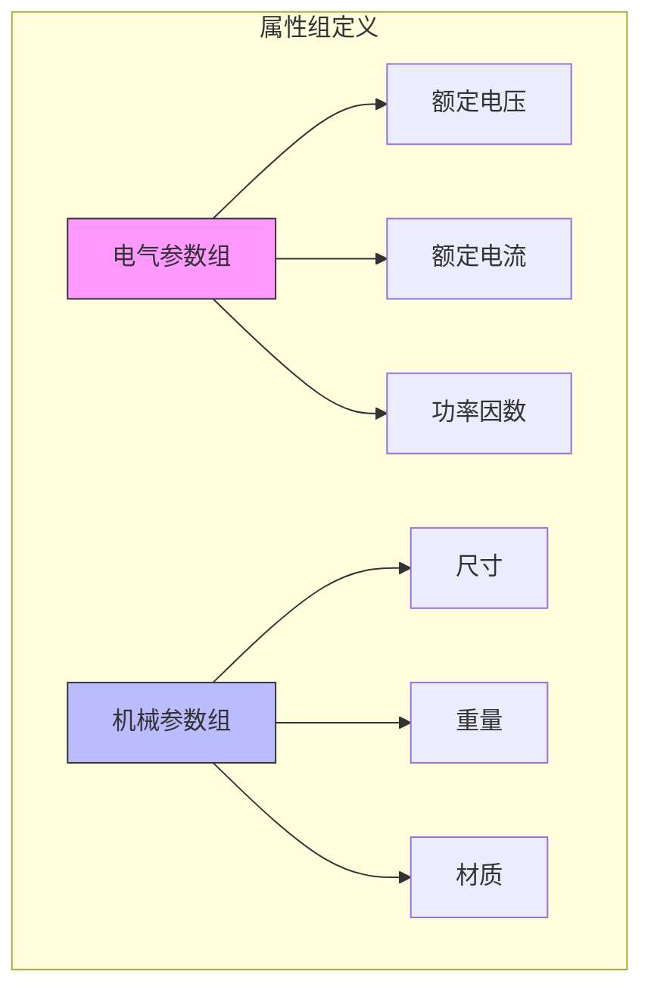

属性组的主要功能：
- 将相关属性组织在一起，便于管理和展示
- 支持属性组级别的权限控制和操作
- 简化用户界面，提高用户体验

## 6. 分类系统扩展

### 6.1 分类体系扩展

分类系统需要有良好的扩展性，以适应业务的变化和增长。

关键扩展机制：
- **新维度添加**：能够灵活添加新的分类维度
- **关系类型扩展**：支持定义新的关系类型
- **属性动态定义**：允许在运行时动态添加和修改属性，利用EMOP的`_properties`机制

### 6.2 外部标准预留

分类系统需要考虑与外部标准和系统的集成和互操作性。

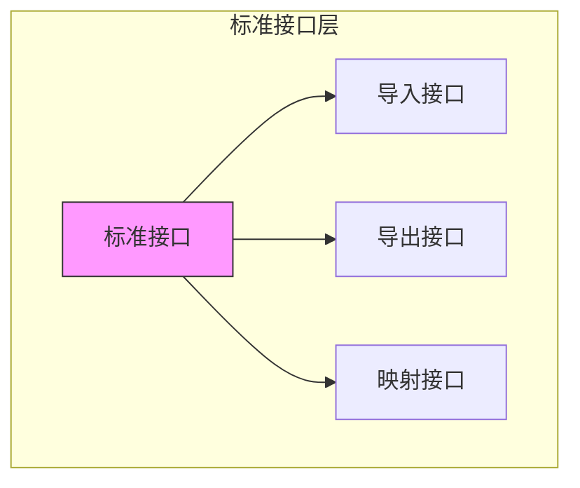

标准兼容性考虑：
- 接口标准化，支持与外部系统的数据交换
- 映射框架设计，处理不同标准间的概念映射
- 版本演进支持，适应标准的变化和更新

## 7. 分类应用场景

### 7.1 产品分类体系

产品分类是分类系统的典型应用，通常需要多维度的分类视角。

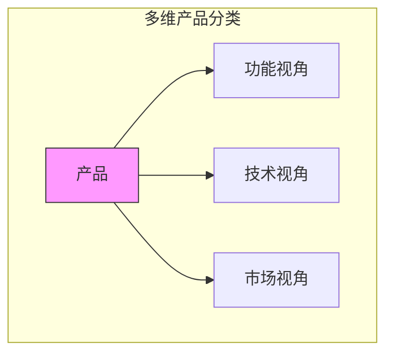

产品分类的主要维度：
- **功能视角**：基于产品功能的分类，如动力产品、控制产品等
- **技术视角**：基于技术特性的分类，如机械产品、电子产品等
- **市场视角**：基于目标市场的分类，如工业市场、消费市场等

### 7.2 零部件分类

零部件分类需要处理大量细粒度的项目，通常采用多层次的分类结构。可以与EMOP的材料与BOM管理集成。

零部件分类的特点：
- 基础分类树提供主要的组织结构
- 应用领域标签提供额外的分类维度
- 供应商关联建立与供应链的连接，集成EMOP的关联关系功能

### 7.3 知识资产分类

知识资产分类用于组织和管理企业的知识资源，如文档、经验和最佳实践。可以与EMOP的文档管理系统集成。

知识资产分类的关键特性：
- 文档类型层次结构组织不同类型的文档
- 主题标签网络提供跨领域的知识关联
- 关联知识图谱展现知识之间的连接和依赖

### 7.4 对象创建时的分类约束

在创建业务对象时，系统会根据对象类型过滤可用的分类节点，确保对象只能被分类到允许该类型的节点下。

使用案例：
- 创建物料时，只能选择允许Material类型的分类节点
- 创建文档时，只能选择允许Document类型的分类节点

## 8. 实施案例：电子产品分类

### 8.1 多维分类设计

电子产品分类是分类系统的典型应用场景，需要多维度的分类设计。可以结合EMOP的产品管理实现。

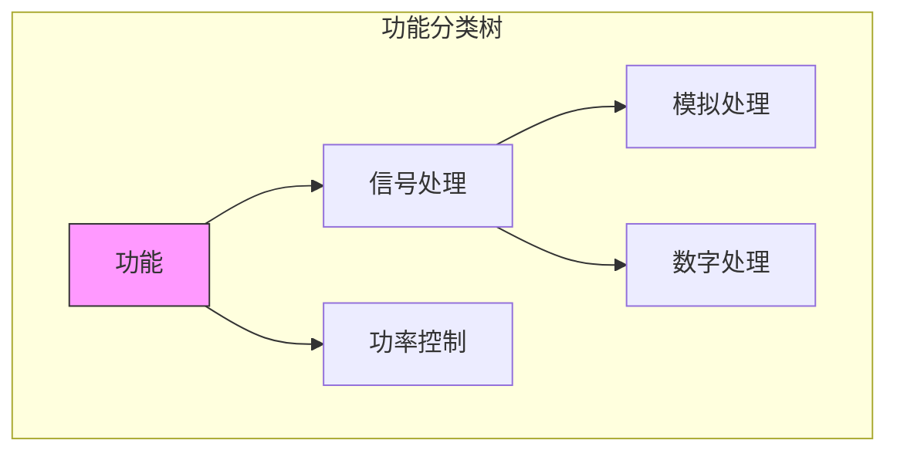

电子产品的主要分类维度：
- **功能分类树**：基于产品功能的分类
- **技术参数网络**：基于技术参数的关联网络
- **应用场景标签**：基于应用场景的标签分类

### 8.2 属性组应用

电子产品有大量复杂的属性，通过属性组可以更好地组织和管理这些属性。可以利用EMOP的属性系统实现。

主要的属性组包括：
- **电气参数组**：电压、电流、功率等电气特性，使用属性组管理
- **机械参数组**：尺寸、重量、安装方式等机械特性，使用属性组管理
- **环境参数组**：温度范围、湿度要求、防护等级等环境特性，使用属性组管理

## 9. 最佳实践与总结

### 9.1 设计原则

分类系统设计需要遵循一系列平衡原则：

1. **平衡复杂性与可用性**
   - 树形结构提供清晰的层次关系
   - 图结构增加灵活性但需控制复杂度
   - 根据业务需求选择合适的模型

2. **性能与功能权衡**
   - 合理使用索引优化查询性能，遵循EMOP的索引建议
   - 适度缓存减少重复计算，利用EMOP的计算属性缓存机制
   - 避免过度设计影响系统性能，遵循EMOP的最佳实践

3. **可扩展性考虑**
   - 预留扩展接口，利用EMOP的模型扩展机制
   - 支持动态属性定义，使用EMOP的`_properties`字段
   - 考虑未来业务变化，采用DSL或Java注解的混合方式

### 9.2 实施策略

分类系统的实施应采用渐进式方法，分阶段推进：

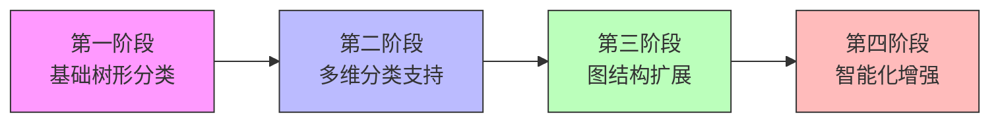

- **第一阶段**：建立核心分类树，实现基本分类功能
- **第二阶段**：引入多维分类支持，增强分类灵活性
- **第三阶段**：实现图结构扩展，添加关联关系
- **第四阶段**：引入智能化功能，如自动分类和推荐

### 9.3 类型约束配置策略

配置分类节点类型约束的最佳实践：

1. **顶层节点配置**
   - 在分类体系的顶层节点配置基础类型约束
   - 子节点通过继承策略细化类型约束

2. **继承策略选择**
   - 一般场景使用默认的INHERIT策略
   - 需要完全替换父节点类型约束时使用OVERRIDE
   - 需要限制为父节点允许类型的子集时使用RESTRICT

3. **对象类型组织**
   - 合理设计对象类型继承体系，充分利用类型继承关系
   - 尽量在顶层通用类型上配置约束，减少配置量

4. **性能考虑**
   - 避免在单个节点上配置过多类型，影响验证性能
   - 利用类型继承关系简化配置，减少类型约束数量


## 10. 分类数据导入与管理

使用[DSL树形数据导入](../business/data/dsl#树形数据导入)的能力直接导入分类树定义。

### 10.1 CSV数据准备

为了有效导入分类体系数据，需要先准备符合格式要求的CSV文件。分类节点CSV文件应包含以下列：

- **代码**：分类节点的唯一标识符，建议使用有意义的编码体系
- **名称**：分类节点的显示名称
- **父级代码**：指向父节点的代码，根节点此值为空
- **允许对象类型**：该分类节点允许关联的对象类型列表，多个类型用分号(;)分隔
- **类型约束继承策略**：从父节点继承类型约束的策略（INHERIT/OVERRIDE/EXTEND/RESTRICT）
- **属性定义**：节点的属性定义，格式为"属性名:类型:是否必填"，多个属性用分号(;)分隔

#### CSV示例

```csv
代码,名称,父级代码,允许对象类型,类型约束继承策略,属性定义
MAT-ROOT,材料,,Material,INHERIT,density:Double:true;description:String:false
MAT-MET,金属材料,MAT-ROOT,Material;Compound,INHERIT,strength:Double:true;corrosionResistance:String:false
MAT-MET-FER,黑色金属,MAT-MET,Material,INHERIT,magneticProperty:Boolean:false;carbonContent:Double:true
```

#### 属性命名规范

- 属性名必须使用英文，遵循驼峰命名法（如`density`、`corrosionResistance`）
- 可使用多语言映射为属性提供本地化名称和描述
- 支持的属性类型：String、Integer、Long、Double、Boolean、Date

### 10.2 DSL导入脚本

使用以下DSL模板导入分类体系及其节点：

```sql
// 1. 创建分类体系
create object ClassificationHierarchy {
    code: "HIERARCHY_CODE",
    name: "分类体系名称",
    dimension: "维度标识",
    description: "分类体系描述"
}

// 2. 导入分类节点树结构
import tree ClassificationNode "temp:classification/sample/文件名.csv" {
    parent "父级代码" -> "代码"
    column "代码" -> code
    column "名称" -> name
    column "允许对象类型" -> allowedObjectTypes
    column "类型约束继承策略" -> typeConstraintInheritance
    column "属性定义" -> attributeDefinitions
} with {
    existence: update,
    relationType: "children",
    dataMappingFunction: """
        // 数据映射处理脚本
        import io.emop.model.metadata.Types;
        import io.emop.model.common.MultiLanguage;
        
        // 处理属性定义
        if (data.attributeDefinitions) {
            // 属性处理逻辑
            // ...
        }
        
        // 移除原始属性定义字符串
        data.remove('attributeDefinitions')
        return data
    """
}

// 3. 建立分类体系与顶层节点的关系
relation ClassificationHierarchy(code='HIERARCHY_CODE') -> ClassificationNode(code='ROOT_NODE_CODE') as topNode
```

### 10.3 属性处理函数

导入过程中，需要使用数据映射函数将CSV中的属性定义字符串转换为AttributeDefinition对象：

```groovy
// 处理属性定义
if (data.attributeDefinitions) {
    def attrDefs = data.attributeDefinitions.split(';')
    attrDefs.each { attrDef ->
        def parts = attrDef.split(':')
        if (parts.length >= 2) {
            def name = parts[0]
            def typeStr = parts[1]
            def isRequired = parts.length > 2 ? Boolean.parseBoolean(parts[2]) : false
            
            // 为属性添加中文描述
            def chineseDesc = getChineseDesc(name)
            
            // 将字符串类型转换为TypeInfo对象
            def typeInfo
            switch(typeStr) {
                case "String": 
                    typeInfo = Types.STRING
                    break
                case "Integer": 
                    typeInfo = Types.INTEGER
                    break
                case "Long":
                    typeInfo = Types.LONG
                    break
                case "Double": 
                    typeInfo = Types.DOUBLE
                    break
                case "Boolean": 
                    typeInfo = Types.BOOLEAN
                    break
                case "Date": 
                    typeInfo = Types.DATE
                    break
                default: 
                    typeInfo = Types.STRING
            }
            
            // 创建多语言支持
            def multiLang = new MultiLanguage()
            multiLang.get_properties().put("name.zh_CN", chineseDesc)
            
            // 创建属性定义对象
            def attrDefObj = io.emop.model.metadata.AttributeDefinition.builder(name, typeInfo)
                .description(chineseDesc)
                .isRequired(isRequired)
                ._multiLang(multiLang)
                .build()
            
            // 添加到节点中
            data.put("_attr_def_" + name, attrDefObj)
        }
    }
}
```

为属性提供多语言支持，需要实现一个映射函数：

```groovy
// 获取属性的中文描述
def getChineseDesc(name) {
    def descMap = [
        "density": "密度",
        "strength": "强度",
        // 更多属性映射...
    ]
    
    return descMap[name] ?: name
}
```

### 10.4 导入最佳实践

1. **数据准备**
   - 使用模板创建CSV文件，确保所有必要列都存在
   - 确保分类节点代码唯一且有意义，建议使用分层编码
   - 属性名使用英文，避免使用中文作为属性名
   - 预先规划分类层次结构，避免导入后大量修改

2. **文件处理**
   - 将CSV文件上传到MinIO，使用`temp:classification/sample/`路径前缀访问
   - 对于大型分类体系，考虑分多个CSV文件，分阶段导入

3. **导入策略**
   - 分类节点会自动根据代码进行合并(merge)，避免重复创建
   - 先导入基础结构，再添加复杂属性定义

4. **属性定义**
   - 为提高可维护性，建议在属性定义中明确指定是否必填
   - 为每个属性提供中文描述，提升用户体验
   - 避免过度复杂的属性定义，保持数据模型的简洁性

5. **类型约束**
   - 在顶层节点设置基础类型约束，子节点通过继承策略获取
   - 使用适当的继承策略减少重复配置工作量
   - 验证导入后的类型约束是否符合预期

### 10.5 完整导入示例

以下是一个完整的分类体系导入示例，包括材料分类和零部件分类：

```sql
// 创建材料分类体系
create object ClassificationHierarchy {
    code: "MAT-HIERARCHY",
    name: "材料分类体系",
    dimension: "material",
    description: "机械制造行业使用的材料分类体系"
}

// 导入材料分类节点
import tree ClassificationNode "temp:classification/sample/材料分类.csv" {
    parent "父级代码" -> "代码"
    column "代码" -> code
    column "名称" -> name
    column "允许对象类型" -> allowedObjectTypes
    column "类型约束继承策略" -> typeConstraintInheritance
    column "属性定义" -> attributeDefinitions
} with {
    existence: update,
    relationType: "children",
    dataMappingFunction: """
        import io.emop.model.metadata.Types;
        import io.emop.model.common.MultiLanguage;
        
        // 处理允许对象类型 - 将字符串转换为List
        if (data.allowedObjectTypes && data.allowedObjectTypes instanceof String) {
            // 假设CSV中使用分号分隔多个类型
            def typesList = data.allowedObjectTypes.split(';').collect { it.trim() }
            data.allowedObjectTypes = typesList
        } else {
            //仍然需要设置正确的类型
            data.allowedObjectTypes = []
        }
        
        // 处理属性定义
        if (data.attributeDefinitions) {
            def attrDefs = data.attributeDefinitions.split(';')
            attrDefs.each { attrDef ->
                def parts = attrDef.split(':')
                if (parts.length >= 2) {
                    def name = parts[0]
                    def typeStr = parts[1]
                    def isRequired = parts.length > 2 ? Boolean.parseBoolean(parts[2]) : false
                    
                    // 为属性添加中文描述
                    def chineseDesc = getChineseDesc(name)
                    
                    // 将字符串类型转换为TypeInfo对象
                    def typeInfo
                    switch(typeStr) {
                        case "String": 
                            typeInfo = Types.STRING
                            break
                        case "Integer": 
                            typeInfo = Types.INTEGER
                            break
                        case "Long":
                            typeInfo = Types.LONG
                            break
                        case "Double": 
                            typeInfo = Types.DOUBLE
                            break
                        case "Boolean": 
                            typeInfo = Types.BOOLEAN
                            break
                        case "Date": 
                            typeInfo = Types.DATE
                            break
                        default: 
                            typeInfo = Types.STRING
                    }
                    
                    // 创建多语言支持
                    def multiLang = new MultiLanguage()
                    multiLang.get_properties().put("name.zh_CN", chineseDesc)
                    
                    // 创建属性定义对象
                    def attrDefObj = io.emop.model.metadata.AttributeDefinition.builder(name, typeInfo)
                        .description(chineseDesc)
                        .isRequired(isRequired)
                        ._multiLang(multiLang)
                        .build()
                    
                    // 添加到节点中
                    data.put("_attr_def_" + name, attrDefObj)
                }
            }
        }
        // 移除原始属性定义字符串
        data.remove('attributeDefinitions')
        return data
        
        // 获取属性的中文描述
        def getChineseDesc(name) {
            def descMap = [
                // 材料通用属性
                "density": "密度",
                "description": "描述",
                
                // 金属材料属性
                "strength": "强度",
                "corrosionResistance": "耐腐蚀性",
                // 更多属性映射...
            ]
            
            return descMap[name] ?: name
        }
    """
}

// 建立分类体系与顶层节点的关系
relation ClassificationHierarchy(code='MAT-HIERARCHY') -> ClassificationNode(code='MAT-ROOT') as topNode

// 创建零部件分类体系（同样方式）...
```

### 10.6 导入后的数据验证与管理

成功导入分类数据后，应进行以下验证和管理操作：

1. **结构验证**
   - 检查分类树结构是否完整
   - 验证分类节点之间的父子关系是否正确
   - 确认顶层节点与分类体系的关联关系

2. **属性验证**
   - 确认各节点的属性定义是否正确导入
   - 测试属性继承机制是否按预期工作
   - 验证多语言支持是否生效

3. **类型约束验证**
   - 测试类型约束是否按预期工作
   - 验证不同类型对象的分类指派是否受到适当限制
   - 检查类型约束继承策略是否按预期执行

4. **数据维护计划**
   - 制定分类数据的定期更新计划
   - 规划分类体系的扩展方向
   - 建立数据质量监控机制

通过这些实践，可以确保分类体系数据的完整性和有效性，为业务对象的组织和管理提供可靠支持。