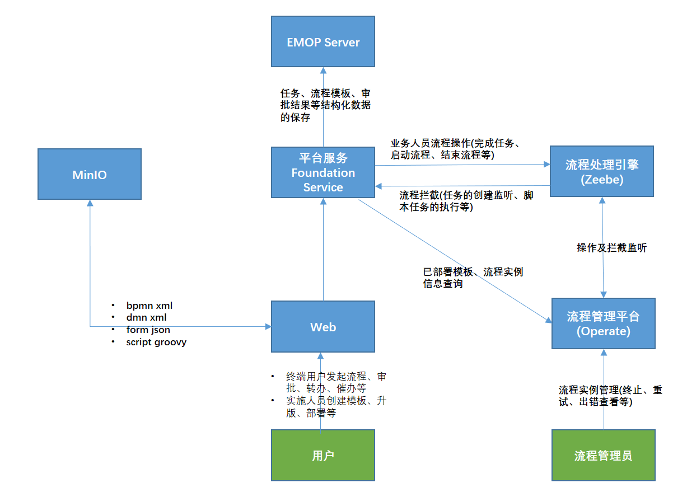
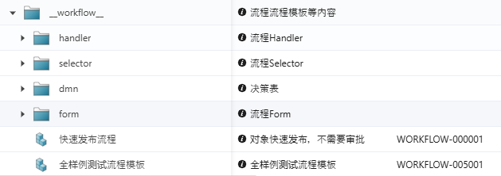
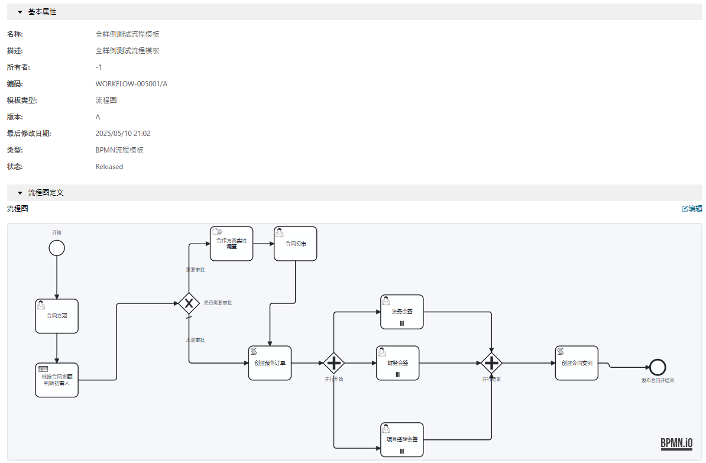
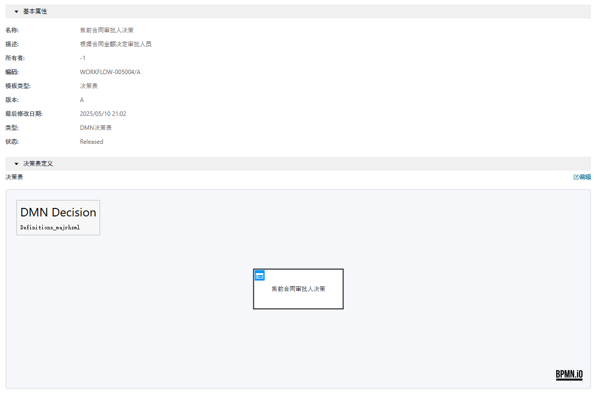
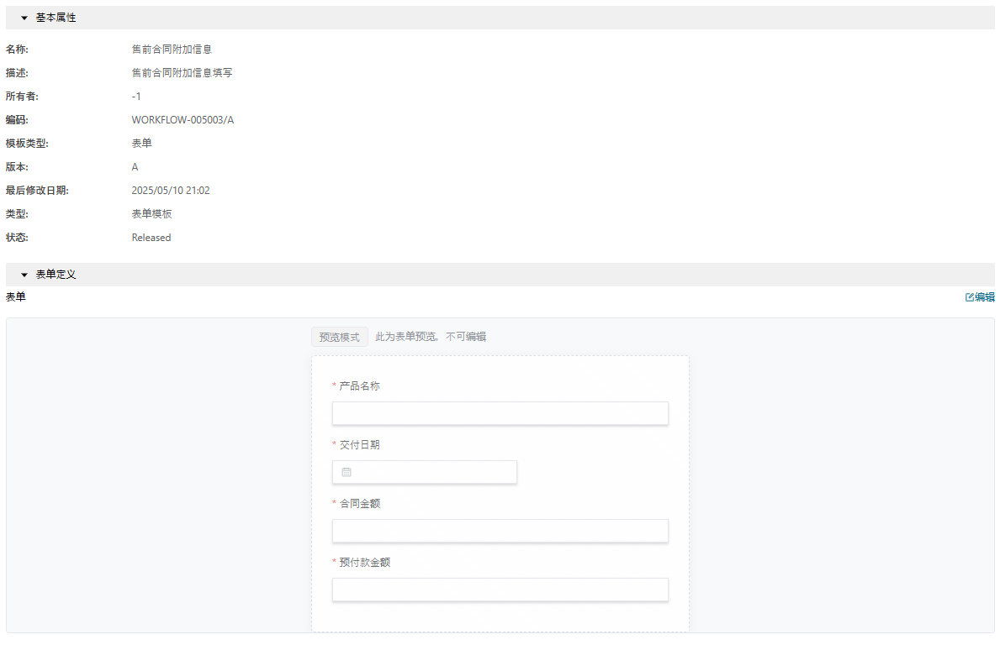
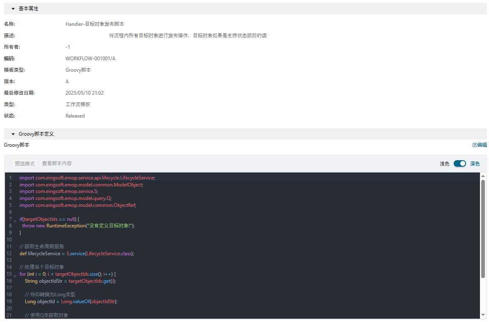
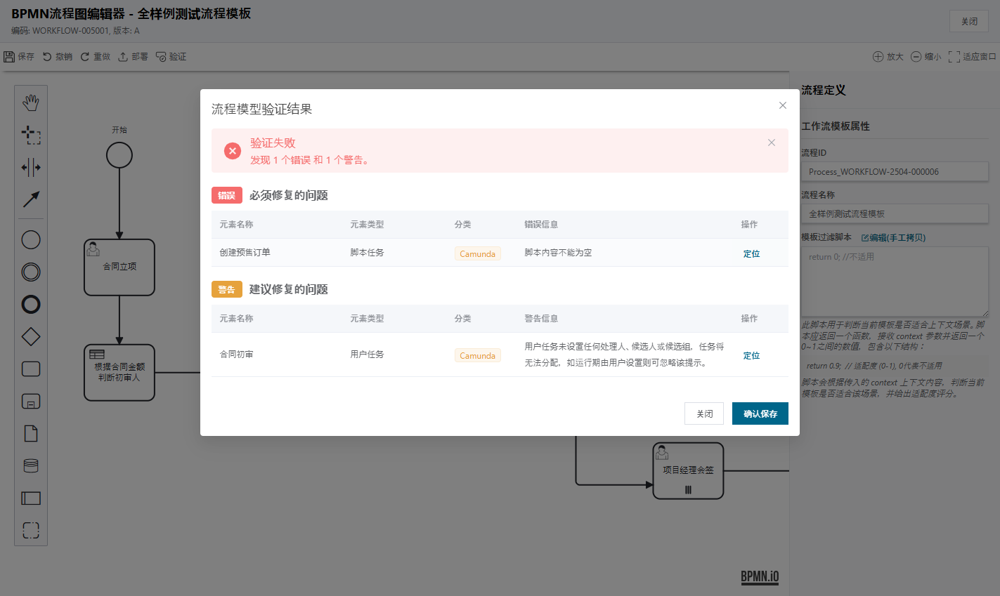
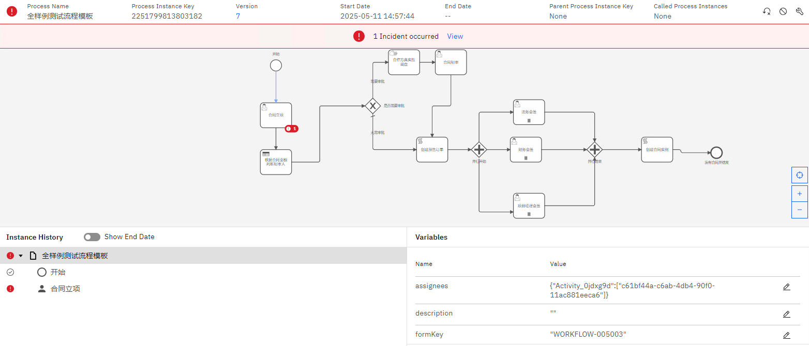

# EMOP 工作流实施指南

## 1. 工作流引擎基础

### 1.1 工作流概述

工作流引擎是EMOP平台的核心功能之一，对于PLM系统尤为重要，它用于自动化产品生命周期中的各种业务流程，实现规范化的设计审批、变更控制和产品发布流程。通过工作流引擎，您可以：

- 定义标准化的产品开发和变更流程
- 自动分配设计审核和审批任务
- 追踪产品开发各阶段的进度和状态
- 通过决策表实现复杂的产品参数规则评估
- 与现有PLM系统的数据模型无缝集成

### 1.2 EMOP平台工作流架构

EMOP平台采用现代化的工作流架构，基于微服务设计，提供高可用性和可扩展性。核心架构包括：

[](images/workflow_diagram.png)

### 1.3 核心概念

在深入了解实施细节前，需要理解以下核心概念：

1. **流程定义**：描述业务流程的蓝图，如产品设计审批流程或变更控制流程。
2. **流程实例**：流程定义的运行时实例，代表正在执行的特定业务流程，如某个特定产品的设计审批。
3. **任务**：流程中的工作单元，可以是人工任务（如设计审核）或自动执行的系统任务（如数据校验）。
4. **网关**：控制流程执行路径的决策点，如基于产品复杂度选择不同审批路径。
5. **事件**：标记流程生命周期中的重要时刻，如开始、结束或中间事件。
6. **目标对象**：流程操作的主要业务实体，在PLM中通常是产品、零部件、文档或变更单等。

## 2. 工作流组件

EMOP平台采用模块化设计思想，将工作流系统分为多个可独立配置的组件。在设计流程前，您需要先创建基础组件，这些组件将在流程设计中被引用。建议将这些组件按类别放置在`__workflow__`文件夹下

[](images/workflow_components.png)

### 2.1 流程图(BPMN)

流程图是工作流的主要定义方式，使用标准的流程建模图表示业务流程。在PLM系统中，常见的流程图包括：

- 产品设计审批流程
- BOM变更控制流程
- 工程变更流程
- 供应商零部件审批流程

流程图包含以下基本元素：
- 开始和结束事件
- 各类任务节点
- 流程控制网关
- 连接元素的顺序流

[](images/bpmn.png)

### 2.2 决策表(DMN)

决策表用于定义复杂的业务规则，将输入条件映射到输出结果。在PLM中的适用场景：

- 基于产品参数的审批路径选择
- 零部件风险评估
- 物料成本计算

[](images/dmn.png)

### 2.3 表单模板

表单模板定义用户交互界面，用于收集或展示数据。在PLM流程中的应用：

- 设计评审反馈表单
- 变更申请表单
- 物料审批表单
- 偏离请求表单

表单特点：
- 可视化表单设计
- 多种控件支持
- 数据验证规则
- 与流程变量和PLM对象属性绑定

[](images/form.png)

### 2.4 脚本模板

EMOP平台支持两种类型的脚本模板：

1. **处理脚本(Handler)**：用于执行特定操作的脚本，如自动计算BOM成本、更新产品状态、生成报告等。
2. **选择器脚本(Selector)**：用于动态确定任务执行人的脚本，如根据产品类型选择专业审批人员，或基于变更影响范围选择审批部门。

[](images/script.png)

### 2.5 组件版本管理

所有工作流组件都支持版本管理，发布后的版本不可修改，确保流程稳定性：

- 草稿状态：可自由编辑
- 已发布状态：不可修改，可在流程中引用
- 新版本：基于现有版本创建新版本

只有已发布的组件才能在流程定义中被引用，这与PLM系统中的版本控制理念一致。

## 3. 开始设计工作流

### 3.1 设计器概览

EMOP平台提供了直观的可视化设计器，帮助您创建和管理工作流组件：

- 流程设计器：用于创建和编辑流程图
- 决策表设计器：用于创建和管理决策表
- 表单设计器：用于设计用户交互表单
- 脚本编辑器：用于编写和测试脚本

### 3.2 工作流设计最佳实践

针对PLM系统的工作流设计建议：

1. **先创建基础组件**：在开始流程设计前，先创建所需的表单、决策表和脚本。
2. **映射现有业务流程**：基于实际的产品研发流程设计工作流，保持流程的实用性。
3. **保持流程简洁**：避免过于复杂的流程，必要时分解为子流程（如将设计审批和生产审批分为两个关联流程）。
4. **使用有意义的命名**：为元素使用描述性名称，便于理解和维护。
5. **考虑异常路径**：设计流程时考虑异常情况（如紧急变更、审批拒绝等）的处理方式。
6. **兼顾灵活性和规范性**：在保证流程规范的同时，预留足够的灵活性应对特殊情况。
7. **定期评审和优化**：随着产品研发流程的优化，相应更新工作流定义。

## 4. 创建基础组件

### 4.1 表单模板

表单模板用于用户交互，支持数据输入和展示：

**创建步骤：**
1. 进入表单设计器
2. 添加和配置表单字段
3. 设置验证规则
4. 配置布局和样式
5. 保存并发布表单

**PLM场景中的常用表单字段：**
- 产品信息字段
- BOM组件列表
- 技术参数表格
- 附件上传（图纸、规格书等）
- 审批意见输入
- 签名和日期字段

### 4.2 决策表

决策表用于定义业务规则和决策逻辑：

**创建步骤：**
1. 进入决策表设计器
2. 定义输入变量（如产品类型、变更类型、影响范围等）
3. 定义输出变量（如审批路径、风险等级、需要的测试级别等）
4. 创建决策规则
5. 测试决策表
6. 保存并发布

**PLM中决策表应用示例：**
- 根据产品类型和变更范围确定审批路径
- 基于产品参数判断质量风险等级
- 确定文档审批要求级别
- 评估供应商零部件风险

### 4.3 脚本模板

#### 4.3.1 处理脚本(Handler)

处理脚本用于执行特定操作，如数据处理或系统集成：

**创建步骤：**
1. 进入脚本编辑器
2. 名称以"Handler"作为前缀
3. 编写脚本
4. 测试脚本功能
5. 保存并发布

**PLM中处理脚本常见使用场景：**
- 自动计算产品成本
- 生成BOM结构报告
- 更新PLM系统中对象状态
- 创建ECN记录
- 执行数据完整性和一致性检查

#### 4.3.2 选择器脚本(Selector)

选择器脚本用于动态确定任务执行人：

**创建步骤：**
1. 进入脚本编辑器
2. 名称以"Selector"作为前缀
3. 编写用于选择审批人的脚本
4. 测试脚本功能
5. 保存并发布

**PLM中选择器脚本常见使用场景：**
- 发起人上级领导
- 基于变更影响范围选择涉及部门负责人
- 根据产品复杂度确定质量审批级别
- 选择与特定零部件相关的工程师
- 根据成本金额确定财务审批层级

## 5. 设计流程图

### 5.1 创建流程模板

要创建新的流程模板：

1. 导航至流程设计器
2. 点击"新建流程模板"
3. 输入基本信息（名称、描述等）
4. 设计流程图
5. 配置流程属性
6. 保存并发布流程

### 5.2 基本元素说明

流程设计中使用的基本元素：

- **开始事件**：标记流程的开始点，如产品设计提交、变更申请等
- **结束事件**：标记流程的结束点，如审批完成、发布生产等
- **任务**：需要完成的工作单元，如设计审核、测试验证等
- **网关**：控制流程执行路径的决策点，如基于产品类型的分支
- **顺序流**：连接元素，定义执行顺序


### 5.3 流程属性配置

流程模板具有以下属性：

- **流程ID**：唯一标识符，用于系统引用
- **流程名称**：描述性名称，如"新产品设计审批流程"
- **模板过滤脚本**：用于确定此模板是否适用于特定产品或变更类型

### 5.4 任务类型与配置

#### 5.4.1 用户任务

用户任务需要人工处理，配置选项包括：

- **表单模板**：选择已发布的审批表单
- **审批人配置**：
    - 指定用户/组织/角色（如产品经理、质量工程师）
    - 脚本推断（部门负责人、流程发起人、专业工程师）
- **会签设置**：
    - 启用/禁用会签（多部门协同审批）
    - 审批通过比例（如需要75%同意才能通过）
- **任务委派**：允许/禁止委派（审批人临时不在时）
- **到期时间**：设置任务期限（如3个工作日）

#### 5.4.2 脚本任务

脚本任务执行预定义脚本，配置选项包括：

- **脚本类型**：
    - 内联脚本：直接编写脚本内容
    - 脚本引用：引用已发布的脚本模板
- **结果变量名**：存储脚本执行结果的变量名

脚本任务可用于产品数据分析、成本计算、风险评估等自动化处理。

#### 5.4.3 业务规则任务

业务规则任务执行决策表，配置选项包括：

- **决策表引用**：选择已发布的决策表（如产品风险评估规则）
- **结果变量名**：存储决策结果的变量名

业务规则任务适用于根据产品参数自动确定审批路径、质量测试需求等。

#### 5.4.4 手动任务

手动任务类似于用户任务，但通常用于记录系统外的活动：

- **表单模板**：选择展示信息的表单
- **处理人配置**：指定负责确认任务完成的人员
- **任务委派**：允许/禁止委派
- **到期时间**：设置任务期限

手动任务适用于实验室测试、物理样品检验等需要线下完成的活动。

### 5.5 网关配置

#### 5.5.1 排他网关

排他网关（XOR）在多个路径中只选择一条执行：

- **默认顺序流**：当所有条件都不满足时执行的路径
- 每条出口路径设置条件表达式（如根据产品类型或复杂度选择不同审批路径）

#### 5.5.2 并行网关

并行网关（AND）同时执行所有出口路径：

- 分支点：将流程分成多个并行执行的路径（如同时进行设计审核和成本评估）
- 合并点：等待所有入口路径完成后继续（所有审批都完成才能进入下一步）
- 不需要设置条件表达式

## 6. 目标对象和流程上下文

### 6.1 目标对象概念

目标对象（ModelObject）是流程操作的主要业务实体：

- 在PLM中，目标对象通常是产品、零部件、文档或变更请求
- 每个流程实例至少关联一个目标对象
- 目标对象包含业务数据属性（如产品规格、成本、分类等）
- 流程可以读取和修改目标对象的属性
- 目标对象类型决定适用的流程模板

### 6.2 在流程中使用目标对象

目标对象的属性可以在流程中通过表达式访问：

- 条件表达式中：`= modelObject.getProperty("productCategory") == "A类"`
- 表单绑定：将表单字段与目标对象属性关联，如自动显示产品名称和规格

流程上下文提供额外信息：

- 流程发起人：`initiator`（谁提交了设计或变更申请）
- 当前用户：`currentUser`（当前处理任务的用户）

## 7. 模板选择与过滤

### 7.1 模板过滤脚本

当用户发起流程时，系统会根据目标对象和上下文选择合适的流程模板：

- 每个流程模板可以定义过滤脚本
- 脚本返回0-1之间的数值表示适配度（0表示不适用，1表示完全适用）
- 系统选择适配度最高的模板

**配置步骤：**
1. 打开流程模板属性
2. 编辑"模板过滤脚本"字段
3. 编写返回适配度值的脚本

## 8. 校验与部署

### 8.1 流程校验

流程设计完成后，需要进行校验以确保没有错误：

- 元素连接检查
- 属性配置验证
- 表达式语法验证
- 引用组件存在性检查

[](images/bpmn_validation.png)

常见校验错误：
- 未连接的元素（"悬空"任务或事件）
- 缺少开始或结束事件
- 无效的表达式
- 引用不存在的组件（如已删除的表单模板）

### 8.2 部署流程

流程校验通过后，可以部署到运行环境：

1. 点击"部署"按钮
2. 选择目标环境（开发、测试、生产）
3. 确认部署信息
4. 等待部署完成

在PLM环境中，建议先在开发或测试环境中验证流程，确认无误后再部署到生产环境。

### 8.3 版本管理

流程模板支持版本控制：

- 每次发布创建新版本
- 已发布版本不可修改
- 可以基于现有版本创建新版本
- 多个版本可以同时运行

版本管理使您能够逐步改进流程，同时保持现有流程的稳定性。

## 9. 流程监控与管理

### 9.1 工作流监控工具使用指南

工作流监控工具提供以下功能：

- 查看运行中的产品审批和变更流程
- 监控各环节的执行状态和耗时
- 查看历史流程记录和统计数据
- 处理流程异常和干预流程

```bash
#网页地址，建议只针对特定IP开放访问
http://localhost:9602/login

#账号
demo/demo

#Swagger doc, 需要登录后访问
http://localhost:9602/swagger-ui/index.html
```
[](images/operate.png)

### 9.2 查看活动流程

要查看活动流程：

1. 登录监控界面
2. 导航至"流程实例"页面
3. 使用过滤器找到特定产品或变更的流程
4. 点击流程实例查看详情，包括：
    - 当前状态
    - 已完成和待处理的任务
    - 处理时间
    - 流程变量

### 9.3 处理异常情况

当流程执行遇到问题时：

1. 在监控工具中查找带有异常标记的实例
2. 查看异常详情和错误信息
3. 根据情况采取措施：
    - 重试失败的活动（如系统集成失败）
    - 修改变量值（纠正数据错误）
    - 取消流程实例（对于已不需要的流程）
    - 迁移到新版本（修复流程设计问题）

常见的PLM流程异常包括数据错误、系统集成问题、审批人缺失等。

## 10. 常见问题与故障排除

### 10.1 常见问题解决方案

**问题：流程部署失败**
- 确保所有引用的组件（表单、决策表、脚本）已发布
- 检查流程图是否有连接错误
- 验证所有必填属性是否已配置

**问题：审批任务未分配给正确的人**
- 检查审批人配置
- 验证选择器脚本是否正确
- 查看用户/组织/角色ID是否正确
- 确认组织结构数据是否最新

**问题：流程卡在某个节点**
- 检查该节点的条件表达式
- 验证服务任务配置
- 查看是否有外部系统集成问题
- 检查数据格式是否符合预期

**问题：特定产品类型没有触发正确的流程模板**
- 检查模板过滤脚本
- 验证产品数据是否正确设置
- 查看是否有多个模板具有相似的适配度

### 10.2 调试技巧

有效调试PLM流程的方法：

1. **使用监控工具查看详情**：检查流程变量和执行路径
2. **启用日志**：配置详细日志记录，特别是关键节点
3. **测试脚本**：单独测试脚本功能，验证数据处理和审批人选择逻辑
4. **分段测试**：先测试流程的各个部分，如审批路径、决策规则等
5. **使用测试数据**：准备典型场景的测试数据，验证流程行为
6. **监控集成点**：特别关注与外部PLM系统集成的服务任务

## 11. 附录

### 11.1 表达式参考

流程中常用表达式语法：

| 表达式类型 | 示例 | 说明 |
|----------|------|------|
| 条件表达式 | `= modelObject.getProperty("cost") > 10000` | 评估为布尔值的表达式 |
| 变量访问 | `= approvalResult` | 访问流程变量 |
| 属性访问 | `= modelObject.getProperty("productName")` | 访问产品属性 |
| 日期计算 | `= dateTime().plusDays(3)` | 日期时间计算 |
| 多条件判断 | `= modelObject.getProperty("category") == "A" && modelObject.getProperty("cost") > 5000` | 组合条件 |

### 11.2 配置参考

**用户任务配置选项**

| 配置项 | 说明 | PLM场景示例 |
|-------|------|------------|
| 表单模板 | 关联的表单模板代码 | product_approval_form |
| 审批人 - 用户 | 指定用户ID | quality_engineer1,design_manager |
| 审批人 - 组织 | 指定组织ID | rd_department,quality_department |
| 审批人 - 角色 | 指定角色ID | role_design_reviewer,role_quality_manager |
| 脚本推断类型 | 审批人选择方法 | department_head（部门负责人审批） |
| 会签比例 | 需要完成的比例 | 75%（所有涉及部门中75%同意即可） |
| 到期时间 | 任务期限表达式 | ${dateTime().plusDays(3)}（3天内完成审批） |

**服务任务配置选项**

| 配置项 | 说明 | PLM场景示例 |
|-------|------|------------|
| 实现类型 | 服务调用方式 | jobWorker（自动更新产品状态） |
| 主题/类型 | 服务标识 | update-product-status,generate-bom-report |
| 重试次数 | 失败后重试次数 | 3（与ERP同步数据失败后重试3次） |

**业务规则任务配置选项**

| 配置项 | 说明 | PLM场景示例 |
|-------|------|------------|
| 决策表引用 | 关联的决策表代码 | product_risk_assessment |
| 结果变量名 | 存储结果的变量 | riskAssessmentResult |