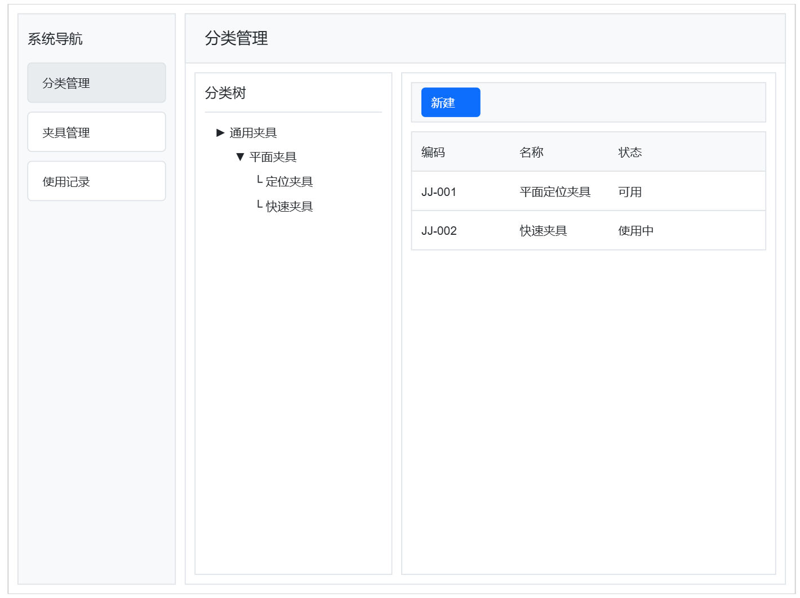
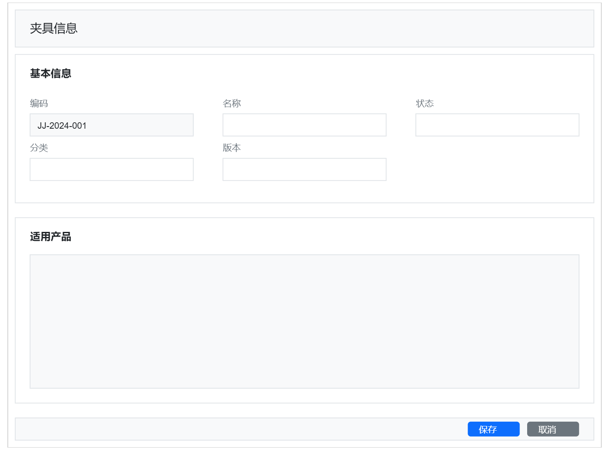
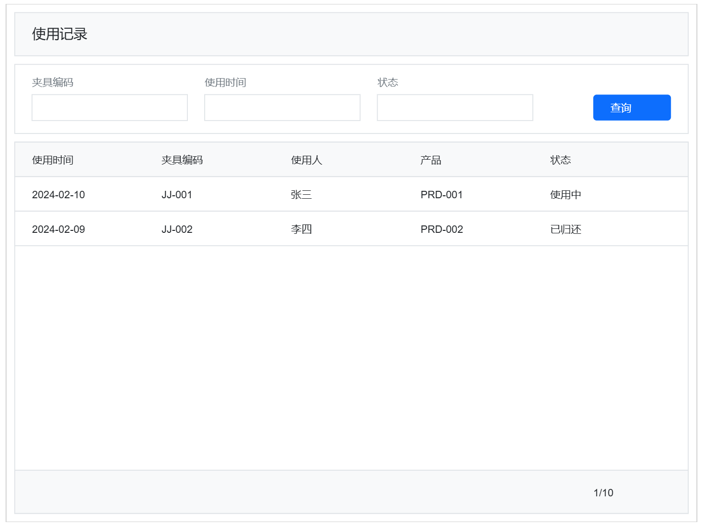

# 工装夹具库管理系统教程概述

## 教程目标

通过开发一个工装夹具库管理系统，帮助您掌握EMOP平台的核心功能和开发方法。本教程涵盖：

1. 业务建模的不同方式（DSL与Java）
2. 数据操作的各种场景
3. 前端开发的最佳实践
4. 平台特性的实际应用

## 系统功能概览

### 1. 核心功能
- 夹具分类管理
- 夹具信息管理
- 使用记录管理
- 产品关联管理

### 2. 界面预览

**主界面 - 分类管理**

**夹具信息表单**

**使用记录界面**

## 技术要点

### 1. 模型定义
- 基础模型定义
- 关系模型定义
- Trait特性应用
- 业务规则配置

### 2. 数据操作
- 基础CRUD操作
- 关系数据处理
- 树形数据处理
- 数据导入导出

### 3. 前端开发
- 列表页面
- 表单处理
- 树形控件
- 数据联动

## 知识储备

开始本教程前，建议先了解以下内容：

1. [开发环境搭建](/business/environment)
2. [业务建模基础](/business/modeling/guide)
3. [数据操作概述](/business/data/overview)

## 学习路径

1. **项目概述**
   - 功能范围和目标
   - 技术架构介绍
   - 开发环境准备

2. **需求分析设计**
   - 业务流程分析
   - 领域模型设计
   - 接口规范定义

3. **基础功能构建**
   - Java建模实现
   - 数据操作开发
   - 前端界面搭建

4. **功能迭代优化**
   - DSL模型扩展
   - 界面交互优化
   - 性能调优

5. **部署和维护**
   - 环境配置
   - 部署步骤
   - 运维建议

## 预期收获

- 掌握EMOP平台核心功能
- 了解领域驱动设计实践
- 熟悉常见业务场景解决方案
- 积累项目开发经验

## 注意事项

- 基于EMOP 3.0版本
- 示例代码仅供参考
- 建议完成每章练习
- 遇问题可参考常见问题或社区讨论

## 下一步

准备好了吗？让我们从[需求分析与设计](tutorial/fixture/requirements)开始吧！